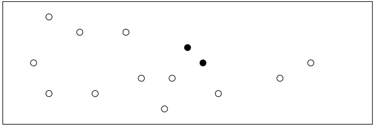
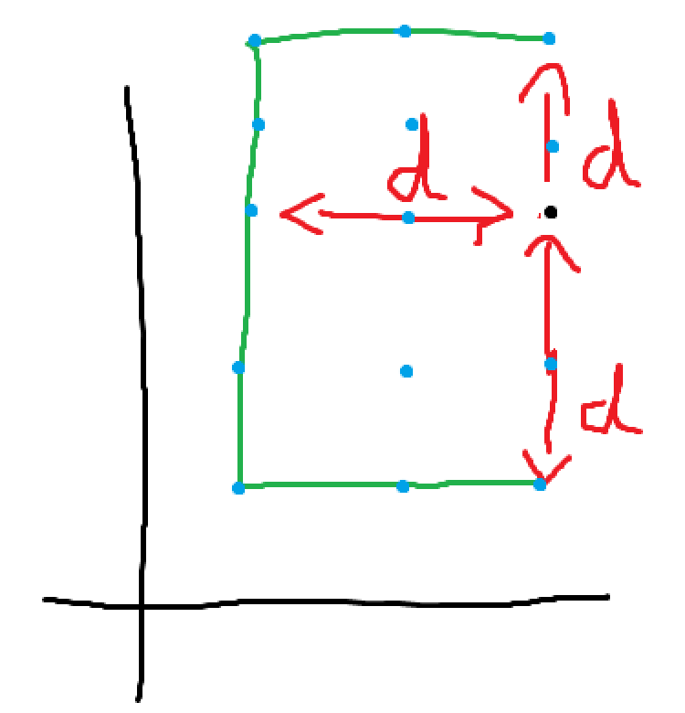
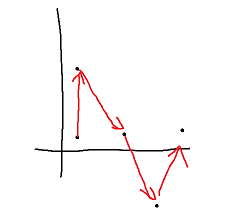
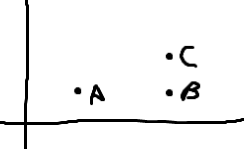
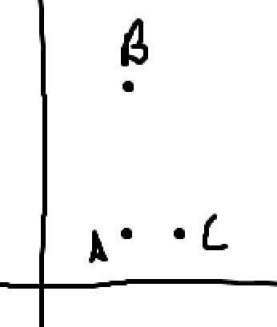

- In this problem, given a set of points in the 2D [[Cartesian Plane]], we are to find 2 points closest to each other where the distance is [[Euclidean Distance]]. 
  
  LIke shown here
  {:height 222, :width 629}
- To solve this problem the logic is like so, we go through the sorted points from left-to-right and keep track of minimum [[Euclidean Distance]] ``d`` between any 2 points. 
  If we have an ``MED``, i.e., ``d``, if there's any point with distance less than ``d`` with any other point then that pair is the closest pair, and we do so until we have processed all the points. We only check the distance with the points already processed, i.e., points on the left.
  
  To check if the E.D between any 2 points is the closest, we simply check it's co-ordinates, so if a point is at A $$(x_1, y_1)$$ and we have another point B $$(x_2, y_2)$$ , then for E.D of A to B to be smaller than B, the $$x_1 - x_2 $$ must be within the range $$[x, x+d]$$ (because we are only comparing 
   x_1 with points already processed on the left, this also means that x_1 will always be >= to x_2) and the abs($$y_2 - y_1 $$) must be within the range $$[y-d, y+d]$$.
  
  Remember, the E.D between any 2 points is given by $$\text{Euclidean Distance} = \sqrt{ (x_2 - x_1)^2 + (y_2-y_1)^2 }$$
  
  So in this image
  {:height 400, :width 400}
  Say A is at the black point, we are using [[Integer]] co-ordinates, the distance d is given in red, then the green semi-box represents the range within which our points must be to be <= ``d``. The blue points are the only possible points within that range so B must be any of those points to be <= ``d``, there are fixed no. of points inside this box as if we only have Integer co-ordinates then it can be shown that there will be a constant number of points in a fixed region inside the d X d rectangle.
- For our [[Algorithm]] we use the same idea,
  
  * First we sort the points based on their x-axes, and y-axes if x is the same. Unlike in [[Line Intersection]], the y-axis can be sorted in either asc/desc order.
  {:height 222, :width 225} 
  
  * Next we create the MED, ``d`` initialized at Infinity and a [[Set]] which will have the processed points in it sorted by their y-axes.
  
  * Next, we go through the sorted points in left-to-right iteration. 
  
  * At each iteration, we check if the x axis of the points stored in the set exceed ``d``, if they do they are removed. 
  Now this is not the same as just plainly removing points if they exceed ``d``, we only consider the x axis here. This is based on the observation that the points farther than d on x axis are guaranteed to be farther than d for all points on the right, but the points farther than d on y axis can potentially be close on the x axis.
  For ex.: 
  {:height 255, :width 255} 
  Here, even though B and C are close on the y axis, they are much farther from A on the x axis. So if we reach C, and we get d from B and C then A will be removed as no point will ever be <=d to A when we sweep from left-to-right.
  Similarly,
  {:height 255, :width 255}
  Here, when we sweep from left-to-right, we can easily see that to consider point A from C, we mustn't remove A from the set based on its y axis.
  
  Hence, in both the cases we can see x axis as the determining factor for a point to have an ED <= d, i.e., if its greater than d on the x axis it will never be forming the closest pair. 
   
  
  * Now we simply need to iterate over the points with their y axes in the range $$[y-d, y+d]$$. In the processed points, we already have the guarantee that all points are within $$[x,x+d]$$x of the current point, so now we only need to go through the points whose y is within d as well. This is where creating the set on y axis helps, as the range y-d to y+d will be a continuous range as all points are sorted based on y axis.
  
  * In the iteration over the range, we check if the current d is less than the ED between current point in the iteration to the point from the set.
  
  * Lastly we insert this point in the set of processed points.
  
  In C++,
  ```cpp
   int dist(CI& a, CI b) {
  
          return ((a.R-b.R)*(a.R-b.R)) + ((a.I-b.I)*(a.I-b.I));
  
      }
  
   int d{INF};
          std::set<pii> pp{}; //processed points
          pp.insert(pii(totalSegs[0].I,totalSegs[0].R));
  
          for(int i{1}, j{0}; i<n ;++i) {
              CI& current{totalSegs[i]};
              int ed= ceil(sqrt(d)); //euclidean distance converted to int
              while(j < i && current.R-totalSegs[j].R > ed){ //current.R or x axis will be always greater or equal to the points before
                                                             //because of how we sorted totalSegs
                  pp.erase({totalSegs[j].I,totalSegs[j].R});
                  j++;
              }
  
              auto itLB{pp.lower_bound({current.I - ed, 0})}; //iterator lower bound
              auto itUB{pp.upper_bound({current.I + ed, 0})};
              while(itLB != itUB)
              {
                  d= min(d, dist(current, {itLB->second,itLB->first}));
                  itLB++;
              }
              pp.insert({current.I,current.R});
          }
  
          output(d);
  
  ```
  We use lower bound which gives the first point greater than the given point, upper bound which gives the last point lesser than the given point, dist() which gives the ED squared,  and j which is a simple optimization to only consider unprocessed (x axis removal) points on the x axis, so if for points 1,2,3 it did not trigger, but for point 4 it triggers then it must go from point 1 to 3, on the other hand if it triggered for point 1 and 2 then for point 4 it only needs to process point 3 as point 1 and 2 are already removed.  
  
  
  
  *
- Alternate Algorithm: If we simply go through the points and only consider the last point to compare distance with, then we may miss out on cases where point 1 and 3 are closer than point 1 and 2 and point 2 and 3. Like shown here
  {:height 222, :width 225}
  
  An alternate algorithm that works is by simply going to each point and checking the distance against all other points. TC is $$\text{O}\lparen n^2 \rparen$$
  
  Another alternate alg is using [[Divide And Conquer]] but it is trickier to implement.
-
- References: Page 246 of [[CPH]]
  [Robin Visser's Note from University of Cape Town](https://saco-evaluator.org.za/presentations/2015%20Camp%203/Line%20Sweep%20Algorithms%20(Robin%20Visser).pdf)
  [Codeforces Blog](https://codeforces.com/blog/entry/58747)
-