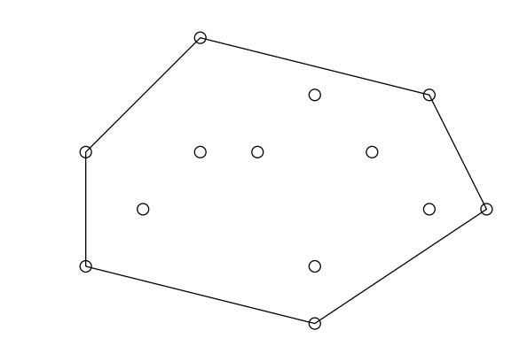
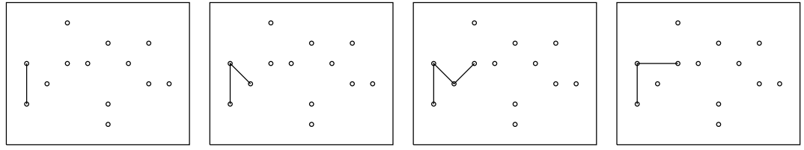
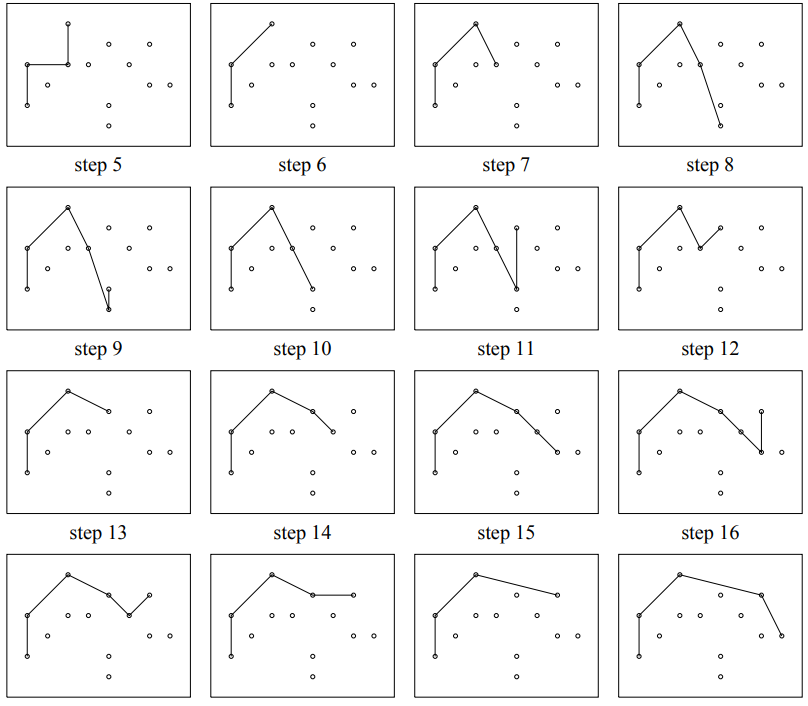

- A convex hull is the smallest convex [[Polygon]] (a convex polygon is a polygon where the boundaries of the polygon don't go inside) that contains all the points of a given [[Set]] of a [[Virtual Plane]] and none extra point, so it uses the points of the set itself to define the polygon's vertices.
  
  For ex.:
  
  is a convex polygon which contains all the points in the set of all points here
- To compute the convex hull for a given set of points we can use Andrew's Algorithm which goes like so
  
  * First we sort all the points primarily on x-axis component and secondarily on y-axis component
  * Next we are ready to construct 2 ``hulls``, the upper hull and the lower hull. A hull is simply an enclosure, so here we construct the upper half of the polygon and then the lower half of the polygon.
  
  So we get our starting point, which is the left-most point we insert it to both our hulls
  * Now we can begin constructing the upper hull, to do so we simply go through the sorted points and make sure each subsequent point does not lie to the left of the previous 2 points, if it does, we remove the previous point and then check again. The idea is to have the upper hull as the outermost set of points.
  For ex.:
  
  Here we can see that the 4th point causes the hull to turn left, so we remove the 3rd point and now our hull only turns right. 
  We follow this same logic and process all the points, and for each point check if the hull hasn't turned left, if it has we remove all points from the hull that cause it to go left. It is always the last point before the current point so we can do it in a simple loop.
  
  * Now we get our upper hull like so
  
  
  * Then, we do the same for the lower hull with the only difference being that we check that the hull doesn't turn right. 
  This then generates a hull which has the same ending point and we make sure the starting point remains the same for both the hulls giving us our final convex polygon.
  
  In C++,
  ```cpp
  void setup() {
  
    INPUT(n);
    points = vci(n, CI());
    upperHull = vci();
    lowerHull = vci();
    for (int i{}, arg1{}, arg2{}; i < n; ++i) {
  
      INPUT(arg1, arg2);
  
      points[i] = CI({arg1, arg2});
    }
    sort(points.begin(), points.end(), comparator);
  }
  
  // Andrew's Algorithm
  void compute() {
    std::function<bool(int)> check{
        [](int res) { return res > 0; }}; // point is to the left
  
    upperHull.pb(points[0]);
    lowerHull.pb(points[0]);
  
    int kUpper{solveHull(upperHull, check)};
  
    check = {[](int res) { return res < 0; }}; // point is to the right
  
    int kLower{solveHull(lowerHull, check)};
  
  }
  
  int solveHull(vci &results, std::function<bool(int)> &check) {
    int k{1};
  
    for (int i{1}; i < n; ++i) {
  
      while (k >= 2 && check(dirn(results[k - 2], results[k - 1], points[i]))) {
        results.pop_back();
        --k;
      }
  
      results.pb(points[i]);
      ++k;
    }
  
    return k;
  }
  bool comparator(CI &a, CI &b) { return (a.X == b.X) ? a.Y < b.Y : a.X < b.X; }
  int dirn(CI &x, CI &y, CI &p) {
    CI a{p - x};
    CI b{p - y};
    int res{cast((conj(a) * b).Y)};
    return res;
  }
  ```
  
  Here ``solveHull`` is the main logic, which simply goes over the points and inserts them all. For each point we check if the hull hasn't turned in the wrong direction and if it does we remove the last point in the hull and check again until either there aren't enough points (excluding the starting point) or if the hull turns in the right direction at the last point for the current one.
-