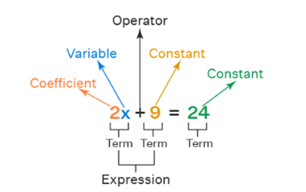

- It’s a mathematical statement that defines the relation between 2 algebraic
  expressions. The relation can be <,>, = or their mix. We may also have
  the inequality relation such as ax != bx, however then it may not necessarily
  be true that f(ax) != f(bx), such as
  $$-1 \ne 1$$
  is true
  but
  $$(-1)^2 \ne (1)^2 \\\
  1 \ne 1 $$
  is false.
- The equations theirselves are of diff. types such as [[Linear Equation]], [[Quadratic Equation]],
  [[Cubic Equation]] etc.
- Form of an eq.
  
- Degree of an equation 
  It is the highest exponent amongst all terms. For 2x+9 it is 1 as 1
  is the highest power for a term. Same for $$2x+9^2$$, because $$9^2$$
  can be directly solved giving us 81.
  but
  $$2x^2 +3y+2$$ when simplified remains the same, so here degree is 2 because the highest exponent is 2.
- All equations can be represented in a [[Virtual Plane]], generally the [[Cartesian Plane]] is used but eqns with [[Complex Number]] or [[Vector]] use the [[Complex Plane]]. 
  
  [[Function]]s for any point are defined by equations so
  f(x) = 0
  here the equation can be ``x*0=0``
  and as we can see the function is defined by the equation ``x*0``. Now f can be easily
  described by a single axis plane. We simply plot all the results of f(x).
  
  * Another eqn is
    $$y = f(x)$$
     where f can be ``2x+9``
     Now here we have 2 [[Variable]]s, each variable represents the magnitude in its axis for a point which is why we use x and y as variables. But we can use other variables too, its just simpler
  to get x and y directly and plot them. Here we have 2 variables so we get a 2 axes plane and for each value of x we get f(x) which is its y.
  
  * $$F=ma$$
  force = mass\*acceleration
  Here we can use 
  y= x\*z
  And we can see there are 3 variables so it will require a 3-dimensional plane.
- Zero of a [[Function]]
  If $$f(c) = 0$$
  then the [[Number]] ``c`` is called the zero of f.
- Constant [[Function]]
  If $$f(c)=b $$ 
  where c and b are constant [[Number]]s then the function is called
  a constant function and its graph is a horizontal line with y-intercept with
  (0,b).
- Real solution
  A solution to an equation is the ordered pair of points at which the
  equations satisfies the relation.
  More formally,
  A solution is the [[Set]] of all possible values of a [[Variable]] which satisfy the equation. The solution
  is a real solution if the set only accepts [[Real Number]]s.
  For ex.:
  $$2x+9=0$$
  so for ``x=-4.5``
  $$-9+9=0 \\\ 0=0$$
  so``-4.5``  is a solution to the equation 2x+9=0. Since it is a real number, it is a real solution.
-