- We deal with geometric shapes here.
- [[Complex Numbers]]: MSVC and GCC have a library <complex> that can be used to represent complex numbers.
  Now CNs theirselves can use either floating or integer coordinates, so we can do
  ```cpp
  #define R real()
  #define I imag()
  
  using CD = complex<long double>;
  using CI = complex<long long>;
  
  and then define a CN with
  CI c{ CI(4,2) };
  cout << c.R << c.I << endl;
  ```
- CI is deprecated as of C++17, so CD is the only one we can use.
- We can find |v| which is the +ve length of a vector v from origin to the point (x,y). Here y is the imaginary part and x is the real part. This is done using the abs(<CN>) function. 
  That is, 
  $$\text{abs(<CN>)} = \sqrt{x^2+y^2}$$
  What is $$\sqrt{x^2+y^2}$$ ?
  
  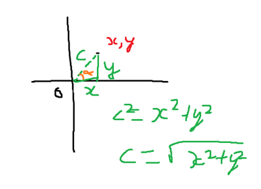
  
  It is the distance from origin to the point x,y.
  Since it can be floating, it is better to use CD.
- We can also calculate distance between 2 points using abs(),
  to do so say a and b are CD, then
  ``double dist{ abs(b-a) }; ``
  will return the distance between them.
- Angle: We can get the angle 
  
  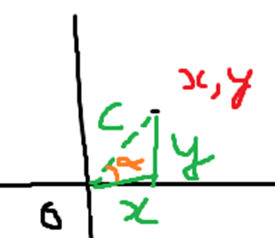
  
  alpha using the function arg(<CN>)
  This angle has its base on the x axis (so at (x,0) it is 0) and increases counter clockwise. The angle is in radians, where r radians means 180*r/pi or 1 radian = pi/180 degrees.
- Polar form: We can use polar(s,a) to construct a Complex Number which has length s and angle a (radian) from origin. Polar returns a CD/CI based on the input type.
  Another use of polar is for vector rotation.
  A CN can be represented as a vector, and this vector can be rotated by multiplying it with a vector with length 1 and angle a. 
  For ex.:
  ```cpp
  CD vec{CD(4,2)};
  cout<<arg(vec); //0.463
  vec*=polar(1.0,0.5);
  cout<<arg(vec); //0.963
  ```
- [[Cross Product]]: For 2 vectors (CI/CD), a and b, the cross product is only defined for 3D. But if they are complex numbers then they can use Complex Number Multiplication and get a scalar value, this scalar value tells us the direction of b when its tail is placed at a’s tip. 
  If a X b > 0, b turns left
  a X b = 0, b turns 180 degrees or keeps straight after a
  a X b < 0, b turns right.
  
  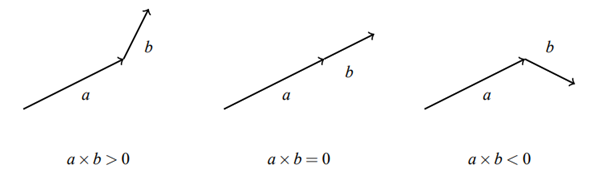{:height 185, :width 597}
  
  $$ a \times b = a_1*b_2 - a_2*b_1 $$ 
  (for 2D, vector cross product is the CN multiplication), it can be retrieved by
  ``double result { (conj(a)*b).I };``
  Here conj turns a’s imaginary part (or y axis) negative, as conjugate of a CN is simply the sign of its imaginary part flipped so we get (a_{1}, -a_{2}) and the CN multiplication of this with b is
  a_{1}b_{2} - a_{2}b_{1}
  Yes, C++ performs CN multiplication on multiplication of 2 CNs.
  
  This is also to say, that whilst Vector Cross Product isn’t defined for 2D, we can represent the 2D vectors as Complex Numbers and perform Complex Number Multiplication on them. This is not the same as a vector cross product as it doesn’t give a third vector which is perpendicular to both the vectors, nor is it the same as vector dot product which tells us about the projection of a vector onto another. Instead, it simply helps us understand the rotation of the second vector in 2D space.
	- Applications of CN multiplication/vector cross product (for 2D):
	  
	  * Testing point location: If we have 3 points, A, B and P and we wish to know if P is on the line passing through A and B, then we can do so
	  ``double R = (P - A) X (P - B)``
	  which returns a scalar value, 
	  0 means P is on the line passing through A and B 
	  \>0 means P is on the left of the line
	  \<0 means it is on the right.
	  
	  For ex.:
	  
	  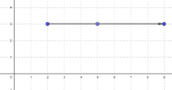
	   
	  Here A= (2,3), B= (9,3) and P = (5,3) and after computing R we get R = 0 which means P lies on the line passing through A and B.
	  
	  So, to use a 2D co-ordinate, we turn it to CN/Vector 2D then we perform the above CN Multiplication/cross product
	  like so
	        ```cpp
	        CD a{p-x};
	        CD b{p-y};
	        double result{(conj(a)*b).I};
	        ```
	  This identifies if for a point x and y, another point p falls on the line passing through them, or its left or right.
	  
	  ** Properties:
	  *** Even if P is ahead of AB, it will still give R as 0. This is also to say, we aren’t checking if P lies on the line between A and B, we are checking if P lies on the line that passes through A and B, so it can be that P occurs before A and B, between A and B and after A and B and in all cases R will be 0 as it is on the line that goes through them.
	  
	  * Intersection of lines: We can determine if 2 straight lines intersect or not.
	  Say we are given 4 points a, b, c and d and told there are 2 line segments, ad and cb.
	  Then there are 3 cases if 2 lines intersect,
	  
	  ** Case 1: The line segments are on the same line. In this case there are infinite points of one line intersecting with other wherever they overlap. We just test the given points with simple vector cross product and if they are all 0 then we test if any of the point lies between a line segment.
	  
	  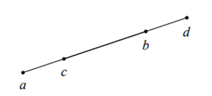
	  
	  
	  First we simply get the vector cross product of all of them with respect to any other 2 points and see if all of these cross products are 0. This tells us if all of them lie on the same line passing through them. If they don’t then that means Case 1 isn’t true as the lines don’t overlap.
	  
	  Now to check if they intersect, we sort them based on their x or y co-ordinate. This tells us if any point lies on the other line segment, we already know they are on the same line passing through them, and this confirms if a line segment overlaps the other.
	  
	  So in the above case we get all vector cross products as 0, then we sort the points on x axis and find out the order is a, c, b and d. Meaning at-least c falls between a and d and hence there is an intersect and an overlap.
	  
	  
	  ** Case 2: There is only 1 intersection point, and it is one of the vertices/given points. Here we get the vector cross products of the points of the one line segment’s vertices with respect to the other 2, then do it for the other one and if one of the points is on the line passing through the other line segments vertices then that means that point intersects with this line segment.
	  
	  For example:
	  
	  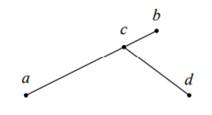
	  
	  We find vector cross product of first c and d with respect to a and b then a and b with respect to c and d, here we find the vector cross product of c on the line a and b as 0 and some negative value for d. This means c lies on the line passing through a and b and hence we have an intersection point.
	  
	  ** Case 3: There is only 1 intersection point but it is neither of the vertices. In this case we take one line segment and get vector cross product for both its points with respect to the 2 points of the other line segment and then do the same for that line segment. Then, if for both line segments 1 point falls to the left of the other line segment and the other point falls to the right of the other line segment, then they intersect somewhere.
	  
	  For example:
	  
	  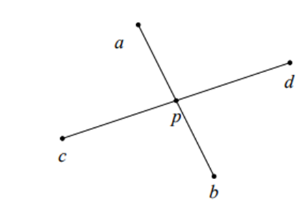
	  
	  
	  Here, we get vector cross product of both c and d AND a and b with respect to a and b and c and d respectively. If they intersect somewhere, as we can see above, then vector cross product of a will be >0 and b will be <0, and the same will be true for c and d. If both these are true as here, then it means ab and cd intersect somewhere.
	  
	  In C++,
	  ```cpp
	      // 2D vector cross product aka Complex Number Multiplication
	      double crossProduct(CD &a, CD &b, CD &p)
	      {
	          CD temp1{p - a};
	          CD temp2{p - b};
	          double result{(conj(temp1) * temp2).I};
	  
	          return result;
	      }
	  
	      bool comparatorCD(CD &a, CD &b)
	      {
	          return (a.R == b.R) ? (a.I < b.I) : (a.R < b.R);
	      }
	      //checks if the point b is in middle on the cartesian plane with respect to the other args.
	      bool isMid(CD &a, CD &b, CD &c)
	      {
	          std::vector<CD> temp{a, b, c};
	          std::sort(temp.begin(), temp.end(), comparatorCD);
	  
	          return temp[1] == b;
	      }
	  
	      void start()
	      {
	          double resA1{crossProduct(b1, b2, a1)};
	  
	          double resA2{crossProduct(b1, b2, a2)};
	  
	          double resB1{crossProduct(a1, a2, b1)};
	  
	          double resB2{crossProduct(a1, a2, b2)};
	  
	          result = "NO";
	  
	          if (resB1 == 0 && isMid(a1, b1, a2))
	          {
	              result = "YES";
	          }
	          else if (resB2 == 0 && isMid(a1, b2, a2))
	          {
	              result = "YES";
	          }
	          else if (resA1 == 0 && isMid(b1, a1, b2))
	          {
	              result = "YES";
	          }
	          else if (resA2 == 0 && isMid(b1, a2, b2))
	          {
	              result = "YES";
	          }
	          if ((resA1 * resA2) < 0 && (resB1 * resB2) < 0) // case 3
	          {
	              result = "YES";
	          }
	  
	          output();
	      }
	  ```
	  The logic is pretty simple, first we test each point against the other line segment. This way we know where each point lies wrt the other line segment. Now if a point is in between the points of the other line segment and lies on the line then we have case 1 or case 2 fulfilled. Lastly if that is not true then we check for case 3  which requires both pairs of points to be on the opposite side of the other line segment. We can check this by simply multiplying the opposite resultant values, it will be -ve if exactly one of them is negative.
	  
	  * Distance from a point to a line: Using vector cross product we can calculate the distance from a point to a line. This is because we can calculate the area of a triangle using vector cross products using the formula
	  $$\text {Area of a triangle} = \frac {(\left| (a-c) \times (b-c) \right|)}{2}$$
	  | | here means +ve value not vector magnitude because 2D vector cross product returns a scalar value.
	  Here a, b and c are 3 points or rather vertices of the triangle.
	  
	  Using this we can find out the height of the triangle, i.e., shortest distance from c to line passing through a and b using this formula
	  
	  $$ \text d= \frac {(a-c) \times (b-c)}{(\left| b – a \right|)}$$
	  This is because for the area of a triangle we have 2 formulae, first is (½)*(|b-a|)*d, which gives the normal area of triangle and then (| (a-c) X (b-c) |) / 2, which is using the vector cross product. Here d is the height.
	  For example:
	  
	  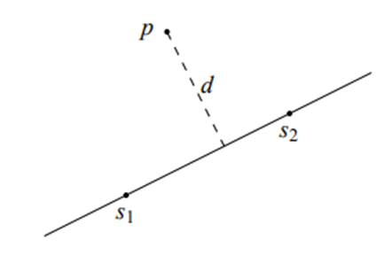 
	  
	  In the above image, if we find d using the distance formula then that will give us the shortest distance from p to the line passing through S1 and S2.
	  
	  * Point in a polygon: We can test if a point is inside a polygon with a simple algorithm. We cast arbitrary number of rays in arbitrary directions from the point, if the rays intersect with any of the boundary of the polygon 0 or even number of times then the point is outside, otherwise it is inside.
	  
	  For example:
	  
	  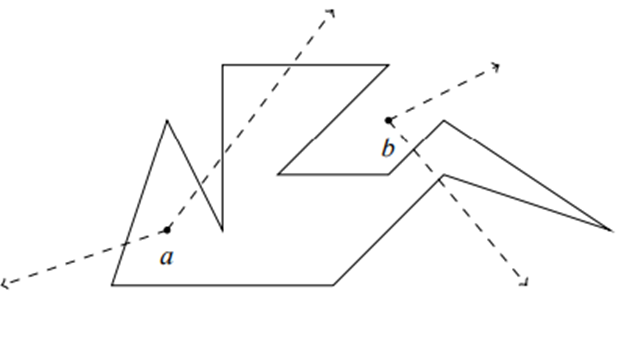
	  
	  
	  A naïve approach here would be checking if the ray of sufficient length making a line segment from a given point, say b, intersects with any of the line of the polygon, so we check line segment b to ray end against all line segments of the polygon (we can use case 3 of checking if a line intersects) and see how many lines the ray intersects
-
- Area of a Polygon
  There are 2 simple ways to calculate the area enclosed by a polygon, dividing a polygon into known shapes and summing the parts. Or using formulae such as shoelace formula, aka Gauss’ Area Formula, aka Surveyor’s Formula. 
  If the shape is a basic regular polygon such as a triangle or rectangle or trapezoid or etc., then using the normal area formula for that shape is faster than using shoelace but otherwise this is a faster and simpler calculation.
  
  The formula is
  $$\text{Area} = \frac{1}{2} \left|\sum_{i=1}^{n-1} (x_iy_{i+1} - x_{i+1}y_i)\right|$$
  
  or
  
  $$\text{Area} = \frac{1}{2} \left|\sum_{i=1}^{n-1} (p_i \times p_{i+1})\right|$$
  
  where p is a CN and this is a 2D vector cross product or CN multiplication.
  p_{i} is any point (x_{i},y_{i}) and p_{i+1} is the point adjacent to it, we follow a direction, i.e., either right or left and then only go in that dirn.
  For ex.:
  
  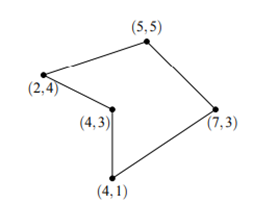 
  
  Here, p_{1} can be (2,4) then if we go right then p_{2} will be (5,5) and we only go this way for consequent points. Similarly, we can go left to (4,3) and all consequent points will be the next adjacent points.
  This doesn’t just apply to the CN version but also the normal formula as well.
  The idea of the formula is to simply compute the area for each trapezoid in the polygon, where the first side is the side of the polygon and the second side is the horizontal axis line at y=0 like so
  
  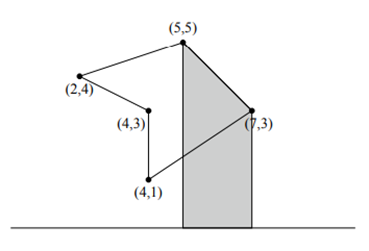 
  
  The area of each trapezoid here is 
  $$Area = (x_{i+1} - x_{i})*\frac{(y_{i} + y_{i+1})}{2}$$
- Pick’s Theorem 
  Tells us the area of a polygon is
  $$\text Area = a + \frac{b}{2} - 1$$
  where a are the integer points strictly inside the polygon and b are the integer points exactly on the boundary of the polygon.
  For ex.:
  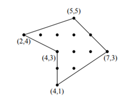
   
  
  Here, a = 6 and b = 7.
- Distance Functions
  Defines the distance between any 2 points, there’s the standard Euclidean distance, which is the plain and straight distance to a point
  $$\text{Euclidean Distance} = \sqrt{ (x_2 - x_1)^2 + (y_2-y_1)^2 }$$
  
  It uses Pythagoras’ theorem in a triangle to calculate the distance.
  represented like so
  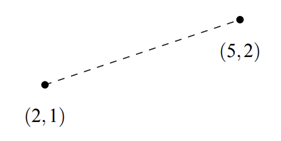
  *There’s another type of distance metric known as a Manhattan Distance which uses a grid-like path, or rather the sum of the differences in each of the cartesian co-ordinates. 
  That is,
  $$\text Manhattan Distance = \left | x_1 - x_2 \right | + \left | y_1- y_2 \right |$$
  
  We basically summed the difference of the cartesian co-ordinates, this means we follow a grid-like path to the point and not a straight line like so
  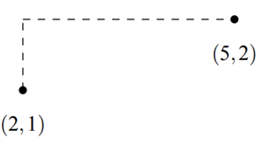
  
  * Then there’s the Chessboard distance or the Chebyshev distance, which is the maximum of difference of either coordinates between 2 points.
  $$\text {Chebyshev Distance} = \max ( \left | x_1 - x_2 \right |, \left | y_1 - y_2 \right | )$$
  
  It looks like so 
  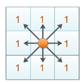 
  
  The Chebyshev distance can be thought of as a King’s minimum number of moves to reach another block on a chessboard, as shown here
  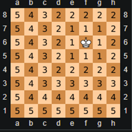
  
  * Properties
   ** 1 unit
  
  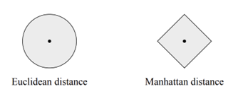
  
  and with Chebyshev
  
  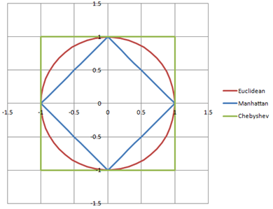
  
  We can visually see why the Chebyshev is 1 for all green points, it’s because it doesn’t care about the diagonals, just the pure maximum of difference of either axes between any 2 points. Or we can say 1 unit of Chebyshev Distance is the distance travelled on x-axis, or y-axis or on both at the same time (diagonal) so (1,1) is still 1 Chebyshev Distance as we can use both or either of the axes to move.
  
  ** As we can see above, a Chebyshev distance can be converted to a Manhattan Distance if we rotate it by 45 degrees, and same for the other way around. This means,
  
  ``45 degree Rotated Chebyshev or Manhattan = Manhattan or Chebyshev respectively.``
  
  A simple way to rotate a Manhattan to a Chebyshev is,
  for a point 
  ``p=(x,y)``
  we transform it as 
  ``p’= (x+y , y-x)``
  
  This transforms a point by rotating it 45 degrees and scaling it.
  
  For ex.:
  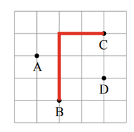
  
  
  We have to find the max. Manhattan Distance between any 2 points here
  
  It is BC here and the MD is 5 as we can see.
  But we can also convert all points to use a CD by rotating all points by 45 degrees, like so
  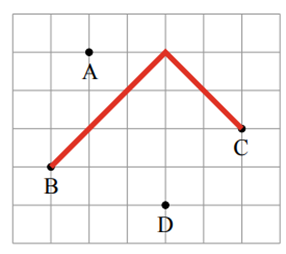
   
  
  Now for this graph the MD will be different but the CD will give us the MD for graph 1. 
  So for any 2 points in the rotated graph, 
  $$\text {CD} = \max ( \left | x_{1’} - x_{2’}, y_{1’} - y_{2’} \right|)$$
  where x’ and y’ are the rotated points.
  
  This has the benefit that now, we can look at each axis separately, so between any 2 points if their x or their y coordinate has maximum difference then they will give the max. MD.
- Sweep-Line Algorithms
  The idea with these algs is to represent a problem in the cartesian plane and its events as points in it. Then we process the events in the increasing order of their x or y co-ordinates.
- Intersection Points