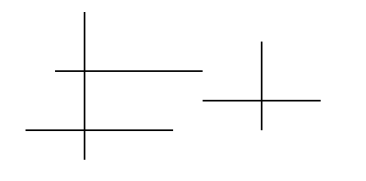

- Suppose we have orthogonal line segments like so
  
  
  As we can see, there are 3 intersection points.
- There are 2 types of line intersection algs, orthogonal and general case ([Bowdoin.edu]( https://tildesites.bowdoin.edu/~ltoma/teaching/cs3250-CompGeom/spring17/Lectures/orthosegmintersect-6up.pdf)). The former is quite simpler as we can simply 'sweep' from left to right (Leftmost segment X axis) or top to bottom (Topmost segment Y axis) and count number of intersections.
- In orthogonal line segment intersection, we focus on 3 events, 
  1. Horizontal LS begins
  2. Horizontal LS ends
  3. Vertical LS occurs. 
  The logic for this sweep line is simple, we start from the leftmost X axis point and then go rightwards  processing all 3 events on the X axis. 
  The starting point itself could belong to either a VLS or an HLS, now if we face event 1, we store the Y co-ordinate of the HLS in a data structure like a Set, if we face event 2 we search for the Y co-ordinate and remove it from our data structure and if we face event 3 we check for all the Y co-ordinates stored in our data structure within the range [VLS' start Y co-ordinate, VLS' end Y co-ordinate].
  In C++,
  ```cpp
  enum SegType {
   H, //Horizontal
   V  //Vertical
  };
  int testCases{1};
  int n{};
  std::vector<std::pair<CD,SegType>> totalSegs; //
  int result{};
  si activeSegs{};
  
  namespace Algorithm
  {
      using namespace std;
      void start();
      void output();
      bool comparator(pair<CD,SegType>& , pair<CD,SegType>& );
  
      void setup()
      {
          IOS;
  #ifdef LOCAL
          FILE *inpStream;
          FILE *outStream;
          freopen_s(&inpStream, "input.txt", "r", stdin);
          freopen_s(&outStream, "output.txt", "w", stdout);
  #endif
          // INPUT(testCases);
  
          while (testCases-- > 0)
          {
              INPUT(n);
              double arg1{};
              double arg2{};
              double arg3{};
              double arg4{};
  
  
              for (int i{}; i < n; ++i)
              {
                  SegType s{};
                  INPUT(arg1, arg2, arg3, arg4);
  
                  if(arg1==arg3) { // Vertical Segment
                      s=SegType{V};
                  }
                  else{
                      s= SegType{H};
                  }
  
  
                  totalSegs.pb(pair(CD({arg1,arg2}), s));
                  totalSegs.pb(pair(CD({arg3,arg4}), s));
              }
              sort(totalSegs.begin(), totalSegs.end(), comparator);
              n*=2;
              start();
          }
      }
  
      bool comparator(pair<CD,SegType>& a, pair<CD,SegType>& b ) {
          return (a.first.R == b.first.R) ? a.first.I > b.first.I : a.first.R < b.first.R;
      }
  
  
     void start()
      {
          CD* firstV{nullptr};
          CD* secondV{nullptr};
          for(int i{0}; i< n; ++i) {
              SegType& sType{totalSegs[i].second};
              CD& point{totalSegs[i].first};
  
              if(sType == SegType{H}) {
                  if(activeSegs.find(point.I)== activeSegs.end()) {
                      activeSegs.insert(point.I);
                  }
                  else if(firstV != nullptr) {
                      result++;
                      activeSegs.erase(point.I);
                  }
                  else {
                      activeSegs.erase(point.I);
                  }
              }
              else {
                  if(firstV == nullptr) {
                      firstV=&point;
                  }
                  else{
                  secondV=&point;
  
                  for(int elem: activeSegs){
                      if(elem >= secondV->I && elem <= firstV->I) { //The way we sort enables us the assumption that the element that comes later in totalSegs has greater Y axis (I)
                          result++;
                      }
                   }
                  firstV=nullptr;
                  secondV=nullptr;
                  }
              }
              
          }
  
          
          output();
      }
  
      void output()
      {
  
          std::cout << result  << '\n';
  
          std::cout << std::endl;
      }
  
  
  
  }
  ```
  Here, the logic is pretty straight forward. If given n line segments 
  we
  * Identify if it is a VLS or an HLS, it is VLS if the x axis of both points of the LS are same. Then store them. 
  * Sort all points based on X axis in ascending order, if X axis is same then sort based on Y axis (descending order). We do this to sweep from left to right, and if for any 2 points X is same like if it's the starting point of an HLS and a VLS is already being tracked, this ensures the point comes whilst the VLS is already being tracked so we don't miss processing the HLS within it.
  So we store the points like so
  
  
  * Then begins our main logic, we loop over all the sorted points. 
  * If the current point belongs to a VLS then we store it if we don't have a tracked VLS pair and wait for it's other point, the way we sorted ensures that we first get the higher Y axis point of the VLS then the lower one. Once we get both the points in our iteration, we simply search for all tracked LS' Y axis between the Y axis of this VLS and add it to our result.
  
  If the current point belongs to an HLS, we either store it if it isn't already stored, if it is stored then we see if we are on a VLS, if we are we add 1 to result and remove it and if we aren't then we simply remove the point indicating this HLS ended.
-
-