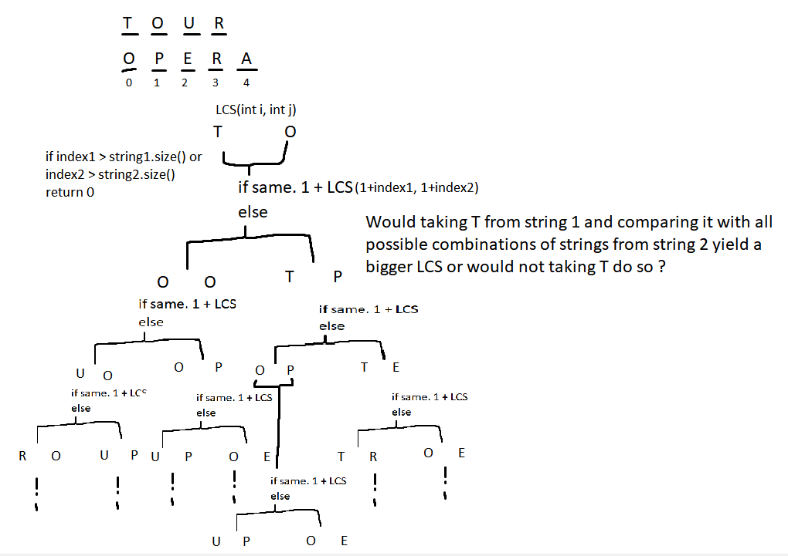
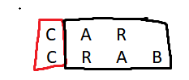
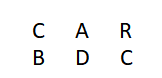
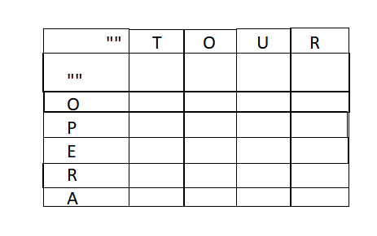
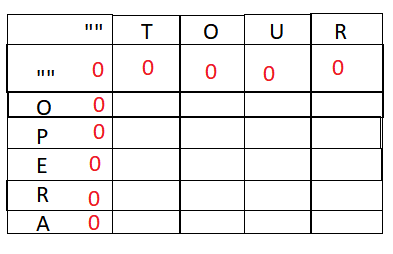
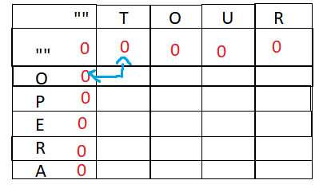
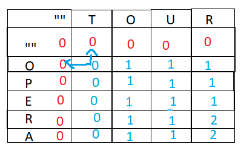

- The ``LCS`` of any 2 [[String]]s is the longest [[Subsequence]] present in both strings.
  For ex.:
  In 2 strings, ``TOUR`` and ``OPERA``, the LCS is ``OR``.
- 3 [[Algorithm]]s in decreasing order of growth are
  * Normal Recursive Approach
  * Memoized [[Recurse]]ive Approach
  * [[Dynamic Programming]] + [[Iterative]] + [[Memoize]]d Approach
- Normal [[Recurse]]ion
  
  In this approach we recursively ask if taking an element from a string or not taking it would yield a bigger common subsequence. We take an element if it matches with the currently tracked element of the other string, in this case the overall common subsequence size increases by 1.
  
   
  As we can see, we start from the first character of both strings and compare them. If they are equal, they increase the LCS and we get LCS increased by 1.
  Effectively, if 2 elements are equal, the problem then becomes finding the LCS of the remaining 2 strings and we can forget the elements that were equal.
  
  
  But if the elements are not equal, then they can either contribute to the LCS, or not. 
  For example:
  it is possible that an element from string 1 can be the same as an element at the end of string 2.
  
  Here, the ``C`` from string 1 is at the end of string 2. So it does contribute to the LCS.
  
  Hence we need to recursively find all possible combinations of subsequences of both strings and compare their culminated LCS'.
  
  In C++,
  ```cpp
  // Bottom up, (size1,size2), Normal Recursion based approach, TLE
  int lcs(int i, int j) {
    if (i < 0 || j < 0) {
      return 0;
    }
  
    if (s1[i] == s2[j]) {
      return 1 + lcs(i - 1, j - 1);
    } else {
      return max(lcs(i, j - 1), lcs(i - 1, j));
    }
  }
  
  //called with lcs(s1.size()-1,s2.size()-1)
  ```
  
  [[TC]] is $$\text{0(}2^{n+m}\text{)}$$
  where ``n`` is size of string 1, and ``m`` is size of string 2.
  [[SC]] is O(1) since our [[Algorithm]] takes no extra space.
- [[Memoize]]d [[Recurse]]ive Approach
  
  In the normal approach, we can see that most of the branches are effectively repeating already traversed branches.
  We can simply store the results and drop the [[TC]] at the cost of some [[SC]].
  
  In C++,
  ```cpp
  // Bottom up, Recursion+Memoized, (size1,size2), a bit slower growth in TC
  int lcsMemoized(int i, int j) {
    if (i < 0 || j < 0) {
      return 0;
    }
  
    if (memoTable[i][j] != -1) {
      return memoTable[i][j];
    }
  
    if (s1[i] == s2[j]) {
      memoTable[i][j] = 1 + lcsMemoized(i - 1, j - 1);
    } else {
      memoTable[i][j] = max(lcsMemoized(i, j - 1), lcsMemoized(i - 1, j));
    }
    return memoTable[i][j];
  }
  //called with lcsmemoized(s1.size()-1,s2.size()-1)
  ```
  TC is same as normal approach in worst case, but in average and best case it is a lot better.
  SC is $$O(n*m)$$
- [[Dynamic Programming]] + [[Iterative]] + [[Memoize]]d Approach
  
  From the previous approaches, it can be observed that we depend on the solution to the previous subproblems (smaller strings to be compared). 
  So if we go from smaller strings to bigger strings, we can effectively forgo the recursion and linearly find the LCS from smaller strings to bigger ones.
  To do so, we can visualize the 2 strings in a [[2D]] [[Matrix]].
  
  For ex.:
  For ``TOUR`` and ``OPERA``
   
  
  Now, we can find the LCS by going from top left to right bottom and looking at previous values and building upon them. 
  Each row's/column's character represents the max. subsequence size from empty string to that character.
  For ex.:
  If we take ``""TO`` in row and ``""OP`` in column, then the cell corresponding to them will hold the max. subsequence size, which is 1 in this case.
  
  Now, the [[Algorithm]] .
  First we initialize all ``""`` vs ``""`` comparison values, these are always 0, because empty strings have no common subsequence with each other.
  
  
  Now we compare subsequent cells for each row, for each cell, if the 2 current characters are inequal then we take max of the previous row same column, or previous column same row. In other words, we take the max of either the subsequence till the current string 1 character and the previous string 2 character, or the other way around.
  
  For ex.:
  
  Since ``T`` and ``O`` are inequal, we take max of ``""`` and ``""O`` vs. ``""T`` and``""`` .
  This is exactly the same as the original algorithm, either we take the LCS size till current element of either string 1 or string 2, whichever is bigger.
  
  Now, if 2 characters that are equal, we do the same but add 1 to the max. This is because the current characters are increasing the LCS by 1.
  
  Finally, we get this matrix.
  
  
  And the result is the last element.
  
  In C++,
  ```cpp
  // Top to Bottom, 1 indexed, DP + Iterative + Memoized, O(nm)
  int lcsDP() {
    for (int i{1}; i <= cast(s1.size()); ++i) {
      for (int j{1}; j <= cast(s2.size()); ++j) {
        dpTable[i][j] = s1[i - 1] == s2[j - 1]
                            ? 1 + dpTable[i - 1][j - 1]
                            : max(dpTable[i][j - 1], dpTable[i - 1][j]);
      }
    }
    return dpTable[s1.size()][s2.size()];
  }
  //called with lcsDP()
  ```
  
  [[TC]] is $$O(n*m)$$
  [[SC]] is also $$O(n*m)$$
- Reference: {{video https://www.youtube.com/watch?v=ASoaQq66foQ}}