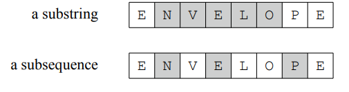

- String s of n characters with alphabets({a,b,....z}, i.e., [[Set]] of lower-case Latin characters) is an array from s[0],s[1]....s[n-1].
- A ``substring`` s[a...b] is a string formed from the characters from int index a to b in s. This covers a continuous index range in the string.
- A ``subsequence`` is a string/sequence formed from consecutive characters in a string (consecutive indices), every substring is a subsequence but the converse is false as a subsequence may not be formed from a continuous range of characters in the string but a substring must always cover a continuous index range. 
  For ex.:
  
- A ``prefix`` of a string s is any substring p formed from s that starts with the first character of s. For ex.:
  ```
  s= "BYTE"
  p= {"B", "BY", "BYT", "BYTE"} //p can be any of the substring from this set.
  ```
- A ``suffix`` of a string s is any substring p formed from s that ends with the last character of s. For ex.:
  ```
  s= "BYTE"
  p= {"E", "TE", "YTE", "BYTE"} //p can be any of the substring from this set.
  ```
- A ``border`` of a string s is any substring p formed from s that is both the prefix and the suffix of s. For ex.:
  ```
  s= "ABCDAB"
  p = "AB"; //AB can be both prefix and suffix for s, hence it is a border.
  ```
- A ``rotation`` of a string s is another string r that can be created by repeatedly shifting the first character to the end of s.
  For ex.:
  ```
  s= "STAR"
  r= "TARS"; //then r can be ARST then RSTA and so on.
  ```
- [[Trie]]
-
-