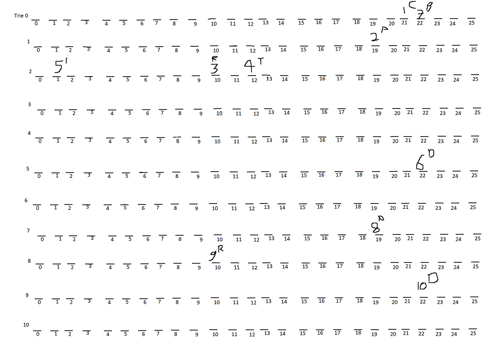

- aka prefix tree or digital tree.
  This is a [[Rooted Tree]] data structure that allows for fast insert, delete and search operation on a [[Set]] of strings. Each character in a string is consecutively stored in the [[Tree]] as individual nodes and if 2 strings contain the same prefix characters, then the same chain of the graph is used. The node representing the end character of a string is marked to know what strings are stored in the trie.
  For ex.:
  
  Here, the trie has the given strings stored and as we can see CAT and CATTLE share the same chain, the T and E is marked to denote that from the root, the chain C->A->T and C->A->T->T->L->E are the strings here.
- To implement a trie
  
  * We can use a [[Linked List]] like [[Data Structure]] to store unique chains of letters separately and non-unique chains in existing chains.
  * We can also use a simple 2-Dimensional [[C++ Array]] to represent chains. 
  
  Implementing the 2nd one here, the 1st can be easily understood from it as well.
  
  ```cpp
  void setup() {
    INPUT(k, A, c);
    trie = vvi(cN, vi(A, 0));
    eos = vb(cN, false);
    counter = 0;
    {
      string arg{};
      cin.ignore(intmax, '\n');
      for (int i{}; i < k; ++i) {
        getline(cin, arg);
        trie_insert(arg);
      }
    }
  }
  
  // Trie
  void compute() {
    string arg{};
    while (c-- > 0) {
      getline(cin, arg);
      output(search(arg));
    }
  }
  
  void trie_insert(string_view s) {
    int sz{cast(s.size())};
    int next{};
  
    for (int i{}; i < sz; ++i) {
      int &elem{trie[next][cast(s[i] % A)]};
      if (!elem)
        elem = ++counter;
  
      next = elem;
    }
    eos[next] = true;
  }
  
  bool search(string_view s) {
    int sz{cast(s.size())};
    int next{};
    for (int i{}; i < sz; ++i) {
      int &elem{trie[next][cast(s[i] % A)]};
      if (!elem)
        return false;
  
      next = elem;
    }
    return eos[next];
  }
  ```
  Using [[Default C++ Template]]
  
  The logic is quite simple.
  We use 2 variables, ``eos`` and ``trie``. ``trie`` is a 2-D Array with size ``trie[N][A]`` where ``N`` is the total size of all input [[C++ String]]'s size and ``A`` is the alphabet size. In a string ``s`` we store each ``s[i]`` in ``trie[i]`` and then we use the ``s[i]%A`` position of the array ``trie[i]`` to store a value indicating where at which ``i`` in trie the next character of the string is, this value is named ``counter``. The reason we do this is because ``s[i]`` corresponds to ``trie[i]`` only when the same chain stored in ``trie[i]`` is followed. If it is not, we jump to the next ``trie[n]`` where no char has been stored. This is where the ``counter``'s value comes in handy. ``counter`` essentially keeps track of how many indices in ``trie`` have been used to allow a string to find the next empty index.
  The ``eos`` variable helps in marking indices of ``trie`` where a string has come to an end. The guarantee here is that each unique string stored in the ``trie`` will have a unique end index, and it will be checked only when a search string expects an index to be an end index.
  
  For ex.:
  For these 4 input strings
  ```
  car
  cat
  caid
  bard
  ```
  
  And these 2 strings to be searched in the trie
  ```
  card
  cat
  ```
  
  We store inputs like so, in the order they are given above,
  
  The ``eos`` will be true for 2,5,9.
  
  As can be seen from the code and from the image, if an index is already used, it indicates the letter is already stored, and each character stores the index of the next empty row, and except the diverging letter, all letters are stored on new rows. This guarantees, if an index is already used in a row, it means it's part of an existing chain, and if it is not then it is empty and hence our character is the diverging character which will show the next index where we can find the rest of the string. 
  
  This allows search to be trivial as well. 
  So when we search for ``card``, we get ``c``, ``a`` and even ``r`` but when we look at ``d``, it is empty in the ``trie``, hence ``card`` isn't stored in the ``trie``.
  
  [[TC]] is O(n) for storage and O(n) for retrieval as well, but with a fixed constant time overhead of the fixed size of ``trie`` and ``eos``.  For [[SC]], Space is constant O(1) here, but it can also be dependent on the input size, in which case the constant time overhead for TC will be lower as well.