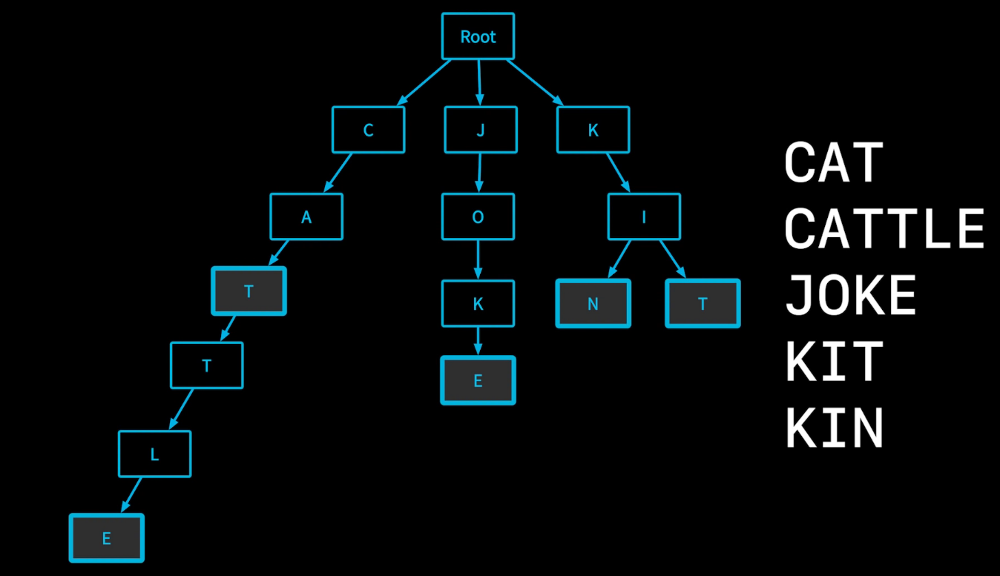

- aka prefix tree or digital tree.
  This is a [[Rooted Tree]] data structure that allows for fast insert, delete and search operation on a [[Set]] of strings. Each character in a string is consecutively stored in the [[Tree]] as individual nodes and if 2 strings contain the same prefix characters, then the same chain of the graph is used. The node representing the end character of a string is marked to know what strings are stored in the trie.
  For ex.:
  
  Here, the trie has the given strings stored and as we can see CAT and CATTLE share the same chain, the T and E is marked to denote that from the root, the chain C->A->T and C->A->T->T->L->E are the strings here.