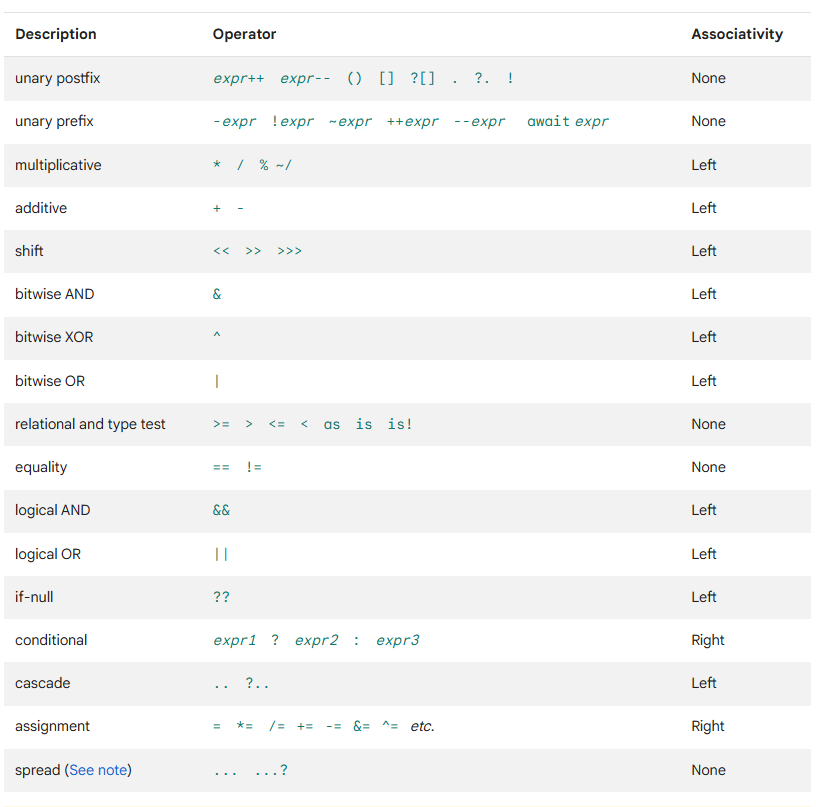
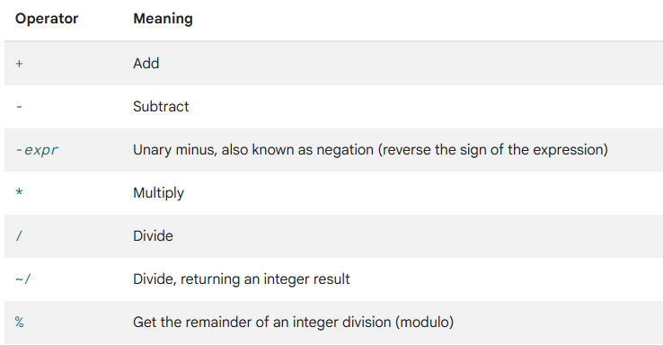
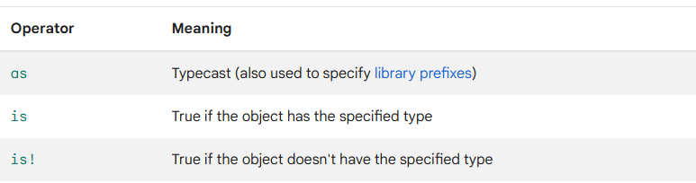
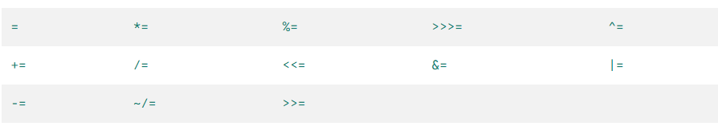
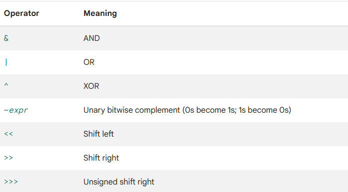

- Operator List
  
  
  The list is sorted in decreasing order of precedence, that is the unary postfixes have the highest precedence and spread operators have the lowest precedence. 
  An expression is any combination of operators and operands (values/variables).
  FE:
  ``a++``
  where `a` is a [[Variable]] and `++` is the unary postfix operator.
   
  A precedence defines which operator will be resolved first in an expression with multiple operators.
  If 2 operators with same precedence are present in an expression then their associativity (which is guaranteed to be the same for both the operators) will be used, to determine which position operator will be resolved first, 
  FE: 
  In the expression`4+2-3`
  The operators `+` and `-` have the same precedence so, their associativity, i.e., Left is used and hence the operators are resolved from Left to Right, and hence here the leftmost operator `+` is resolved first then the one to its right `-`.
- When an operator takes 2 operands such as the `+` operator then the operator is called for the left operand with the right operand as it's argument.
  FE: if we have a `SomeVector` [[Class]] object `v` and ``SomePoint`` [[Class]] object `p`, and we do `v+p` then the `SomeVector`'s addition [[Method]] is called with the ``SomePoint`` object `p`.
- Arithmetic Operators
  The usual
  
  But Dart also brings `~/` which divides left operand by right and if the result is a [[double]] then it truncates the values after the decimal.
  FE:
  ``5.4~/2`` is 2.7 and then it is truncated and hence the result is ``2``
- Postfix and prefix ops supported as normal, `<operand>++/--` and `++/--<operand>`
- Comparison and Relation Ops supported as normal, `>/</==/!=/<=/>=`
  For equality,
  Compares if 2 objects represent the same thing, but they must be the same type or be nullable [[Data Type]]. To check if they are the same types we can use the `identical()` [[Function]] in ``dart:core`` ((66342d21-0997-462e-9dee-e1fe8428fe6d)) instead.
  That is,
  * for 2 objects `x` and `y`, if `x` or `y` is null, then if both are null then equality returns true, and false if only one is.
  * If they are the same type and non-nullable then the `==` method of the left operand is invoked with the `right` operand as the argument.
- Type Test Operators
  
  * `is` in an expression like `a is T` checks if the type of `a` implements the interface T. 
  FE: `a is Object?` would always return `True` for any type of `a` because every class implements the [[Object]] class and since it is nullable, even a nullable type would be covered.
  
  * `as` in `a as T` typecasts an object of a's type to an object of type T. Throws an exception if `a` is either null or is not `T` or a derived class of `T`.
  FE:
  ```dart
  void main() {
    var x = Y();
    print((x as X).x);
  }
  
  class X {
    final String x;
    X({this.x = "yo"});
  }
  
  class Y implements X {
    @override
    final String x;
    Y({this.x = "yas"}) : super();
  }
  ```
- Assignment Operators
  Supports the operators such as `*=` or `+=`,
  
  
  Where any compound assignment such as `a <operator>=b` is equivalent to `a = a <operator> b`.
  
  * There's also the ``??=`` called the assign-to-null operator, for an expression `a ??= b` it only assigns `b` to `a`  when `a` is null.
- The usual logical operators `!` for inversion of a [[bool]], `&&` and `||` are supported.
- Bitwise ops
  
- Conditional Expressions
  Dart has ternary operator, `<bool expression> ? <compute and return on true> : <compute and return on false>` and it can use one more operator for conditional expressions, the null-coalescing operator `??`, `<expr 1> ?? <compute expr2 and return if expr1 is null>`
  That is, if the left operand is null then compute the expression on the right and return its result.
  FE:
  ```dart
  String? name = null;
  String x = name ?? "yo"; //puts yo in x
  ```
- Cascade notation
  This notation uses the cascade operators (`..` and `?..`) to chain multiple instance method calls and instance member accesses, i.e., it allows  us to call methods or modify members of the same object without specifying the object repeatedly. 
  
  Syntax: ``<object instance>..<member expression (can use ops)>..<member expression (can use ops)>;`` any number of times and the semicolon is put at the end. [[Dart Style Guide]] recommends separating the subsequent operations with newlines.
  The subsequent operations are performed on the modified object, so expression 1 modifies the object then the cascade operator applies the expression 2 on the previously modified object and so on, it is a chain and the order matters.
  FE:
  ```dart
  var x= Car()
   ..name= "Yo"
   ..speed= 20;
  
  //is equivalent to
  var x= Car();
  x.name= "Yo";
  x.speed= 20;
  ```
  uses the dot access operator.
  
  * Similarly, we have the null cascade operator `?..` which wouldn't do the subsequent operations if the object can be null. It needs to be specified only once at the beginning of the chain.
  FE:
  ```dart
  var x= Car()
   ?..name= "Yo"
   ..speed= 20;
  
  //is equivalent to
  var x= Car();
  x?.name= "Yo";
  x?.speed= 20;
  ```
  uses the null dot access operator.
  
  * Works for [[Function]]s and [[Method]]s too, for them , the cascade operators applies the expressions to their return types.
  FE:
  ```dart
  String x= "yo";
  x.toString().toString(); //works, applies tostring to yo then to its result.
  ```
  * The cascade operator is part of the language and is not exactly an operator.
- Spread Operators
  id:: 66393218-445e-4755-b430-19bb9b920954
  These operator evaluates an expression that yields a [[Collection]], unpacks the values of the collection in-place and inserts them into another collection. 
  
  There's ``...<expression>`` and it's null-aware version `...?<expr>` which only unpacks if the expression is not null, otherwise doesn't do anything.
  
  FE:
  ```dart
  var x= [1,2,3];
  var y= [...x, 4]; //puts 1,2,3,4 in y.
  List<int>? z= null;
  var m= [...?z, 4]; //only puts 4 in m
  ```
  
  * `...<expr>` and `...?<expr>` are not exactly an operator expression but part of the [[Collection]] Literal Syntax instead. 
  Since they are not exactly operators, they don't have any precedence, and if any they would have the lowest precedence , FE: `[...a+b]` would first compute `a+b` then apply the spread to that result.
  
  * Works for [[List]]s, [[Set]]s and [[Map]]s.
- Function Application 
  ``()`` This op calls a [[Function]]
- Subscript Access Operator
  ``[ ]`` Used to call the ``[ ]`` operator defined for a type, overridable. 
  FE: In ``x[1]``, the [[Integer]] `1` is passed to the `[ ]` operator defined for the type of `x`.
  
  It has a null-aware version too, the `?[ ]` op, which only calls the `[ ]` op if the object is not null.
- Member Access Operator
  id:: 6639395b-7171-49a2-a9a1-8e4c41405c90
  `.` Accesses the given property of an object/expression.
  
  null-aware version: `?.`
  FE:
  ```dart
  var x= Car();
  x.yo();
  ```
- Non-null assertion Operator
  `!`: Casts an expression into it's non-null type. 
  
  FE: 
  ```dart
  String? x="yo";
  x!.toString(); //casts x's type String? to String and calls toString() on it
  ```
  Gives a ((66393a1d-7e50-4e42-84d6-3ee4edc72132)) if it fails.