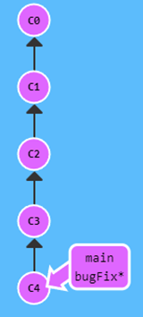

- A branch is simply a pointer to a [[Commit]].
  Commits chain up to form a [[Commit History]], so the branch history is just the commit history for the commit pointed to by the branch.
- Creating a new branch
  
  ```bash
  git branch mybranch
  ```
  creates a new branch ``myBranch`` at the commit the [[HEAD]] is pointing to.
- Branch forcing
  Forcibly moves a branch pointer to point to a given [[Commit]] or if given a branch, then its latest commit.
  Syntax:
  ``git branch -f <branchName> <commit/branchName>`` 
  
  For ex.:
  For this [[Commit History]],
  
  
  ```bash
  git branch -f main C2
  ```
  will move branch ``main`` to ``C2``.
-