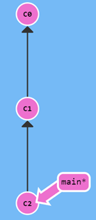
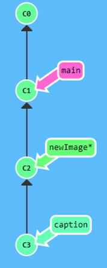
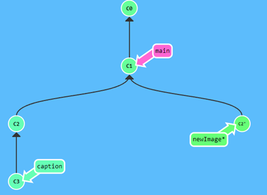

- A commit is a snapshot of all the tracked files, it basically contains the delta (change) made on the files from the previous commit. This way the commits are light. These commits are stored in a history.
  
  A sample git repo’s history looks like so
  
  
  Here the local [[Branch]] ``main`` is on ``C2`` commit which is the child of ``C1`` which is the child of ``C0``.
  ``C0``, ``C1`` and ``C2`` are the the commit hashes, they are automatically generated.
  
  ```bash
  git commit -m Yo 
  ```
  
  will commit another commit with message ``Yo`` to local [[Branch]] main, which is at ``C2`` right now, so maybe the next hash will be ``C3`` and it will be the child of ``C2``.
- Amend
  
  ```bash
  git commit --amend
  ```
  
  Creates a new commit and puts it below the parent of current [[HEAD]] then makes [[HEAD]] point to it thereby replacing the old commit in the [[Commit Graph]].
  In other words,  ``amend`` _edits_ or rather, _replaces_ the current commit with a slightly modified commit.
  
  For ex.:
  
  In this commit chain, if [[HEAD]] is at ``newImage`` [[Branch]] and we do
  ```bash
  git commit --amend
  ```
  Then it creates this graph
  
-