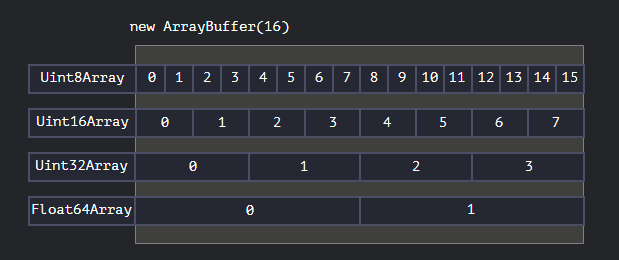

- This [[Class]] provides access to a fixed contiguous <given length bytes> area in the memory for storing raw binary data directly. It has nothing to do with [[Array]]. 
  
  To create an ArrayBuffer, we can use ``new ArrayBuffer(<size>)``, this reserves a fixed given no. of bytes in the memory and fills the region with 0s.
- To modify data in an ArrayBuffer, we need to define how to parse the given byte array
  
  
  These classes are called ``View`` Classes or ``TypedArray``s ([spec](https://tc39.github.io/ecma262/#sec-typedarray-objects)).
  
  These are the classes that can get/set the Arraybuffer's contents, like ``UInt8Array`` reads each byte individually as a [[Number]] (the name says, read 8 bits as an unsigned int).
  
  Each index in the ArrayBuffer is a byte, so the possible values are $$2^8$$ as a byte has 8 bits, so 0 to 255. If we assign any value greater than the allowed value for an index, it wraps around.
  
  For ex.:
  
  ```js
  let buffer= new ArrayBuffer(16);
  let view= new UInt8Array(buffer);
  console.log(view.length); //prints 16, for 16 locations to store stuff
  console.log(view.byteLength); //the total size in bytes
  view[0]=2;
  
  for(let num of view){
   console.log(num); //prints 2 then prints 0, 15 times
  }
  ```
  * These are the TypedArrays
  ``Uint8Array``, ``Uint16Array``, ``Uint32Array`` 
  ``Uint8ClampedArray`` : Doesn't wrap around but clamps, i.e., if value >255, it stores 255, similarly any value <0 stores 0.
  ``Int8Array``, ``Int16Array``, ``Int32Array``
  ``Float32Array``, ``Float64Array``
  
  
  * There's 5 variants of the TypedArray's arguments
  ```js
  new TypedArray(buffer, [byteOffset], [length]); //where "TypedArray" can be any of Int8Array,UInt8Array etc.
  new TypedArray(object); //the object can be an Array too like new Int8Array([0,1,2,5]);
  new TypedArray(typedArray);
  new TypedArray(length);
  new TypedArray();
  ```
  There's no class called TypedArray, this is just a term for the View classes.
  This is also to say, a TypedArray can create a buffer if it doesn't already exist and then provide access over it.
  
  * TypedArrays are just views over the ArrayBuffer, they can't delete a region or add new memory (nor can ArrayBuffer) etc.
  They can do other things like map, reduce, find etc.
  
  * DataView
  This is a bit more flexible View over the ArrayBuffer, hence called an ``Untyped view``.
  We can create an Object with ``new DataView(buffer, [byteOffset], [byteLength])`` where the buffer has to be created and assigned explicitly.
  
  For ex.:
  ```js
  
  let buffer = new Uint8Array([255, 255, 255, 255]).buffer;
  
  let dataView = new DataView(buffer);
  
  console.log( dataView.getUint8(0) ); // 255
  
  console.log( dataView.getUint16(0) ); // 65535 (biggest 16-bit unsigned int)
  ```
-
-