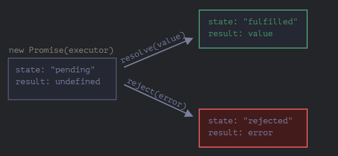
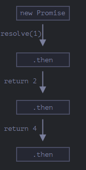
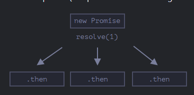
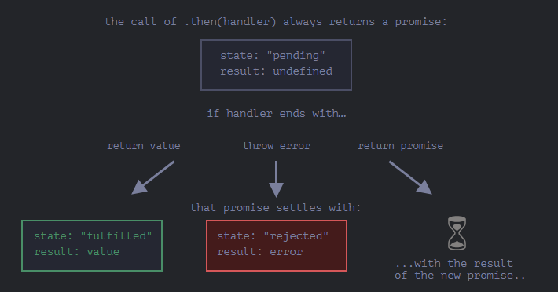

alias:: Async

- JS supports async, albeit weakly. This is because JS is a single-threaded language. That is, all JS code in a script can only ever execute on a single thread. Various [[Optimization]]s to the execution and how [[V8]] works ensure the execution remains smooth but it remains on a single thread per process. 
  Node introduces the concept of [[Web Worker]]s which do multi-threading but that is done by spawning other processes, each process has an overhead associated with it, and a thread, this thread is then monitored by a main thread in another process and that is how multi-threading is achieved but true multi-threading is there in JS (or it is, idk yet).
- ``Callbacks``
  Normal [[Function]]s that are passed to other functions and are then executed from these functions when they are finished processing whatever they had. 
  This approach is simple enough but it leads to a huge bloat named ``Callback Hell`` as we can have multiple levels of nesting with these and if they also include something like [[Error]] Handling, it adds complexity.
- ``Promise``
  JS natively supports promises, these are like so
  ```js
  let promise = new Promise(function(resolve, reject) {
    // executor (the producing code, "singer")
  });
  ```
  The function passed to the Promise is called the ``executor`` and it accepts 2 callback [[Function]]s, ``resolve(value)`` and ``reject(error)``, both of these are implicitly passed by the ``Promise`` [[Class]]. However, executor has to call these with the result, if it was a success the ``resolve(...)`` should be called and for an error, ``reject(...)``. 
  
  The executor is ran automatically by the Promise.
  
  For ex.:
  ```js
  let promise = new Promise(function(resolve, reject) {
    resolve("done");
  
    reject(new Error("…")); // ignored
    setTimeout(() => resolve("…")); // ignored
  });
  ```
  
  
  * The Promise is ran automatically so it has 3 states, 
   ``Pending``
  ``Successful``
  ``Failed``
  and the success or failure is determined by which callback was called by us, either resolve or reject.
  However, the state can only change once after Pending, so if the executor calls ``resolve(...)`` then the Promise's state is successful and it can't change, even if we call ``reject(...)`` later. However, it will process the rest of the body, it just won't be able to change the state.
  
  The result obtained after the executor's execution is the value passed to either the ``resolve(...)`` or ``reject(...)``. Both the result and state are internal properties of the Promise [[Object]].
  
  * An executor can call ``..reject(...)`` in 2 ways, either explicitly or it is called implicitly if there's an uncaught [[Error]] in the executor.
  Similarly, ``return`` also implicitly uses ``.resolve(...)``.
  
  * Producer and Consumer
  The Promise Object is an interface between a producer, which is the executor which produces some result and the consumer is a function that reads this produced value.
  To consume a promise, we use ``.then(<func1>,<func2>)``, ``.catch(err)``, ``.finally()`` on the Promise' object. These 3 methods are known as ``Promise Handlers``.
  For ex.:
  ```js
  let promise= new Promise(...);
  promise.then(
  function(result) {},
  function(rejectedValue){},
  ); //And they do as they are named.
  
  promise.catch(
  function(err) { },
  );
  
  promise.finally(
  function() {
  ...
  }
  );
  ```
  For ``.then(...)``, if the state was successful then the first callback is called, otherwise the second. Both are optional.
  ``.catch(<func>)`` is a shorthand for ``.then(null, <func>)``.
  ``.finally(<func>)`` is ran despite the state and it is a [[monad]], i.e., it returns the same object back allowing us to passthrough the promise events.
  For ex.:
  ```js
  new Promise(...)
  .finally(() => {})
  .then(result=> console.log(result)
  );
  ```
  Here after the Promise is finished, ``.finally(...)`` is ran then ``.then(...)`` is ran.
  
  We don't need multiple ``.catch(...)``, or in other words, ``.then(null, rejects)``. if we have a single ``.catch`` in a promise chain, then it's ``reject`` method is used and the error is considered handled. If there are multiple ``.catch`` then the nearest one is used and then the rest of the chain continues.
  For ex.:
  ```js
  new Promise(...)
  .then(...) //then's without a reject handler
  .then(...)  //assume this one has an error
  .then(...) //assume it doesnt have a reject handler too
  .catch(...) //will be triggered
  .then(...) //will be executed normally, i.e., the catch didn't halt the chain.
  ```
  But the key point is, there must always be a ``reject`` handler at the end using either ``.then`` or ``.catch``, errors that are unhandled crash the whole script in JS and raise an ``unhandledrejection`` [[Browser Event]] in the [[Browser]].
    
  
  * We can have a Promise executed immediately too, such are Promises that have no async code inside them.
  For ex.:
  ```js
  let promise = new Promise(resolve => resolve("done!"));
  ```
  Handlers attached to a resolved promise are executed immediately.
  
  * Thenable
  The Promise Constructor and ``.then(<func1>, <func2>)`` handler return a ``Thenable``, this is an Object that also has a ``.then(<func1>, <func2>)``, which also returns a Thenable and so on. The logic is, we can chain these Thenables to process events one after another modularly. 
  It looks like so
  
  ```js
  class X {
   constructor(value) {
   this.value= value
   }
   then(resolve,reject) {
    try {
      return X(resolve(value))
     } catch(err) {
      return X(reject(value))
    }
   }
  }
  
  let x= new X(2);
  x.then(
  function(result) { return 4;}, //result gets 2
  function(rejectedValue) { } //same
  ).then(
   function(result) { return 5;}, //result gets 4 after previous then is finished processing
   function(rejectedValue) { } //same
  );
  //and so on
  ```
  The flow looks like so
  
  
  This is kind of how ``Thenable`` returned by a promise works too, a big difference is that the thenable returned by a Promise is actually just the Promise class itself, this is why its called ``Promise Chain``. 
  Note: Chaining thenables is not the same as assigning multiple ``.then``'s to an object. 
  Each would finish and not recieve value from its predecessor but only the main object,
  for ex.:
  ```js
  ...
  x.then(..);
  x.then(...);
  ```
  would have a flow like so
  
  
  Ofc, since thenables just return whatever their callbacks return but wrapped in a Thenable, this means we can return anything, even another Promise which also returns a Thenable
  For ex.:
  ```js
  let x = new Promise(...)
  .then((result)=> new Promise(...))
  .then(...);
  ```
  works. And works like expected, until the first promise is resolved the first ``.then(...)`` isn't executed and the same for the second one.
  Kind of like so
  
- Promise API
  Provides other features to work with Promises.
  ``Promise.all(<iterable>)``: Takes an [[Iterable]] of executors and processes them all concurrently, when all the executors are finished, then the handlers are executed. Can accept raw values, Promises and normal functions. When any one of the executors fail or reject, all other executors are halted and the rejection passed to the handlers. The value to the resolve handler is also an iterable, of results.
  ``Promise.allSettled(<iterable>)``: Same as ``.all()``, except doesn't halt and lets all executors finish then passes an [[Object]] to the handlers with results where each result Object is
  *`{status:"fulfilled", value:result}` for successful responses,
  *`{status:"rejected", reason:error}` for errors.
  Yes, this means, reject isn't called after ``.allSettled()``
  ``Promise.race(<iterable>)``: Waits as long as the first executor finishes, then immediately halts all others and passes the result to handlers.
  ``Promise.any(<iterable>)``: Similar to race, but waits as long as an executor with success state is finished. If all executors fail, then an ``AggregateError`` Object is returned with a list of errors.
  ``Promise.resolve(<func>)`` and ``Promise.reject(<func>)``: Returns a Promise with its state already set at success or failure despite whatever the passed callback function does.
  
  Promisification
  We can turn normal functions into Promises, this is called Promisification and is helpful when when want to turn sync code async.
  Other than manually writing helper functions that do so, we have [es6-promisify](https://github.com/digitaldesignlabs/es6-promisify) and ``util.promisify`` in Node.
-
- Async/Await
  Using the [[Operator]] ``async`` on a [[Function]] turns its body into an executor of a Promise.
  The await [[Operator]] is used on a Promise and pauses the execution until the Promise is finished, yes since this pauses the execution, or in other words, suspends the function, it can't be used in the macrotask [[Message Queue]] directly and can only be used inside Promises (or async functions). Then after the Promise is finished, it's returned value is returned by await.
  For ex.:
  ```js
  async function noo() {
   return 2;
  }
  async function yo() { 
   let x = await noo(); //pauses yo until Promise function noo() is finished, then puts 2 in x.
   return 1; 
  } 
  //is the same as
  /*
  new Promise(function(resolve,reject){
     let x = await noo();
     resolve(1);
  });
  */
  
  yo(); // Puts yo() in the microtask queue
  let x = await noo(); //also works if this script is a Module
  ```
  We can ``await`` in the top-level [[Scope]] of [[Module]]s.
  
  * async can also be used with methods.
  * If the Promise being awaited fails with an error or reject, then await rethrows the [[Error]].
  But since it can only be used in Promises itself, we can ``catch`` it quite easily.
  For ex.
  ```js
  async function yo() {
    throw new Error();
  }
  async function no() {
    let x = await yo();
  }
  no().catch((er)=>{...}) ; //since no() returns a Promise itself, we can use the Thenable of Promise to handle the error.
  ```
  We can use a simple ``try{...} catch{...}`` above an await too.
-