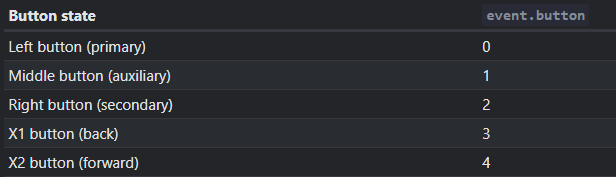
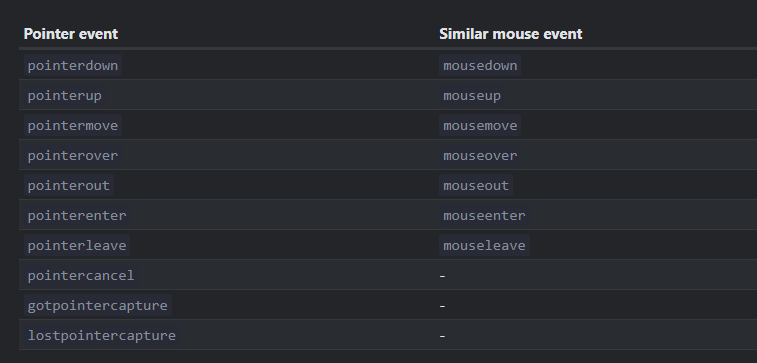
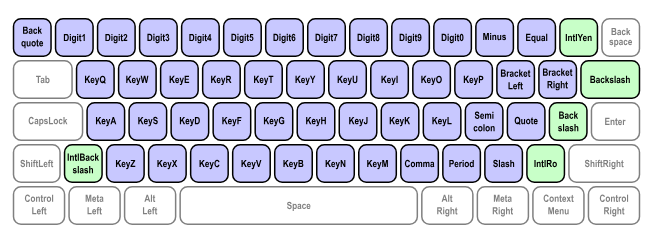

- The main event types are: [Event Interfaces](https://developer.mozilla.org/en-US/docs/Web/API/Event#interfaces_based_on_event) and then each type defines events that use the interface/blueprint of the type.
- ``click``
  When an element receives a left click.
- ``contextmenu``
  When an element receives a right click.
- Mouse Events
  Events that are of the ``MouseEvent`` [[Class]], they map all the common mouse actions such as ``click``, ``dblclick``, ``mousedown``, ``mouseover`` (when a mouse comes over an element), ``mouseout`` (when a mouse leaves an element) etc.
  
  All events triggered by mouse and are instance of ``MouseEvent`` have a ``.button`` property which is a [[Number]] as in this table
  
  Similarly, there's a deprecated ``.which`` property.
  
  There's also a ``.buttons`` property which is a bitmask of all the mouse buttons pressed at the time of event.
  
  * Modifier Keys:
  If any one or more of the modifier key is pressed, a property with its same name is true.
  Modifier Keys are
  ``altKey``,``shiftKey``, ``ctrlKey`` and ``metaKey`` (Cmd on Mac).
  
  * Touch
  Common Touch actions are automatically translated by [[Brower]]s to ``MouseEvent``, like single tap on an element is a ``click`` and long hold is a ``contextmenu``. But they also trigger Touch Events and Pointer Events. 
  
  * Coordinates
  MouseEvent class also has pageX/pageY and clientX/clientY [[DOM]] property to denote the cursor position at the time of the event.
  
  * Drag and Drop
  ``dragstart`` and ``dragend`` for when a mouse holds left click over an element and drags it around.
-
- ``copy``
  This event is triggered whenever user tries copying an element.
- Pointer Event
  This Class encompasses both Touch and Mouse Events. It is recommended to use this when a standard behavior is expected. Class is ``PointerEvent``.
  It has properties like 
  ``pointerId``: Unique [[Browser]] generated Id per pointer, useful in multi touch screens.
  ``pointerType``: A [[String]] from "pen", "mouse" or "touch"
  ``isPrimary``: Boolean, true if the left click or the first finger has triggered the event
  ``width`` and ``height``: The size of the touch, for mouse it is always 1.
  ``pressure``
  ``tangentialPressure``
  ``tiltX/Y`` and ``twist``
  
  Mapping Pointer Events to Mouse Events
  
  
  ``pointercancel`` is triggered when a pointer interaction is ongoing and it is abruptly disturbed, such as when the device orientation changes, or the pointer hardware was disabled etc.
  
  * Pointer Capturing
  We can bind a pointer to a [[DOM]] node, this is done using ``<node>.setPointerCapture(<pointerId>)`` and now any pointer event where the pointer has this pointerId, anywhere, targets its events to this node. This capturing also triggers an event, ``gotpointercapture``.
  This binding can be removed with ``<node>.releasePointerCapture(<pointerId>)``, or automatically if the node is removed or ``pointerup`` or ``pointercancel`` event is triggered. And this releasing also triggers an event, ``lostpointercapture``.
- Keyboard Events
  They use the ``KeyboardEvent`` class and common events that use it are, ``keydown``, ``keyup`` etc.
  
  Instances of this class have 2 important properties, ``.key`` and ``.code``. ``.key`` is a string that contains the exact character that initiated the event.
  So for ``z`` it is ``"z"``, for ``Shit+z`` which is ``Z`` it is ``"Z"`` and so on. It will correctly represent languages and their characters.
  The ``.code`` is a case-insensitive mapping code for the key, no matter the language or case, if the position of the key is the same as given here in [specs](https://www.w3.org/TR/uievents-code/#keyboard-sections) it will be the same as shown in the image. 
  
  
  For alphabets it is ``Key<char>``, for digits it is ``Digit<digit>`` and for special keys it is the name itself like ``"Enter"`` etc. 
  For ex.: 
  ``z`` will be ``"KeyZ"``, ``Z`` will be ``"KeyZ"`` and so on.
  However, the ``.code`` is always distinct for a different place on the keyboard, so ``Shift`` will be ``"Shift"`` in ``.key`` despite being right or left ``Shift`` whereas ``"ShiftLeft"`` or ``"ShiftRight"`` will the value in .``code``
  
  * ``.repeat``: Boolean, if the key was held down and repeatedly triggered the ``keydown`` event, then this Boolean becomes true.
  
  * Preventing Default [[Browser Event]] handler on ``keydown`` handlers is able to stop most of the automatic actions such as ``Ctrl+s`` to save etc. but the [[Browser]] won't stop ``Alt+F4`` and other system keys.
  
  * Legacy properties like ``keypress``, ``keycode``, ``charCode``, ``which`` also exist but they are deprecated.
  
  * The ``Fn`` key has no mapping in the browser, the browser can simply not catch ``Fn``.
- ``scroll``
  Event is triggered when scroll is initiated. As we know from [[DOM]], we can use ``<event Object>.preventDefault()`` or ``<event Object>.preventImmediateDefault()`` to prevent scrolling but we can also do the same through Keyboard or Mouse Events to prevent the scroll.
- ``focus`` and ``blur``
  The ``focus`` event is triggered when an element receives the user's focus (the user clicks on it or presses ``Tab`` key) and the ``blur`` event when it loses the focus.
  
  We can use [[DOM]] methods to do the same as well with ``<node>.focus()`` and ``<node>.blur()``.
  The [[HTML]] attribute ``autofocus`` gets the focus on an element whenever the Document loads.
  
  * ``blur`` is triggered after the focus is lost, so we can't prevent its default to prevent focus loss.
  
  * Focus/Blur generally only works by default on [[HTML Element]]s that take some input/interaction but elements like ``div``, ``p`` etc. are unfocusable hence these events are never triggered for them.
  
  * The ``tabindex="<number value>"`` HTML attribute allows any element to be focusable and its value defines its priority and focusability.
  If ``tabindex`` ==  "-1", then it is only focusable by manual focus.
  If ``tabindex`` ==  "0", then it is focusable and doesn't alter focus priority.
  If ``tabindex`` >= "1", the lower the value, the higher the priority, and then pressing ``Tab`` would switch to the next same or lower priority element, so if there are 2 elements, one has value of "1" and other has "2" then if we press ``Tab`` the focus will jump to the "1" and then if we do it again it will switch to "2" and so on. 
  After the higher priority elements have got and lost focus, the elements with "0" are focused.
  
  We can set the same attribute using the [[DOM]]'s ``<node>.tabIndex`` property.
  
  * Focus/blur don't Bubble up, but they do go down in the capturing phase. 
  There's also ``focusin`` and ``focusout`` which do bubble and capture down but their handlers must be assigned with ``<node>.addEventListener(...)``.
- ``change``
  This event is triggered when an element has finished changing. Like after an ``input`` [[HTML Element]] loses focus.
- ``input``
  This event is triggered every time after a value is modified by the user. It is triggered after the modification so preventing default doesn't work.
- ``cut``/``copy``/``paste``
  Triggered when their actions occur. We can prevent default to abort the intended action.
  These events can only be user-initiated and are of ``ClipboardEvent`` class.
  
  These events have ``<event Object>.clipboardData`` which has the clipboard data but only in the context of the browser, and we can use ``.getData("text/plain")`` to get its data in plain-text. More details in the [spec](https://www.w3.org/TR/clipboard-apis/#clipboard-event-interfaces).
- Resource elements have ``load`` and ``error`` events
  ``load`` is triggered after the resource has been successfully loaded, and ``error`` otherwise.
-