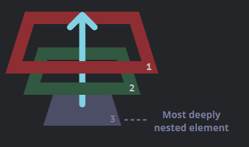

- An event is a signal and most things in [[Browser]]s generate events. There are events generated by [[DOM]] nodes, [[CSS]] property changes such as changes in CSS [[Animation]]s, mouse events generated by the browser itself etc.
  
  We can assign ``handlers`` to all events, these are [[ECMAScript]] [[Function]]s which are executed whenever an event is triggered.
- [[Browser Event List]]
- Assigning event handlers
  There can only be a single event handler for any event. 
  
  We can assign an event handler to an [[HTML Element]] directly using the ``on<eventname>=<func>()`` attribute which is a common attribute.
  
  For ex.:
  ```html
  <input value="Click me" onclick="alert('Click!')" type="button">
  <!-- or -->
  <input id="x" value="Click me" onclick="yo()" type="button">
  
  <script>
  function yo() {}
  </script>
  ```
  The HTML attribute copies the body of the value of an event handler to a method and then calls that method instead. So, 
  ``onclick=yo()``
  becomes
  ```js
  x.onclick=function(event) {
  yo();
  }
  ```
  The ``event`` Object is always passed, this is why we can use it directly in the attribute's value too.
  
  Similarly we can assign using [[DOM]] by using any ``node``'s ``on<event name>`` property.
  ```js
  let elem=...;
  elem.onclick= function(){};
  
  elem.onclick= null; //to unassign an event handler
  
  function yo(){}
  
  elem.onclick=yo; //works, notice the lack of ()
  ```
  If the HTML attribute assigns an event handler, then it is available in the DOM.
  We can't assign event handlers using ``<node>.setAttribute(...)``.
  
  * Whilst a single event can only have a single event handler, we can have handlers that call multiple handlers, this is already implemented with ``<node>.addEventListener("<event name>", <handler func or Object>, <optional options>)`` and ``<node>.removeEventListener("<event name>", <handler func or Object>, <optional options>)``
  For ex.:
  ```js
  let elem=...;
  function yo(){}
  elem.addEventListener("click",yo);
  elem.removeEventListener("click",yo); //ok
  ```
  The ``.removeEventListener(...)`` must be called with the exact same args to work. And since there's no way to read all the assigned handlers for a node, if we assign an anonymous [[Function]], it will never be removed.
  
  The optional options is an [[Object]] that can have these properties
  ``once``: Boolean value, removes listener after a single trigger.
  ``capture``: Boolean, the phase of the event where this listener will be triggered. If default/false, the handler is executed on the bubbling phase otherwise the capturing phase.
  ``passive``: Boolean, if true, it denotes that the handler wouldn't call ``<event Object>.preventDefault()``.
  
  The ``passive`` property is an optimization that allows browsers to not anticipate a ``preventDefault()`` call from an event handler, thereby optimizing the event flow.
  
  Some events can only be assigned handlers through these methods, such as ``DOMContentLoaded``. Furthermore, it is advised to use these methods to add/remove handlers from the ``document`` DOM Object directly.
  
  The handler can be an [[Object]] too, in which case the object's ``handleEvent(event)`` is called.
  
  These methods guarantee the order of execution from the order of declaration given the handlers are assigned for the same phase. 
  For ex.:
  ```js
  elem.addEventListener("click", e => alert(1)); // guaranteed to trigger first
  elem.addEventListener("click", e => alert(2));
  ```
- Event handler's [[this]], except for arrow [[Function]]s, is always assigned the [[DOM]] node.
- Events propagate in [[Brower]]s
  That is, they flow into other elements.
  [DOM Events](https://www.w3.org/TR/DOM-Level-3-Events/) describe there to be 3 ``phases`` of event propagation
  * Bubbling Phase: The event flows upward, from the most nested element to the least nested element.
  * Capturing Phase: The event flows downward, from the least nested to the most nested element at which the event occurred.
  * Target Phase: The event is at the element
  Like so
  
  
  Here the ``td`` element is the recipient of the event.
  
  As we can see, every event propagates in both directions.
  
  By default, event handlers only handle events bubbling up.
  By setting the ``capture`` [[Boolean]] to true for the ``<node>.addEventListener(...)`` we can switch to the capturing phase instead.
  
  * We can call ``<event Object>.stopPropagation()`` to stop the bubbling and capturing at the current element.
  If there are multiple handlers on the event in this element, they are still ran. We can call ``<event Object>.stopImmediatePropagation()`` to stop propagation and prevent any other handler to be executed. 
  However it is recommended to only stop bubbling/capturing if explicitly required as there are obvious behaviors.
- Bubbling
  When an event occurs on any [[HTML Element]], it triggers the most nested element's handler then the event bubbles up and triggers the parent element's handler and so on. 
  
  For ex.:
  ```html
  <form onclick="alert('form')">FORM
    <div onclick="alert('div')">DIV
      <p onclick="alert('p')">P</p>
    </div>
  </form>
  ```
  Here if we click ``P``, we would first get ``P`` then ``div`` then ``form``.
  Like so
  
  
  Almost all events bubble, some events like ``focus`` don't. However, the amount of bubbling is variable, some events reach all the way from elements to ``html`` to ``document`` then to [[window]], but others stop at ``html`` and so on.
- The ``event`` [[Object]]
  This event is passed to all event handlers and has some properties on it set to better describe the events.
  Common properties are
  ``.type``: The event name
  ``.currentTarget``: The [[HTML Element]] or [[DOM]] node that handled the event.
  ``.target``: This is a [[DOM]] node where the event occurred, this allows us to see if an event bubbled up or originated at the current node. 
  In an event handler, [[this]] is the DOM node at which the handler is ran, and now we know ``.target`` has the node where the event occurred so we can compare these 2 to check where the event occurred.
- The bubbling/capturing allows us to assign a single event handler on the ``document``, then check if the event occurred on a specific [[HTML Element]] by either checking their ``id`` or ``tagName`` or custom attribute and then execute some functionality for them centrally without assigning an event handler for each element separately.
- Event handlers can return values but they are generally ignored.
- Browser Default Actions
  Browsers perform some default actions like navigating to url on click of ``a`` [[HTML Element]].
  We can prevent these in 2 ways:
  Assigning custom handler to the event and doing ``<event Object>.preventDefault()``.
  Assigning handler using ``on<event>`` either through [[DOM]] or [[HTML]] attribute and returning ``false``.
  For ex.:
  ```js
  menu.onclick = function(event) {
    if (event.target.nodeName != 'A') return;
  
    let href = event.target.getAttribute('href');
    alert( href );
  
    return false; // prevent browser action (don't go to the URL)
  };
  ```
  
  * Default Action event propagation is different from normal bubbling/capturing. The former only triggers the browser inbuilt event handlers, the latter triggers both. 
  ``.preventDefault()`` only stops default action event propagation. 
  The other event handlers can use ``<event Object>.defaultPrevented()`` to get a bool is true if the default event propagation was prevented.
- Some events flow into other events, such as ``mousedown`` event also triggers ``focus`` event. These are also part of browser default actions, so if we do ``<event>.preventDefault()``, these don't occur.
- Custom Events
  We can generate custom events as well as trigger predefined events using [[ECMAScript]].
  
  To create a custom event we use the ``Event`` Class. It has the args ``let event = new Event("<type>", <optional options Object>);``
  * ``type``: The name/type of the event, can be a predefined event, like "click" or custom.
  * Options: An [[Object]] that can have these properties
  ``bubbles``: Boolean, if true the event bubbles.
  ``cancellable``: Boolean, if true then the default action event may be prevented.
  Both are false by default.
  
  Then, to fire an event on an [[HTML Element]], we use ``<node>.dispatchEvent(<event Object>)`` from the [[DOM]].
  
  For ex.:
  ```html
  <button id="elem" onclick="alert('Click!');">Autoclick</button>
  
  <script>
    let event = new Event("click");
    elem.dispatchEvent(event); //works
  </script>
  ```
  Here the ``click`` event is triggered on ``"elem"`` and it doesn't bubble up. 
  
  * ``<event Object>.isTrusted`` is a property for event Objects and is false for custom triggered events.
  
  * The ``Event`` class is the most base class for all event types. There are more specialized [event interfaces](https://developer.mozilla.org/en-US/docs/Web/API/Event#interfaces_based_on_event) which we can use for more specialized event types. Such as ``new MouseEvent(...)`` would generate a mouse event. 
  
  * There's also ``CustomEvent`` [[Class]] which is meant specifically for custom events. It is the same as the base ``Event`` class, but has 1 change and that is that its ``Options`` Object also recognizes an additional property ``detail`` which can have any type of value and is passed with the event.
  Technically, we can add custom properties to the normal Event and they will be passed around as well but using this class is recommended for truly custom events.
- Events in the [[Message Queue]]
  Events are synchronous, so if ``click`` event occurs and then immediately after it ``contextmenu`` occurs then the latter is queued up so the handlers for the ``click`` event will be called first then the ``contextmenu`` handlers.
  The only exception is when an event handler itself triggers another event, then the event is not queued up and its handlers are processed immediately. 
  We can use [[Scheduling]] to trigger an event from an event and have it processed afterwards.