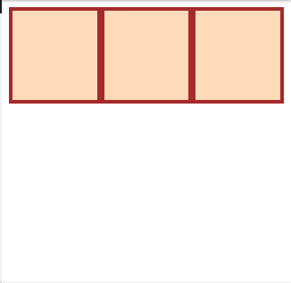
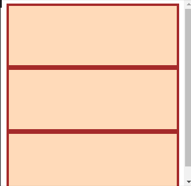
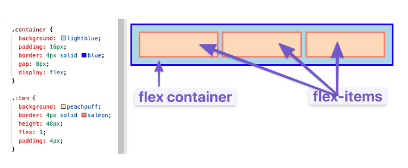
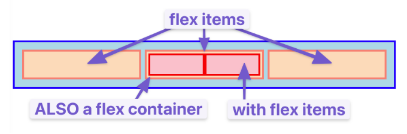
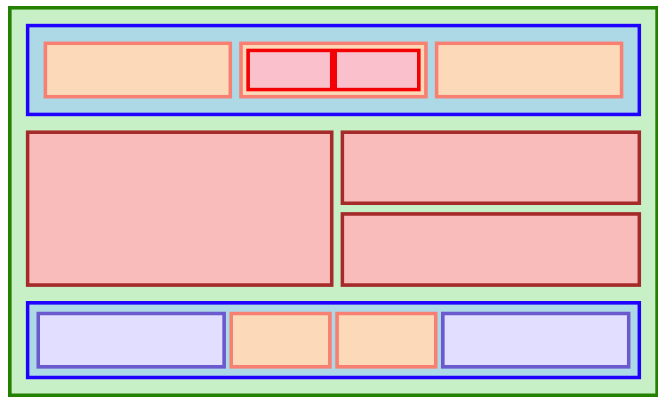
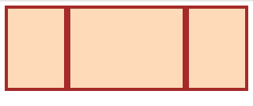
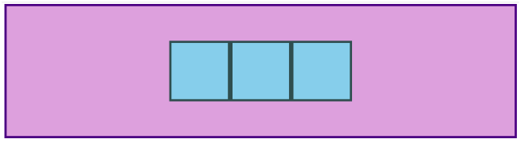

- As defined in [CSS Properties List MDN](https://developer.mozilla.org/en-US/docs/Web/CSS/Reference)
  [[CSS]]
- Shorthand
  Some CSS Properties are shorthand for accessing multiple properties.
  For ex.: 
  ``padding`` is a shorthand for ``padding-top``, ``padding-right``, ``padding-bottom`` and ``padding-left``. 
  So a value like ``padding: 20px 30px 50px 40px`` assigns value to all 4 of these properties.
- ``padding``
  Sets the padding.
  For ex.:
  ```css
    padding: 0 20px 20px 20px;
  ```
  Defines padding in TRBL. 
  Can specify 1 (all sides), 2 (top and bottom take first, left and right take second), 3(TRB) or 4(TRBL) values.
  
  More details: [MDN](https://developer.mozilla.org/en-US/docs/Web/CSS/padding#syntax)
- ``margin``
  Same as padding but defines the margins.
  These properties can also take a value of ``auto`` which divides the remaining space on the axis equally.
  For ex.:
  ```css
    margin: 0 auto;
  ```
  Gives 0 margin to top and bottom and then equally divides left and right space for the element.
  This ``centers`` the element horizontally.
- ``border``
  Defines the size, line style and color of the [border](https://developer.mozilla.org/en-US/docs/Web/CSS/display).
  For ex.:
  ```css
  border: 5px solid black;
  ```
  Sets the border line width as 5px, line style as solid and border line color as black.
- ``display``
  A box in CSS around any [[HTML Element]] is treated as either ``inline`` or ``block`` [Flow Layout](https://developer.mozilla.org/en-US/docs/Web/CSS/CSS_flow_layout).
  Inline basically means it is treated as it is a part of an ongoing text, like the word ``yo`` is inline in this paragraph. So text and other content simply wraps around in the text direction of an inline element.
  
  Block elements are those that are treated as Blocks, much like how this paragraph and the previous one are their own ``Blocks``.
  
  These are the outer display types, there's also the inner display types. We can set both for a given using this property. [display](https://developer.mozilla.org/en-US/docs/Web/CSS/display)
  For ex.:
  ```css
  display: block; /*Sets the outer display type to block.*/
  display: flex; /* Sets the inner display type to flex. */
  display: inline-flex; /* Sets both*/
  ```
  The inner display types define how the children are laid out, it can be either flow, grid or flex (creating a flexbox).
  
  For ex.:
  ```css
  img {
    display: block;
    margin: 0 auto;
  }
  ```
  ``centers`` an img block, img is an inline element and this turns it into a block.
- Positioning
  CSS can define where and how an element is positioned on the page. This is done using the [position](https://developer.mozilla.org/en-US/docs/Web/CSS/position) property which defines the type of position, a value from 
  ``fixed``: Fixed to the viewport. So no space is created for the element in the Document and then offset by LTRB. Can be thought of as fixed from the current window's top left.
  ``static``: Positioning according to the flow of the document, so if its ``display is ``inline/block then it applies normally. LTRB doesn't affect it.
  ``relative``: Like static, then it is offset by LTRB but without moving other elements.
  ``sticky``: Kind of like fixed but fixed to the nearest scrolling element.
  ``absolute``: Like fixed but fixed to the nearest element with the ``position`` property set and then affected by LTRB. 
  
  This property is combined with any or all of the properties ``left``, ``top``, ``right`` and ``bottom`` (LTRB) to finally determine the actual position of the [[HTML Element]].
  For ex.:
  ```css
  position: relative;
  top: 40px; 
  left: 40px;
  ```
- FlexBox
  [Reference](https://www.theodinproject.com/lessons/foundations-growing-and-shrinking)
  
  A relatively new way of arranging [[HTML Element]]s.
  By having the value ``flex`` for the ``display`` css property, we make an HTML element a *Flex Container*. And it's children are called *Flex Item*s. FlexBox is a way of defining both these.
  This is a container element, meaning this HTML element can have multiple direct children.
  
  This is an incredibly flexible container that can automatically resize itself based on its children, then it automatically resizes its children to fit with each other and it can also adjust the children's children.
  
  For ex.:
  For this HTML
  ```html
  <div class="flex-container">
    <div class="one"></div>
    <div class="two"></div>
    <div class="three"></div>
  </div>
  ```
  If we style the elements like so
  ```css
  .flex-container {
     display: flex; 
  }
  
  /* this selector selects all divs inside of .flex-container */
  .flex-container div {
    background: peachpuff;
    border: 4px solid brown;
    height: 100px;
     flex: 1; 
  }
  ```
  Then we get this
  
  
  And if we remove the ``display:flex`` we would get
  
  where it's using the whole space of the viewport to lay out the elements.
  
  
  * The Flex Container: The element that uses the ``flex`` property is called a Flex Container, and its children are called flex items.
  
  
  The children theirselves can be flex containers and the parent flex container and adjust their flex items too.
  
  
  By just using FlexBox, we can create all sorts of layouts.
  
  
  
  * ``flex`` Property: 
  This is a shorthand CSS property for ``flex-grow``, ``flex-shrink`` and ``flex-basis`` respectively. These are defined on flex items to adjust them.
  
  ``flex-grow``: This defines the growth, or in other words in the size of an item in proportion to other flex items.
  By default the ``flex-grow`` is 1. So if an item gets a ``flex-grow`` of 2, it will be larger than the other items. 
  For ex.:
  
  
  ``flex-shrink``: This defines the shrinkness factor, which is also 1 by default. It is applied to the flex items when the size of the flex container is smaller than the sum of sizes of the flex items. Higher values of ``flex-shrink`` shrink a flex item more than the others.
  
  ``flex-basis``: Default is 0%. Defines the percentage of the flex items' ``width`` property to be added to the grow or shrink factor. That is, if the basis is ``0%`` then the flex items' width is ignored and the flex item grows or shrinks at the same rate as the other flex items, but if it is say ``5%``, then ``5%`` of the item's ``width`` is added to the shrinkness or growth factor and hence it grows or shrinks faster than other flex elements. There's another value, ``auto`` for it.
  
  
  The ``flex`` shorthand property can be given some values to get predefined values for all 3. 
  ``flex: auto``: is equivalent to ``flex: 1 1 auto``
  ``flex: 1``: is equivalent to ``flex: 1 1 0``
  
  * ``flex-direction``: Can be ``row`` or ``column``, default is ``row``. Defined for the flex container.
  This defines the direction the flex items in the container are laid out, be it horizontal or vertical. If they are laid out horizontally, which is default, their width is used for the other flex item properties, for vertical their height is used.
  The direction defined here becomes the *main axis*, whilst the other direction becomes the *cross axis* inside the container. These axes are used by normal [[HTML Element]]s and other CSS properties too.
  
  * ``gap``: Numerical unit. Defined on the flex container, it defines the spacing between the flex items. across the *main axis*.
- ``justify-content`` and ``align-items``
  The former, aligns the children of an [[HTML Element]] across its *main axis* whilst the latter aligns them across the *cross axis*. Values are some predefined strings, check intellisense.
  
  For ex.:
  ``align-items: center`` would align the items to the center of the cross axis. 
  If the main axis is horizontal, then this is the result
  