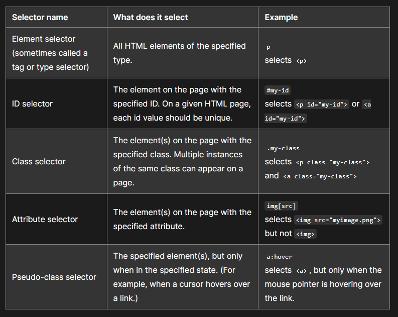
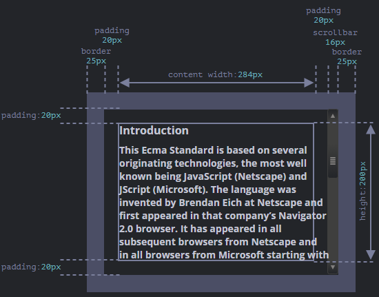
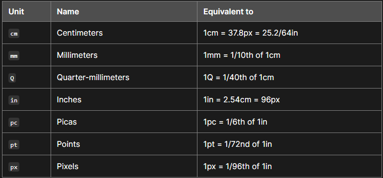
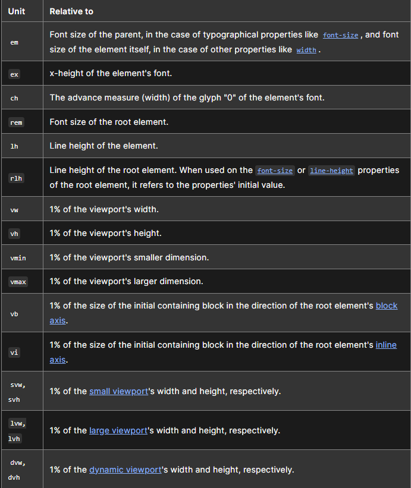

alias:: Cascading Style Sheets

- It is a language to specifically define styles. We use it in conjunction with [[HTML]] to define styles for 
  it. Here's the spec for [CSS](https://w3c.github.io/csswg-drafts/css2/)
- CSS can be defined inline, using the ``style="<css>"`` attribute of [[HTML]] elements or in the head [[HTML Element]] (embedded) or in a separate file .
  
  * External
  For ex.:
  For a file ``1.css``,
  ```css
  p {
    color: red;
    width: 500px;
  }
  ```
  And it is saved with ``.css`` extension. 
  Then to link an external ``.css`` file and use it in an [[HTML]] Document, we use the ``link`` [[HTML Element]]
  like so
  ```html
  <link href="styles/1.css" rel="stylesheet" />
  ```
  
  * Inline
  For ex.:
  ```html
  <div style="color:red; width: 500px;" > ... </div>
  ```
  
  * Internal/Embedded 
  ```html
  <head>
  p {
    color: red;
    width: 500px;
  }
  </head>
  
  <body> ... </body>
  ```
  And this CSS is applied to the current document.
  
  The priority of the CSS definitions go 
  Inline -> Internal/Embedded -> External CSS
  So if an HTML element gets the same style property from External, then it will be overridden by the Inline element if it also defines it. 
  For ex.:
  
  ```html
  <head>
  p {
  color: red;
  width: 500px;
  }
  </head>
  <body> 
   <p style="color:blue;"> </p>
   </body> 
  
  <!-- will apply color:blue and width:500px to p -->
  ```
- Components of a CSS ``ruleset``
  A CSS ruleset is a combination of a selector and a declaration block which looks like an [[Object]] but is simply a block that accepts ``Key:Value;`` pairs. 
  
  For ex.:
  
  is a ruleset.
  
  * The selector is matched against all elements and if an [[HTML Element]] matches the selector then the styles defined in the declaration block are applied to the element.
  We can have multiple selectors, 
  ```css
  p,
  h1,
  li {
  ...
  }
  ```
  applies the same declaration block to all multiple type of elements.
  There are more types of selectors 
  
  Defined here: [MDN](https://developer.mozilla.org/en-US/docs/Learn/CSS/Building_blocks/Selectors)
   
  
  * The property name and value is picked from [CSS Properties List MDN](https://developer.mozilla.org/en-US/docs/Web/CSS/Reference). Not all CSS properties are applicable to all HTML elements and this can be quite arduous to list, so it's best to check if a CSS property is applicable to an HTML element manually. Property value doesn't necessary need to be a single value though, it can accept a single value or multiple separated by ``,`` or just using `` `` and one property can even accept multiple types of values.
-
- Fonts
  We can include external fonts with the ``link`` [[HTML Element]]
  ```html
  <link
    href="https://fonts.googleapis.com/css?family=Open+Sans"
    rel="stylesheet" />
  ```
  Then, use it in css like so
  ```css
  html {
    font-size: 10px; 
    font-family: "Open Sans", sans-serif; 
  }
  ```
  uses the ``CSS Sizing`` for units.
- CSS Box Model
  CSS uses the box model for defining positions and sizes of and between elements.
  It looks like so
  
  
  So, for any [[HTML Element]] we can define the sizes for these properties and they will be affected as shown in the box model.
  
  For ex.:
  ```css
  body {
    width: 600px;
    margin: 0 auto;
    background-color: #ff9500;
    padding: 0 20px 20px 20px;
    border: 5px solid black;
  }
  ```
  sets the background color for the ``body`` [[HTML Element]] along with margin, width, padding etc.
- [[CSS Property]]
- Comment
  Using ``/* */``
- Computed And Resolved Properties
  Raw values that are provided to an element after all the CSS selectors and styles have been applied are called computed properties. Then, once they are finally adjusted to the environment they become resolved properties. The [[DOM]] has method to get these properties on any ``node``.
  
  The resolution process takes the environment into account which includes resolution, window size, dpi etc. and even other elements on the page.
  For ex.:
  For this html with the sizes defined
  ```html
  <div id="example">
    ...Text...
  </div>
  <style>
    #example {
      width: 300px;
      height: 200px;
      border: 25px solid #E8C48F;
      padding: 20px;
      overflow: auto;
    }
  </style>
  ```
  Will actually have sizes like these
  
  
  Here, since the scrollbar, which is added automatically by the browser, takes 16px the actual size taken up is 284px by the content.
- Units
  Units for length values in CSS are defined in either Absolute or Relative [units](https://developer.mozilla.org/en-US/docs/Learn/CSS/Building_blocks/Values_and_units).
  
  Absolute units
  
  
  Relative units
  
  
  We commonly use ``px`` for absolute and ``em``/``%`` for relative units.
-