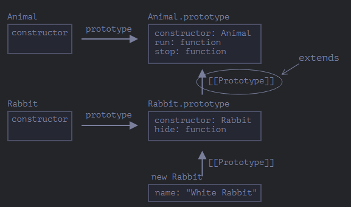
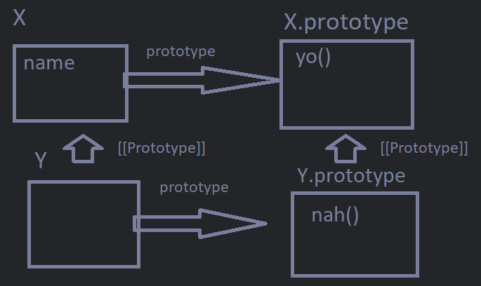

- A class in JS is a kind of [[Function]], which is just an [[Object]]. Still, it offers a lot of convenience and familiarity with classes in other language such as [[C++]].
- Classes are defined with the ``class`` keyword,
  For ex.:
  ```js
  class Yo {
  constructor() {} //notice the lack of commas unlike in Objects
  hi(){}
  } 
  
  let x = new Yo();
  x.hi();
  ```
  Then we can create ``Class objects`` (COs) with the [[new]] keyword. (A CO or class object or just object is different from an Object, ofc an object is still an Object but in terminology, a CO is different from an Object)
- Classes are just a convenience over [[Function]]s in JS
  For ex.:
  ```js
  class X{}
  
  console.log(typeof X); //prints Function
  ```
- When we create a CO with the [[new]] keyword, these 4 things happen
  * A [[Function]] with the same name as the class is created
  * The class' ctor function's body, if defined, becomes the body of this function
  * The default ``[[Prototype]]`` of the function gets augmented with the class' methods/properties as they become methods/properties of the [[Prototype Object]] of this function. 
  * Calls this function as a Ctor Function.
  For ex.:
  ```js
  class X{
   yo(){}
  }
  
  let x = new X();
  ```
  Here, a function named ``X`` is created, it has empty body, ``X``'s ``[[Prototype]]`` gets the method ``yo()`` in it, then this ``X`` function is called.
  So, the function ``X`` has ``X.prototype = {constructor: X, yo(){}}`` and we can check this too
  ```js
  class X{
   yo(){}
  }
  
  console.log(X === X.prototype.constructor); //true
  
  ```
  
  Remember, just like [[Function]] has ``.prototype`` so does a class, this ``.prototype``'s Object is assigned to the ``[[Prototype]]`` of the Object that is returned after ``new <Class>()`` is called.
- However, despite all that there are actual differences between classes and [[Function]]s. This is due to how JS applies many other things to classes, such as
  * ``[[IsClassConstructor]]``, this special internal property is implicitly set to true for classes and is referred at many places in JS, such as with [[new]].
  For ex.:
  ```js
  class X{}
  
  let x = new X(); //ok
  X(); //error
  ```
  * String representation of a class is different too
  ```js
  class X{}
  console.log(X); //prints class X...
  ```
  * All class methods are non-enumerable by default.
  * All code inside classes uses ``Strict`` mode.
- Class Expression
  Just like [[Function]] expression, these are allowed
  ```js
  let x = class {...}; //notice the semicolon
  let y = class Yo{...}; //also allowed, just like Named Function Expressions
  let z = new x(); //ok
  ```
  This allows us to even dynamically create classes, like when we return CE's from functions.
- Classes can use getter/setter methods and the syntax is the same as Accessor Properties in [[Object]].
- Computed Names are also allowed in classes
  For ex.:
  ```js
  class X{
   ["yo"+"yee"]() {
   console.log("yuh");
    }
  }
  
  let x = new X();
  x["yo"+"yee"](); //ok
  ```
  Calling methods using the ``[...]`` [[Operator]] is allowed too.
- Introduced in recent years, classes allow fields too now
  ```js
  class X{
   name = "yo"; //notice the semicolon
  }
  
  let x =new X();
  console.log(x.prototype.name); //undefined
  console.log(x.name); //yo
  ```
  These are set on individual Objects and not the [[Prototype Object]]. And can even use expressions so the value is evaluated at runtime.
  
  Class field is something even the traditional [[Object]] doesn't have, as we can use Arrow [[Function]] to be assigned to a field hence allowing us to refer the class directly in [[this]]
  For ex.:
  ```js
  let x = {
   yo: () => {...}, //error as arrow functions are not allowed in Objects
  };
  
  class X {
   a= 2;
   yo = () => {
    console.log(this.a); //works
    }
  }
  let xobj= new X();
  x.yo(); //ok
  
  ```
- The value of [[this]] in class methods is the class itself.
- Class Inheritance
  We can extend a class with the ``extends`` keyword
  ``class Child extends Parent {...}``.
  
  And it works as expected. The way it works is by simply setting ``Child.prototype``'s [[Prototype Object]] to the ``Parent`` class.
  For ex.:
  ```js
  class X {
  yo() {}
  };
  class Y extends X{
  };
  let y = new Y();
  y.yo(); //ok
  ```
  It looks something like so
   
  
  * However, unlike in other languages, JS also allows an expression after ``extends``
  For ex.:
  ```js
  function yo() {
   return class {};
  }
  
  class X extends yo() {
  }  //works
  ```
  * Overriding methods
  Just like normal, if a child has a method with the same name as the parent then the child method overrides (or call it [[Shadowed]]) the parent one.
  
  * If a class extends another class and doesn't have a ctor, then the following ctor is generated automatically
  ```js
  class X {}
  class Y extends X{
  /*generates
  constructor(...args) {
    super(...args);
   }
  this ctor implicitly
  */
  }
  
  let y= new Y();
  ```
  If we specify our own ctor, then we must call ``super(...)`` before using [[this]] in the ctor. Otherwise it is an error.
  
  This works like so, in JS there's a difference between the ``constructor()`` function of a child/deriving class and of a ``constructor()`` of a parent/derived class. The derived class' ctor function has a special internal property ``[[ConstructorKind]]:"derived"`` set on its [[Object]]. 
  When [[new]] executes the ctor function, it passes an empty Object to [[this]] if there's no derived class, but if there is a derived class then it expects a call to the ``constructor()`` of the derived class and the generated Object is passed to the [[this]].
  
  * Yes we can inherit and override class fields too
  ```js
  class X{
   name= "X";
   constructor() {
    console.log(this.name);
   }
  
   yo() {
   console.log(this.name);
   }
  }
  class Y extends X{
   name = "Y";
  
  }
  
  let x = new X(); //prints "X"
  let y = new Y(); //also prints "X"
  y.yo(); //prints "Y"
  x.yo(); //prints "X"
  ```
  
  The reason ``new Y()`` prints X is due to how the objects are initialized. Firstly, fields are created on the object itself and not the class. Meaning if a class' object is not created yet, it won't have access to the fields. So above, as we know a default ctor is created for ``Y`` which calls ``X``'s ctor. And at that time, ``Y`` isn't created yet so the object of y calling X doesn't yet have a ``name`` property, hence the ctor of ``X``  uses its own field then finishes up . Then the rest of the Y's ctor is finished and it's object overrides the name set by X in the resultant object.
  On the other hand, the resultant object has correct value for name after ctor and now when ``.yo()`` is called, it uses the ``name`` set by ``Y``.
-
- ``super`` keyword: 
  Classes also provide a way to call their Parent Class' methods, this is done using the super keyword.
  For ex.:
  ```js
  class X{
  yo(){}
  } 
  class Y {
   constructor() { 
    super(); //call the super ctor
   } 
   
   ho() {
   super.yo(); //ok
   let x = function() {
     super.yo(); //error as super is unknown here
    }
   let y = () => {
    super.yo(); //ok
     }
   }
   
  }
  ```
  Arrow [[Function]]s don't have ``super`` either, so they refer to their parent block's super which is why it works here.
  
  ``super`` works similarly in normal Object methods too.
- ``[[HomeObject]]``:
  ``super`` doesn't use [[this]] directly to go up the parent chain, it uses this special property.
  ``[[HomeObject]]`` is a special internal property set on [[Function]]s when they are methods of either [[Class]]es or [[Object]]s. The value of this property is the class or Object itself. This is used by ``super`` to correctly identify parent class methods and call them.
  For ex.:
  ```js
  let x ={
   yo() {}
   no() {} //no.[[HomeObject]] = x
  };
  let y = {
  __proto__: x
   yo() {
   this.__proto__.yo.call(this); 
   }
   no() { //no.[[HomeObject]] = y
   super.no();
  }
  };
  let z = {
   __proto__: y
   yo() {
   this.__proto__yo.call(this); //we can do this.__proto__.yo() too but then when y.yo() is called it won't have a ``this`` that has a __proto__ to x as ``this`` be no Object.
   }
    no() { //no.[[HomeObject]] = z
   super.no(); 
  }
  }
  
  z.yo(); //call stack error
  z.no(); //works, calls z.no() then y.no() then x.no()
  ```
  leads to an infinite recursion as ``z.yo()`` calls ``y.yo()`` which still has ``this`` that has ``z`` in it so it calls ``y.yo()`` again and the same for infinite times. 
  On the other hand, ``z.no()`` works because ``super`` knows how to circumvent such issues. It does so by calling something like ``z.no.[[HomeObject]].__proto__.no()`` when we do ``super.no()``, which leads yo ``y.no()`` and then ``y.no.[[HomeObject]].__proto__.no()`` is called which leads to ``x.no()`` finally.
  
  * This special property is only used by ``super``.
  * ``[[HomeObject]]`` is immutable. It never changes. This means, unlike normal Functions, methods in Classes/Objects that use ``super`` must never be copied to other Classes/Objects if we wish to keep the same behavior.
  For ex.:
  ```js
  let x ={
   yo() {
   console.log("x.yo");
   }
  };
  let y = {
   __proto__: x
   yo() {
  console.log("y.yo");
   super.yo();
   }
  };
  let z = {
   yo() {
    console.log("z.yo");
   }
  };
  let k = {
   __proto__:z
   yo: y.yo,
  };
  
  k.yo(); //prints y.yo then x.yo
  ```
  This is not expected behavior since we expect ``k.yo`` to copy the method ``y.yo`` and the ``super.yo()`` in it to call ``z.yo()``. Since the ``[[HomeObject]]`` never changes, even when ``k.yo`` copies the function, it is still the same ``y`` so we get this behavior.
  * ``[[HomeObject]]`` is only set for methods that are defined like ``<method>()`` and not any other way, like ``<method name>: function(){...}``.
- Static Properties and Methods
  Classes in JS can have static methods/properties too, i.e., methods that exist on the Class itself rather than in each object of the class. We use the ``static`` keyword for this.
  For ex.:
  ```js
  class X{
   static name = "nig";
    yo() {
      console.log(typeof this);
    }
    static no() { //use static keyword
      console.log(typeof this);
    }
  }
  X.halo = function () {}; //or create static methods like so
  X.otherName = "ayooo";  //same with properties
  
  let x = new X();
  x.yo(); //prints object
  X.halo(); //works
  X.no(); //prints function
  console.log(X.name); //prints nig
  
  //x.no(); doesn't work, no is a method on the class itself not the objects of it
  ```
  These are the 2 ways to create static methods/properties on classes. The value of [[this]] in a static method is the ctor function of the class.
  
  * These are inherited too
  ```js
  class X{
   static name = "Ay";
   yo() {}
  }
  
  class Y extends X {
   nah(){}
  }
  
  console.log(Y.name); //prints Ay. 
  ```
  The static properties/methods remain in the class itself, so the [[Prototype Object]] of Y which is X has the property name in it.
  It looks like so
  
  
  We can check it too
  ```js
  class X {}
  class Y extends X {}
  
  // for statics
  console.log(Y.__proto__ === X); // true
  
  // for regular methods
  console.log(Y.prototype.__proto__ === X.prototype); // true
  ```
  
  However, built-in classes are an exception. Like [[Array]] and [[Date]] both extend [[Object]], however they don't inherit the statics from Object.
- Access Modifiers:
  Not in the language as of yet, curently it is recommended to go by convention and have protected properties prefixed with ``_`` in classes/ [[Object]]s. The language currently itself doesn't see these properties differently and inheritance/etc. works like normal.
  However, a new JS feature is almost implemented in the standard that allows private properties and methods. To do so we prefix property/method names with ``#`` and such properties/methods are considered private. These are not inherited and can only be accessed by the same class internally.
  For ex.:
  ```js
  class X{
   #speed = 20;
   yo() {
   console.log(this.#speed); //ok works
   }
  }
  
  class Y extends X {
   nah() {
   console.log(this[#name]); //2 errors, firstly the [...] Operator can't use this syntax, this is an intended limitation
  // secondly, as this is a private property, Y can't access it.
   }
  }
  ```
- Built-in classes are implemented in a way that allows extending them more convenient.
  For ex.:
  ```js
  class PowerArray extends Array {
    isEmpty() {
      return this.length === 0;
    }
  }
  
  let arr = new PowerArray(1, 2, 5, 10, 50);
  console.log(arr.isEmpty()); // false
  
  let filteredArr = arr.filter(item => item >= 10);
  console.log(filteredArr); // 10, 50
  console.log(filteredArr.isEmpty()); // false. This still works, isEmpty is present in PowerArray and filter returns PowerArray here.
  
  console.log(arr.constructor===PowerArray); //true
  ```
  Here, our extension on [[Array]] still works despite being processed by the parent Class' method. That is, methods like ``<array>.filter`` are smart enough to return the same type of object that invoked them. To do this, they use the constructor of the child object, which is why ``arr.constructor`` is equal to ``PowerArray`` above.
  
   However, this behavior can be modified so that they return a given type of object. To do so, our Class must override static getter method ``[Symbol.species]`` which is a [[Symbol]] and then we return the constructor those methods will use to generate result object of.
  For ex.:
  ```js
  class PowerArray extends Array{
   static get [Symbol.species]  {
   return Array;
   }
   yo() {}
  }
  let arr = new PowerArray(1,2,3,4);
  let arrF= arr.filter(i=> i>1);
  arrF.yo(); //error as arrF is of type Array and not PowerArray
  ```
- ``instanceOf`` [[Operator]]
  This op. returns true if a given object is an instance of a given class, or one of its parents.
  ``<obj> instanceOf <class>``.
  For ex.:
  ```js
  let x= [1,2,3];
  console.log(x instanceOf Array); //true
  console.log(x instanceOf Object); //also true
  ```
  
  This behavior can be customized too, by defining a static method with the signature [Symbol.hasInstance](<obj>) which is a [[Symbol]]. This method has to return true or false. 
  For ex.:
  ```js
  class X{
   static [Symbol.hasInstance](obj) {
    return true;
    }
  }
  
  let arr = [1,2,3];
  console.log(arr instanceOf X); //prints true
  ```
  The instanceOf op. roughly works like so, for the given Class, search for this method in the Class, if found pass the object, else compare ``<obj>.__proto__===<Class>.prototype``, if this is false then look up the [[Prototype Object]] chain and check these 2 again. If no Class in the prototypal chain has this method and all the [[Prototype Object]] comparison return false, then return false.
  
  There's also ``<objA>.isPrototypeOf(<objB>)``, so we can also use ``<Class>.prototype.isPrototypeOf(obj)``.
- Mixin
  This is a ``Class`` that only provides behavior/functionality that other classes can ``mix-in`` their own definitions to conveniently copy functionality. 
  Classes in JS are single inheritance as we know, so mixins provide a way to mix multiple classes in.
  JS doesn't provide any special functionality for mixins, but we can copy over methods from a class manually. 
  
  For ex.:
  ```js
  let myMixin= {
   yo() {}
  };
  
  class X{
   
  }
  
  Object.assign(X.prototype, myMixin);
  
  new X().yo(); //works
  ```
  We use ``Object.assign(...)`` [[Object]]'s method to copy over methods/properties from one Object into another.