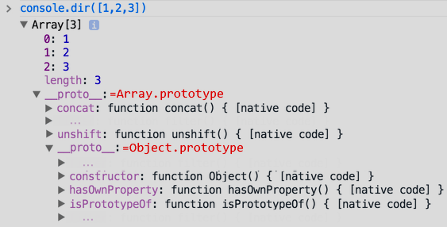

- ``console.log(<any number and type of values>)`` logs stuff to the console. It implicitly converts the arguments to string.
- ``console.dir(<obj>)`` supported in Chrome Devtools and NodeJS takes an [[Object]] and shows all its properties, even the ones in the [[Prototype Object]] . 
  Like so
  ****