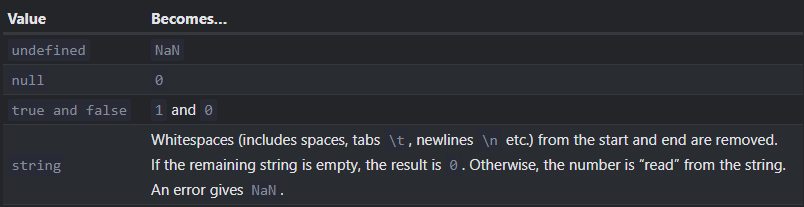

- Most operators and functions implicitly convert values of types into the types they can accept.
  For ex.:
  ``alert(...)`` converts values into strings.
  Similarly, some mathematical operations implicitly convert values into [[Number]]s.
  
  There's 2 types of conversions, implicit which is applied automatically and explicit which we apply through methods like String(...), Number(...), etc.
- Hints:
  In JS when a different type is required than the variable's type, a "hint" is passed for conversion of the type. [[ECMAScript]] specification defines 3 types of "hints":
  "string"
  "number"
  "default"
  
  Boolean isn't required because all values of all types are true in Boolean (except a few special values).
  Default is the type when a String or Number both can be valid.
  
  For ex.:
  ``alert(...)`` works with Strings, so JS passes the hint "string".
- [[String]] conversion:
  ``String(<value/variable>)`` converts stuff into string. It is pretty straight-forward as values like false become "false", null becomes "null" etc.
- [[Number]] conversion:
  aka ``Numeric Conversion``
  For ex.:
  ```js
  let v= "6"/"2"; //converts 6 and 3 into numbers, applies division and stores the result 3 in v.
  ```
  implicit conversion. (Note: This doesn't always happen, for ex. in [[String]] concatenation)
  
  ``Number(<val/var>)`` explicit, returns [[NaN]] if conversion fails.
  Some more rules:
  
- [[Boolean]] conversion:
  Explicitly done with ``Boolean(<val/var>)``
  
  Rules:
  0, empty [[String]], [[null]], [[undefined]], [[NaN]] become false.
  All other values become true.
  For ex.:
  ```js
  Boolean(""); //false
  Boolean(" "); //true
  ```
  
  This is slightly different from a ``Numeric Conversion``, because in numeric conversion an empty string is the same as a string with whitespaces at the ends, as they are trimmed out.
- [[Object]] Conversion:
  To convert an Object to another type implicitly, JS looks for 3 type of methods
  First it looks for
  ``<object>[Symbol.toPrimitive](hint)``
  Then, if hint is "string" it looks for
  ``<object>.toString()`` or ``<object>.valueOf()``
  If the hint is "number" or "default",
  ``<object>.valueOf()`` or ``<object>.toString()`` 
  
  Yes it looks for methods differently based on the hint.
  
  The simplest way to define this behavior is like so
  ```js
  let x = {};
  x[Symbol.toPrimitive]= function(hint) {
   if (hint === "string") return "yo";
   else return 2;
  }
  alert(x); //works, returns "yo"
  x+x; //returns 4
  ```
  Symbol.toPrimitive uses a predefined [[Symbol]].
-
-