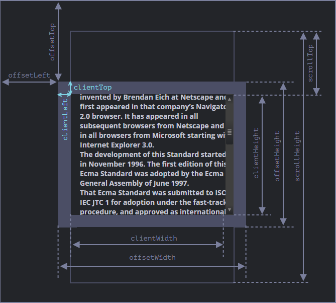

- More props can be checked in the specs of the node type.
- ``.nodeType``: All nodes. Property, this is a [[Number]] that tells which type of node it is. As seen in the spec, [node](https://dom.spec.whatwg.org/#node
  For ex.:
  
  shows the nodeType of any  Element type node is 1.
- ``.nodeName``: All nodes. Property which has the string name of the node type. Element Nodes also have a ``.tagName`` property which has the same value as ``nodeName``. NodeName and TagName are both basically the [[HTML]] element's name. Like a ``div`` element will have ``div`` tagname and nodename.
- ``.innerHTML``: All nodes. Property which has the HTML inside the node as string. We can modify it and the changes are reflected on the page.
  For ex.:
  ```html
  <body>
  <p>A paragraph</p>
  <div>A div</div>
  - <script>
    alert( document.body.innerHTML ); // read the current contents
    document.body.innerHTML = 'The new BODY!'; // replace it
  </script>
  - </body>
  ```
  However, [[<script>]]s inserted inside the ``.innerHTML`` aren't executed automatically.
  Furthermore, any change to the ``.innerHTML`` of a node causes the whole node to be re-rendered. Meaning even if we concatenate a single character to the innerHTML of a node then the whole node will be rendered again, this causes hovered items to lose focus, inputted text to be wiped as well and etc. as the state is reset. If the node had a lot of resources then they will all be re-rendered so it is an expensive operation.
- ``.outerHTML``: All nodes. Property which has the innerHTMl + the node's element itself.
  However, there's a slight difference between innerHTML and outerHTML.
  If we modify an innerHTML with new content, it replaces the innerHTML and the reference to the node remains the same so we can work with it. However, when we modify the outerHTML then the node's element is removed and the new modified element inserted whilst the reference keeps pointing to the old and now removed from DOM node.
  For ex.:
  ```js
  let x= document.querySelector(...);
  alert(x.outerHTML); //prints <div>...</div>
  x.outerHTML = "<p> yo</p>";
  alert(x.outerHTML); //still prints <div>...</div>
  ```
  Here, the new element is inserted and replaces the current node in the DOM but the variable still references the old one. We need to explicitly get the new reference after modifying the outerHTML.
- ``.data`` and ``.nodeValue``: Text Nodes. Properties which hold their data.
  For ex.:
  ```html
  <body>
    Hello
    <!-- Comment -->
    <script>
      let text = document.body.firstChild;
      alert(text.data); // prints Hello
  
      let comment = text.nextSibling;
      alert(comment.data); // prints Comment
    </script>
  </body>
  ```
- ``.textContent``: All nodes . Property that just has the text contents in it concatenated into a single string without any tags.
  For ex.:
  ```html
  <div id="news">
  <h1>Headline!</h1>
  <p>Martians attack people!</p>
  </div>
  - <script>
  
  alert(news.textContent); // prints Headline! Martians attack people!
  </script>
  ```
  We can read/write directly using this and this doesn't cause the whole node to be re-rendered, however if there is any tag in the textContent written to the node, then it is treated literally and is not parsed.
- ``.hidden``: All nodes. Hides the node if it is set to true.
- ``.id``, ``.className`` and ``.classList``: All nodes. Provides the node's id and class name (named so because `class` used to be a reserved keyword by JS). The ``.classList`` returns an [[Iterable]] which returns an iterable on the class names of an element and provides methods to add/remove classes as well.
  4 important methods are 
  ``<node>.classList.toggle("<classname>")`` : adds the class if not present, otherwise removes it
  ``<node>.classList.contains("<classname>")``
  ``<node>.classList.add("<classname>")``
  ``<node>.classList.remove("<classname>")``
  For ex.:
  ```html
  <body id="aydi" class="ha yo"> </body>
  <script>
  alert(document.body.className); //prints ha yo
  - document.body.className = "yo ha";
  for (let elem of document.body.classList); //passes ha then yo
  {}
  - document.body.classList.contains("yo"); //returns true
  document.body.classList.toggle("yo"); // removes it
  - <script>
  ```
  Writing to ``.className`` overwrites the whole ``class`` attribute.
- ``.style``: All nodes. Provides an [[Object]] with the style properties of the node. This Object has all valid [[CSS]] attributes for the node set in it, so we can provide values to them directly.
  For ex.:
  ```js
  document.body.style.width= 20px;
  alert(document.body.style.width); //prints 20px//
  CSS Attributes that have '-' in their property name have the -'s removed and next letter capitalized.
  document.body.style.MozBorderRadius = 2px; //as the attribute is -moz-border-radius
  //The Style Object requires the whole direction with propertes like margin
  document.body.style.marginTop = 2px; //ok
  ```
  
  
  * Instead of calling ``delete <style Object property>`` we should assign the property an empty [[String]] or a default value.
  Or alternatively, to remove a specific CSS property we can also use ``<node>.style.removeProperty("<prop name>")``.
  
  * We can also get/set the whole style at once using ``.style.cssText`` property. This overwrites existing style. 
  These only return the inline CSS syles and not the final style after all the CSS selectors have applied their styles. To get those we use ``getComputedStyle("<node>", "<optional pseudo class>")`` which returns the Style Object as well, with the computed and then resolved properties (computed means raw value and resolved means finally adjusted to the environment, like relative sizes adjusted to raw, it returns the resolved values). Pseudo class can be any except ":visited" as it is forbidden due to security of [[Brower]] to see its state.
  
  * Units need to provided explictly.
- Custom DOM Class Properties
  This is possible too, 
  For ex.:
  ```js
  Element.prototype.yo= function () {
  };
  document.body.nah= function() {
  };
  
  console.log(document.body.nah()); //works
  console.log(document.body.yo()); //also works as document is a child to Element ([[Prototype Object]]).
  ```
  * For any attribute on an [[HTML]] element, if it is standard for the type of element then the DOM automatically keeps track of it. But custom properties must be manually fetched and updated.
  To do so we use
  ``<node>.hasAttribute(name)`` – checks for existence.
  ``<node>.getAttribute(name)`` – gets the value.
   ``<node>.setAttribute(name, value)`` – sets the value.
  ``<node>.removeAttribute(name)`` – removes the attribute.
  ``<node>.attributes``- Returns a collection with all the attributes, [[Iterable]] 
  For ex.:
  ```html
  <div id="a" yoo="bro">
  </div>
  <script>
  
  let node= document.getElementById("a");
  console.log(node.id); //ok prints a
  console.log(node.yoo); //undefined
  
  alert(node.getAttribute("a")); //prints bro
  </script>
  ```
  
  * Attribute names are case-insensitive.
  
  * The ``.outerHTML`` has all the attributes, even custom ones.
  
  * Attribute values are almost always strings. But some attributes such as ``.checked`` on the ``input`` element are boolean or some other tpe.
  
  * Almost all attribute changes made to the HTML sync with the DOM, the exception are attributes like ``.value`` on text input nodes.
  For ex.:
  ```html
  <script>
    let input = document.querySelector('input');
  
    // attribute => property
    input.setAttribute('value', 'text');
    alert(input.value); // text
  
    // NOT property => attribute
    input.value = 'newValue';
    alert(input.getAttribute('value')); // text (not updated!)
  </script>
  ```
  
  * The dataset property
  By the HTML standard, the prefix ``data-`` is left for custom attribute names. And these are all also available in the ``dataset`` property of the DOM.
  For ex.:
  ```html
  <div id="a" data-yoo="bro">
  </div>
  <script>
  
  let node= document.getElementById("a");
  console.log(node.dataset.yoo); //ok prints "bro"
  </script>
  ```
  These [[HTML]] attributes can be used in CSS as well and are automatically synced too.
- Geometry Properties
  There are various properties available to [[DOM]]``<nodes>`` that define their ``outer geometry``.
  
  
  
  The ``<node>.offsetParent`` returns the ``node`` closest to the element which has either [[CSS Property]] ``position`` set (with a value except static), or a ``table`` [[HTML Element]] or the ``body`` HTML element. 
  
  Then the properties in the image define their respective sizes.
  For ex.:
  ```html
  <main style="position: relative" id="main">
    <article>
      <div id="example" style="position: absolute; left: 180px; top: 180px">...</div>
    </article>
  </main>
  <script>
    alert(example.offsetParent.id); // main
    alert(example.offsetLeft); // 180 (note: a number, not a string "180px")
    alert(example.offsetTop); // 180
  </script>
  ```
  The ``.offsetParent`` is null when the element has ``display: none`` or isn't in the DOM, or is ``html`` or ``body`` element or has ``position: fixed`` [[CSS]].
  
  It is recommended to use these properties over ``getComputedStyle(...)`` method as it's behavior is dependent on the browser where it may automatically include sizes like scrollbar width or not, but these are explicit and always computed.
  
  
  * The ``document.documentElement.clientWidth`` and ``document.documentElement.clientHeight`` which is on the ``html`` element of the [[HTML]] Document effectively return the actual window size (minus the scrollbar width/height). The ``window.innerHeight`` and ``window.innerWidth`` on [[window]] do the same, however they don't take the scrollbar into account.
  
  * Given all inconsistences across browsers and versions, it is recommended to use this logic for getting the right window height/width.
  ```js
  let windowHeight = Math.max(
    document.body.scrollHeight, document.documentElement.scrollHeight,
    document.body.offsetHeight, document.documentElement.offsetHeight,
    document.body.clientHeight, document.documentElement.clientHeight
  );
  ```
- We can get the current scroll position in the page by using the [[window]] Object's 
   ``window.pageYOffset``/``window.scrollY`` and ``window.pageXOffset``/``window.scrollX``. These are read-only properties. The alternate properties are their aliases.
-