alias:: Document Object Model

- It is what it is named, it represents the [[HTML]] (and [[CSS]]) or [[XML]] Document as an [[Object]] and allows JS to interact with it as if it was an Object. This allows JS to freely modify the Document.
  The DOM Object has its own spec: [DOM](https://dom.spec.whatwg.org/)
  Similarly, we can modify the CSS classes as well using the CSSOM (creating/removing CSS classes can be done without it) which has the spec: [CSSOM](https://www.w3.org/TR/cssom-1/)
- The ``document`` [[Object]] is the main entry point to a page, it has the entire Document in it as an Object.
  For ex.:
  In [[Browser]]
  ```js
  document.body.style.background = "red"; //turns the background of the Document red.
  ```
  
  For ex.:
  ```html
  <!DOCTYPE HTML>
  <html>
  <head>
    <title>About elk</title>
  </head>
  <body>
    The truth about elk.
  </body>
  </html>
  ```
  
  is represented as
  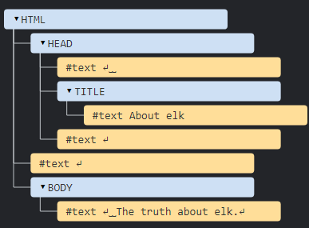
  by the DOM
  Newline character and spaces between [[HTML]] tags is completely valid Objects for DOM, that is why we see them here.
- The general rule is, everything in an HTML page is a part of the DOM tree. Even the ``<!DOCTYPE...`` directive.
- Every attribute of an [[HTML Element]] is mapped to a [[DOM Class Property]] on its node. 
  However, whilst HTML attributes are case insensitive, DOM attributes are case sensitive as JS is case sensitive.
- There are different types of ``nodes``, each node is an [[Object]] with a specific structure, each element in [[HTML]] is represented as a ``node`` in the DOM. There's [12](https://dom.spec.whatwg.org/#node) of these.
  The 4 most common are:
  * ``document`` – the “entry point” into DOM.
  * ``element nodes`` – HTML-tags, the tree building blocks.
  * ``text nodes`` – contain text.
  * ``comments`` – sometimes we can put information there, it won’t be shown, but JS can read it from the DOM.
- We can view the DOM on sites like [Live DOM Viewer](https://software.hixie.ch/utilities/js/live-dom-viewer/) or using the [[Developer tools]].
- Navigation
  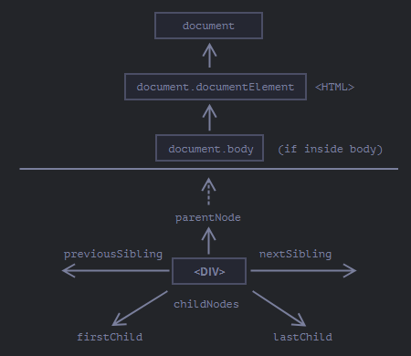
  We can walk the DOM tree using methods with the same name as shown above, 
  ```js
  let body = document.body; 
  ``` 
  and so on. These 3 are directly accessible.
  Note: The [[Browser]] parses the HTML document from top-to-bottom, so if we have a [[<script>]] tag before an element, then it can't see it in the DOM yet. We can have the script tag in the head tag which means the ``document.body`` itself can be [[null]]. In DOM null simply means the element doesn't exist.
  This is why it is recommended to have the script tag at the bottom.
  
  To traverse
  ```js
  let x = document.body.firstChild;
  if (x.hasChildNodes()){
   for(let child of x.childNodes) {
     console.log(child.innerText);
    }
  }
  ```
  ``<node>.hasChildNodes()`` returns true if the node has child nodes. 
  ``.childNodes`` returns an Array-like Object, called a ``Collection``, which is an [[Iterable]] so it can be looped over. However, it is advised to use ``for..of`` [[Loop]] and not ``for..in`` as the latter even enumerates over properties that aren't related to the DOM.
  
  * DOM collections are live and read-only, we can't replace a node with another node. However we can add/remove children and they represent the live state of the node in the Document. If we modify a node then its changes are rendered right away (after being called in the [[Message Queue]])
  
  * Sometimes we don't want to traverse all nodes, just specific type of nodes, for element nodes we have
  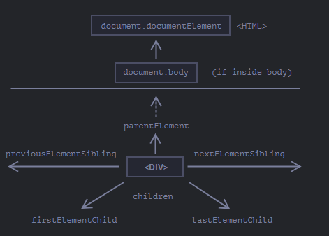
  The top document node is its own node, so 
  ```js
  alert( document.documentElement.parentNode ); // document
  alert( document.documentElement.parentElement ); // null
  ```
  This is useful if we wish to traverse all the way up,
  ```js
  //let elem = ... some node...;
  while(elem = elem.parentElement) {...} 
  ```
-
- Searching for elements
  We can also search for individual nodes directly.
  
  If they have an ``id`` attribute set then we can get them directly
  ```html
  <div id= "yo">
   ...
  
  <script>
   yo.style.background="red"; //ok
  </script>
  ``` 
  Or we can use the ``document.getElementById("<id>")`` method to get the node.
  It is recommended to use this method as the direct access method relies on the mixing of namespaces of JS and DOM, which means it may not be clear to the reader to understand if the variable came from the JS or the DOM and it can be easily [[Shadowed]] by any JS element as well.
  
  * ``document.getElementById("<id>")`` 
  * ``document.querySelectorAll("<css>")``: Any valid [[CSS]] selector can be used here, and then a collection of such nodes is returned. It can even use [[CSS]] pseudo-classes like ``document.querySelectorAll(":hover")`` returns the current nodes being hovered over (from the html node to the given node in depth order)
  *  ``document.querySelector("<css>")``: Same as above except only searches for as long as a single node matching the selector is found, then stops. Meaning it is faster.
  * ``<node>.matches("<css>")``: Returns a bool, true if the given node matches the CSS selector.
  * ``<node>.closest("<css>")``: Starts checking the current node, then its parent, and so on until a node matching the css is found then returns that node. 
  * ``<node>.getElementsByTagName("<tagname>")``: Returns a collection of child nodes that have the given tag. The tag can be "*" meaning any tag. 
  * ``<node>.getElementsByClassName("<classname>")``
  * ``document.getElementsByTagName("<tag name>")``: Searches the whole document and returns a collection with these nodes.
  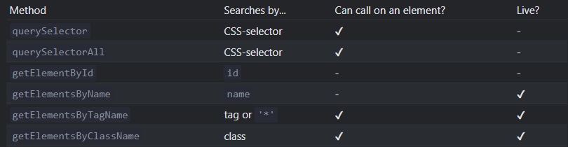
  
  By ``Live``, it means that these methods return the live node, so it represents the current state on the DOM and would get updated if the DOM does, similarly, updating them would update the DOM. In contract, the ``...querySelector...`` return ``static`` elements, which don't represent the Live state of the DOM.
  
  * The ``document....(...)`` methods can be called by any Element Node as well. 
  For ex.:
  ```html
  <div>
   <span>
   </span>
  </div>
  <script>
  let div = document.querySelector('div'); 
  let span = div.querySelect('span'); //works
  </script>
  ```
  The nodes then are searched inside the given node, so only the children of a node are evaluated.
- DOM Node Classes
  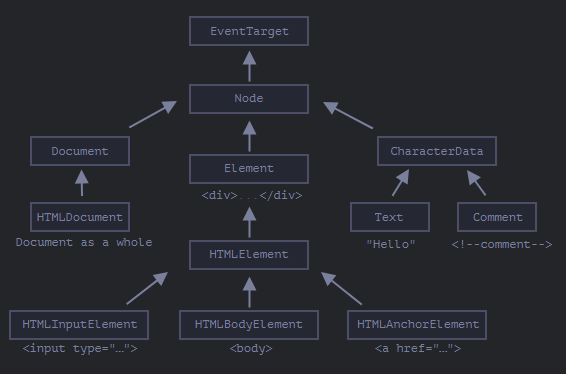
  This is the hierarchy with the EventTarget abstract [[Class]] at the top, JS doesn't have the concept of abstract classes, it just means that by convention it is a class that shouldn't be made an object of, just inherited using [[Prototype Object]].
  EventTarget also provides [[Browser Event]]s. This is why all nodes can have an event hooked to them.
  We can use [[Console]].dir to see any node's prototypal chain.
  
  [[Browser]]s provide all these classes to the JS environment, hence we can directly check them too.
  For ex.:
  ```js
  alert( document.body instanceof HTMLBodyElement ); // true
  alert( document.body instanceof HTMLElement ); // true
  alert( document.body instanceof Element ); // true
  alert( document.body instanceof Node ); // true
  alert( document.body instanceof EventTarget ); // true
  ```
  uses ``instanceOf`` [[Operator]]
- [[DOM Class Property]]
-
- Creating and Inserting Nodes:
  To create:
  * ``document.createElement("<tag name>")``: Creates an Element type node of the given tagname. Recall that tagNames are basically the name of the element. 
  
  * ``document.createTextNode("<text node content>")``:
  ...and so on for other types of nodes as well.
  
  Now to insert the created node:
  * ``<node>.append(...nodes or strings)`` – append nodes or strings *at the end* of `node`,
  * ``<node>.prepend(...nodes or strings)`` – insert nodes or strings *at the beginning* of `node`,
  * ``<node>.before(...nodes or strings)`` –- insert nodes or strings *before* `node`,
  * ``<node>.after(...nodes or strings)`` –- insert nodes or strings *after* `node`,
  * ``<node>.replaceWith(...nodes or strings)`` –- replaces `node` with the given nodes or strings.
  They use the spread [[Operator]] so multiple nodes or strings can be inserted at once.
  Stings inserted are not parsed, so even if they contain HTML syntax, they are added `as-is`.
  
  Like so
  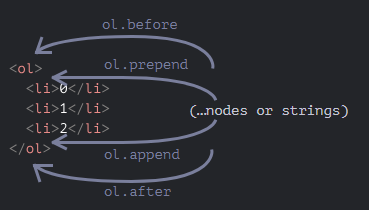
  For ex.:
  ```html
  <ol id="ol">
    <li>0</li>
    <li>1</li>
    <li>2</li>
  </ol>
  
  <script>
    ol.before('before'); // insert string "before" before <ol>
    ol.after('after'); // insert string "after" after <ol>
  
    let liFirst = document.createElement('li');
    liFirst.innerHTML = 'prepend';
    ol.prepend(liFirst); // insert liFirst at the beginning of <ol>
  
    let liLast = document.createElement('li');
    liLast.innerHTML = 'append';
    ol.append(liLast); // insert liLast at the end of <ol>
  </script>
  ```
  Creates
  ```html
  before
  <ol id="ol">
    <li>prepend</li>
    <li>0</li>
    <li>1</li>
    <li>2</li>
    <li>append</li>
  </ol>
  after
  ```
  
  * There is another way to insert nodes, using the ``<node>.insertAdjacementElement("<where string>", "<html string>")``, ``<node>.insertAdjacementText("<where string>", "<html string>")`` and so on.
  These methods takes a ``where`` string, which can be a value from "beforebegin", "afterbegin", "beforeend" and "afterend" and defines the position, and an [[HTML]] [[String]] which is parsed as HTML and the created node/text/etc. inserted at the given position.
  Like so
  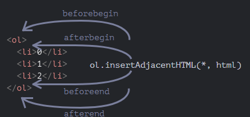
  
  * Old ways of adding nodes to DOM
   ``<parent node>.appendChild(<child Node>)``: An old method, returns the inserted node as well. 
   ``<parent node>.insertBefore(<node>, <next sibling node>)``: Same
  
  * ``document.write("<html string>")``: The html passed is parsed and then inserted right where the method was called in the HTML document. Deprecated as it can only be used while the Document is loading. If it is used after the page has loaded, it overwrites the entire Document with the given html.
- (Re)moving a Node
  ``<node>.remove()``: Removes the node and updates the DOM and [[HTML]] Document. 
  
  To move a node, we simply get the node and insert it any new place. It is automatically removed from its old place and inserted at the new place.
  
  * ``<parent node>replaceChild(<node>, <old child node>)``: An old method, returns the inserted node. Replaces the old child node with the given node from the children of the parent node.
  *  ``<parent node>removeChild(<node>)``: Same.
- ``<node>.cloneNode(<bool shouldDeepCopy>)``
  Returns a copy of the node. That is, it clones a node. If the provided bool is true, the children elements are cloned as well otherwise only the given node is cloned with all its attributes as well.
- ``DocumentFragment``
  This [[Class]] can be used to create a 'transparent' list of nodes that can be inserted anywhere, and this `wrapper` doesn't do anything.
  For ex.:
  ```js
  let x = new DocumentFragment();
  let div = document.createElement('div');
  let div2= document.createElement('div');
  x.push(div);
  x.push(div2);
  
  document.query....(...).append(...x); //works, only div and div2 are inserted
  ```
  It's not necessary to use this wrapper class, as a normal [[Array]] would work the same as well.
- Scrolling
  We can scroll a page using JS  by setting
  ``document.documentElement.scrollTop`` or ``..scrollLeft`` [[DOM Class Property]] to raw values, in safari we instead use ``document.body.scrollTop``/``..scrollLeft``.``
  
  window.scrollBy(x,y)`` or ``window.scrollTo(x,y)`` which work the same way in all browsers. ``.scrollTo`` makes sure the x,y is at the top-left of the current [[window]].
  
  ``<node>.scrollIntoView(<bool top>)`` Brings node into viewport. If top is default/false, then the bottom edge of the element is aligned with the bottom of the window, otherwise the top one.
  
  ``document.body.style.overlow`` If this [[CSS Property]] is set to "hidden", the scrollbar disappears and scrolling is forbidden for the element, which is body here so it forbids it for the whole page.
- [[HTML Element]] coordinates
  Each ``node`` is generally positioned using either 1 of these 2 coordinate systems 
  
  * Relative to the window: Basically relative to the window's top-left. Let's call them [clientX/clientY](https://javascript.info/coordinates).
  * Relative to the Document:  Relative to the document's top-left. Let's call them pageX/pageY.
  
  For ex.:
  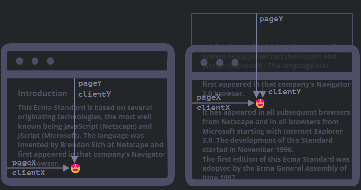
  As we can see for the given element, if it is relative to the window (clientX/Y) then it's position has changed as the clientY is shorter after scrolling the window up. But if it is relative to the document, which it is in this case, it's pageY value still remains the same. 
  
  The ``<node>.getBoundingClientRect()`` [[DOM Class Property]] method returns a ``DOMRect`` [[Class]]' object which represents a minimal rectangle that encapsulates the entire element. Then the methods on this object return properties of this rectange.
  ``<DOMRect object>.x``/``.y``: PageX/PageY
  ``.width``/``.height``: Can be -ve.
  ``.left/top/right/bottom``: Returns either the x-coordinate (for left and right) or the y-coordinate (for top and bottom)
  Like so
  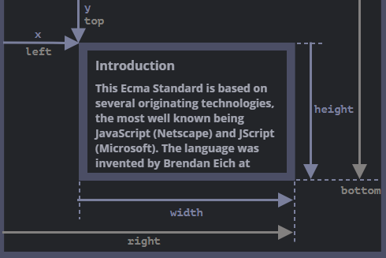
  
  If the rectangle is flipped so the right bottom was x and y then the left/top won't match the x and y, this is why they are 2 separate properties.
  
  * The ``document.elementFromPoint(x,y)`` returns the most-nested element from the given coordinates (clientX/Y). It returns null if the given coordinates are outside the range of the window.
- Forms and control elements
  [Form](https://html.spec.whatwg.org/multipage/forms.html)s in [[HTML]] are an [[HTML Element]] which are treated specially. Similarly, control elements like ``input`` are also treated specially by [[Browser]]s.
  
  They are available in a named and ordered collection ``<node>.forms`` so all forms directly under a node are available in its ``.forms``. Like the forms in the main document are in ``document.forms``. 
  Since they are named and ordered, we can access a form node like ``<node>.forms.myForm`` where ``myForm`` is its ``id`` or with ``<node>.forms[0]`` if its the first form under the node (from top to bottom in the [[HTML]] Document).
  For ex.:
  ```html
  <form name="my">
    <input name="one" value="1">
    <input name="two" value="2">
  </form>
  
  <script>
  
    let form = document.forms.my; // <form name="my"> element
  
    let elem = form.elements.one; // <input name="one"> element
  
    alert(elem.value); // 1
  </script>
  ```
  ``Form`` nodes have a prop ``.elements`` which is also a named Collection of nodes under the form but the ``name`` is used instead of the ``id``. If there are multiple elements with the same ``name``, then it returns a collection instead of a node. All control elements under a form, despite any level are available to ``<form>.elements``.
  
  * All elements under a ``<form>.elements`` are also properties on the form Object itself, however, if the name of the form changes then the old properties and new ones are still valid.
  That is
  ```html
  <form name="yo">
    <input name = "x" >
  </form>
  
  <script>
   let form = document.forms.yo;
   let x= form.x; //works
   x.name="y";
  let y = form.x; //still works
  let y1= form.elements.x; //doesnt exist
  
  </script>
  ```
  
  * All elements under a form have a backreference to the form itself which is kept in ``<node>.form`` property of the nodes under the form.
  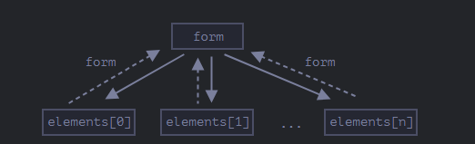
  
  * Forms have a [[Browser Event]] ``submit`` which is triggered when the form submits. We can also use ``<form node>.submit()`` to do so manually.
  For ex.:
  ```js
  let form = document.createElement('form');
  form.action = 'https://google.com/search';
  form.method = 'GET';
  
  form.innerHTML = '<input name="q" value="test">';
  
  // the form must be in the document to submit it
  document.body.append(form);
  
  form.submit();
  ```
- Page Events
  There are a few important [[Browser Event]]s that trigger on an [[HTML]] page's lifecycle.
  
  The events are triggered in this order:
  ``DOMContentLoaded``: The DOM is loaded and ready. The [[<script>]]s of the page are loaded as well, but [[Async]] scripts and dynamically generated scripts are loaded after this event. 
  The event handler has to be on the ``document`` [[DOM]] node. 
  ``load``: External resources are loaded, like [[CSS]] stylesheets, images etc.
  ``beforeunload`` and ``unload``: The user is has gone to another page and now the page is unloading. 
  
  For load/unload the [[window]] has to take the event handler.
  
  * ``document.readyState``: This [[DOM Class Property]] has one of 3 values "loading" (doc is loading), "interactive" (doc is fully read) and "complete" (doc is read and ext. resources loaded) and indicates the readiness of the document's loading. 
  The ``readystatechange`` event is triggered when this property changes.
- [[MutationObserver]]
- Range
  This [[Class]] allows us to select a range of data from the nodes. 
  
  We can create an instance with ``let range= new Range();`` then each Range object/instance requires 2 endpoints, start and end. 
  We set the start with ``<range Object>.setStart(<node>, <offset>)`` and end with ``<range Object>.setEnd(<node>, <offset>)``. 
  The start and end node can be different. The offset must be a [[Number]].
  
  If the start node is a text node, then it returns the given position of characters in its text content from start to end encompassing all text nodes from start to end.
  For ex.:
  ```html
  <p id="p">Hello</p>
  <p id="p2">Example: <i>italic</i> and <b>bold</b></p>
  <script>
    let range = new Range();
    range.setStart(p.firstChild, 2); //the first child is the text node
    range.setEnd(p.firstChild, 4);
  
    // toString of a range returns its content as text
    console.log(range); // ll
  
    range.setStart(p2.firstChild, 2);
    range.setEnd(p2.querySelector('b').firstChild, 3);
  
    console.log(range); // ample: italic and bol
  </script>
  ```
  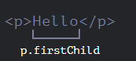
  and
  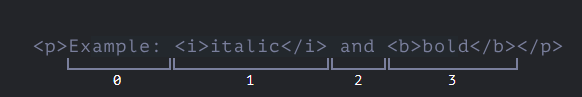
  
  If the start node is an element node, then it returns the nodes in the range.
  For ex.:
  ```js
  <p id="p">Example: <i>italic</i> and <b>bold</b></p>
  
  <script>
    let range = new Range();
  
    range.setStart(p, 0);
    range.setEnd(p, 2);
  
    // toString of a range returns its content as text, without tags
    console.log(range); // Example: italic
  </script>
  ```
  
  Every range object has these properties
  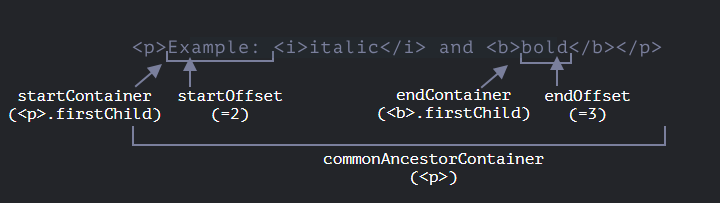
  
  There are more selection methods and also range editing methods [here](https://javascript.info/selection-range#range-selection-methods)
- Selection
  Whilst Range selects a given range, it doesn't show anything visually. However ``Selection`` Objects can show selections visually on the page in the [[Browser]], they can be obtained with either ``document.getSelection()`` or ``window.getSelection()``.
  In firefox, multiple separate regions can be selected with ``Ctrl+click`` like so
  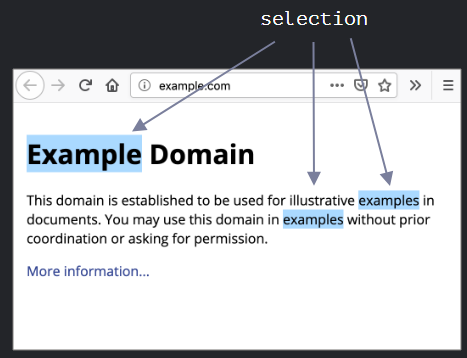
  
  but in other browsers there can only be a single selection at any time.
  This Object has these properties
  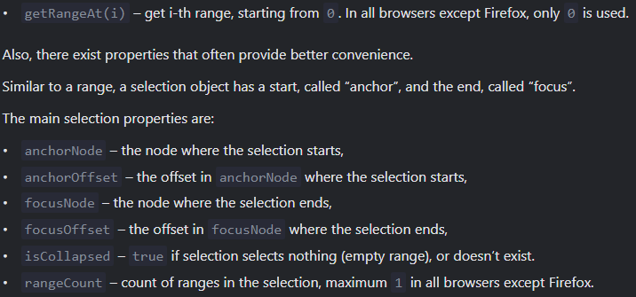
  
  Similarly, there are many methods too [here](https://javascript.info/selection-range#selection-methods).
  * [[Browser Event]] 
  ``selectstart`` and ``selectionchange`` are triggered if an element is selected or if the selection changes.
  
  * Both select and range have much more comprehensive utility and interactions with other elements such as with Form [[HTML Element]], given [here](https://javascript.info/selection-range).