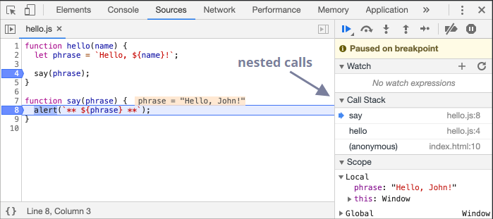
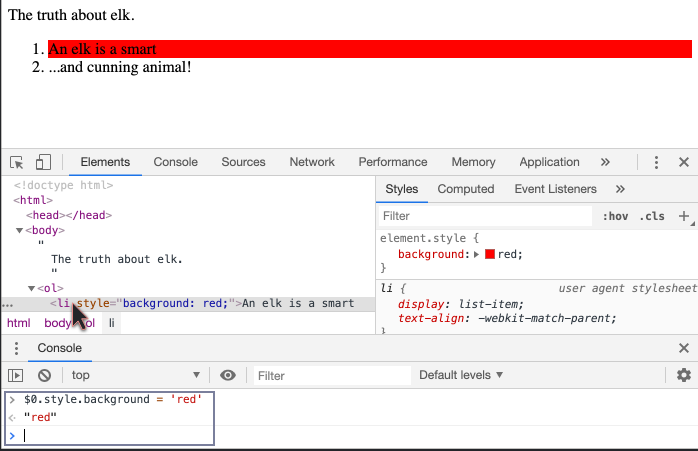

- On chrome and firefox, F12 toggles visiblity for the menu.
- In the developer tools, we have the Sources menu which allows [[Debugging]] [[ECMAScript]] scripts used in a webpage. 
  
- We can also use ``chrome://tracing`` to record website performance and see things like where GC occured etc.
- For normal [[HTML]] Document, the DT shows the various properties in it.
  For ex.:
  
  
  Note: We can click an element, the currently selected element is put in a variable $0, with the previous one being $1 and so on. The reverse is also possible, using the function ``inspect(<node>)`` in the console shows which variables refer the given DOM node.
-
-