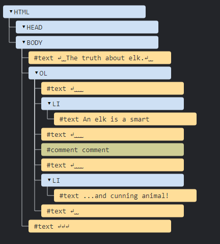

alias:: Hyper Text Markup Language

- It is a text format understood by browsers natively, defined here [HTML](https://html.spec.whatwg.org/). 
  The file format is denoted with``.html``
  For ex.:
  ```html
  <!DOCTYPE html>
  <html lang="en-US">
    <head>
      <meta charset="utf-8" />
      <meta name="viewport" content="width=device-width" />
      <title>My test page</title>
    </head>
    <body>
      
    </body>
  </html>
  
  ```
  
  HTML is a text markup language, meaning it gives a different look to content, and defines Elements and Attributes that do so.
- The ``<!DOCTYPE HTML>`` directive denotes a text file is an HTML Document and is necessary. It is not an HTML element but it is still a part of the [[DOM]].
  It also affects the top-level Geometry properties of the [[DOM Class Property]] by giving odd behavior if not present.
- ``Elements`` and ``Tags``
  HTML Elements are text tokens that are parsed by HTML as meaningful entities, like ``keywords`` of [[ECMAScript]].  Then each tag is a part of an element, generally each element has 2 tags, an opening tag denoting where the element starts and an end tag where it finishes. The content within is the body of the element.
  
  For ex.:
  ```html
  <html>
  </html>
  ```
  Here the element is ``html``, and it's start tag is ``<html>`` and end tag is ``</html>``.
  Some elements have a single tag as they don't need an explicit ending tag but they can still optionally use an ending tag. These are also called void elements.
  For ex.:
  ```html
  
  ```
  
   Consequently, the ``tagName`` of any element, is the name of the element. So here the element is ``html`` so the tag ``<html>`` will have ``tagName`` of ``html``.
  
  
  * We can nest elements in HTML. Meaning a single element can have multiple children and so on for a variable depth (atleast >100).
- Most useful [[HTML Element]]s 
  ``html`` element, which wraps the HTML content and is the rootmost element. It also has a ``lang`` attribute which denotes the language of the page.
  ``head`` element which is a container for all the content that won't be visible as the content of the page, such as its title, encoding etc.
  ``body`` element which finally holds the body of the Document, the content inside it is the content that is displayed on the page by the [[Brower]]s 
  [[<script>]] element which holds the executable script (JS) in it. 
  ``meta`` This void element defines important metadata of the document.
  
  There can be only single of all of these elements except script and meta element in a document.
  For ex.:
  ```html
  <!DOCTYPE html>
  <html lang="en-US">
    <head>
      <meta charset="utf-8" />
      <meta name="viewport" content="width=device-width" />
      <title>My test page</title>
    </head>
    <body>
      
    </body>
  </html>
  
  ```
- Attributes
  Every HTML element has some ``attributes`` which are basically additional properties accepted by the said element. These modify the Element's functionality or are there just to hold some information. 
  
  These are generally ``key=value`` pairs but some are enabled just with a single keyword.
  For ex.:
  ```html
  ...
  <div id="yo"> </div>
  <!-- Here yo is the value to the id attribute of div element -->
  ```
  
  
  Attribute names are case insensitive so we can use ``id`` or ``ID`` etc. it works.
  
  Whilst these depend on the element itself, there are some attributes which are common across all/most elements called [Global Attributes](https://developer.mozilla.org/en-US/docs/Web/HTML/Global_attributes).
  * ``id="<value>"``: Unique Id for any given element. This Id can be used by both [[CSS]] and [[<script>]] to modify the element. If it is not unique then any element with the same Id can be picked at random by the script or CSS.
  
  * ``class="<value>"``: Space separated list of identifiers that can be used to group elements together for the CSS and JS. Just like the ID provides a unique identifier for each element, the class attribute provides a/multiple common identifier(s) for each element.
-
- Most HTML documents can be created dynamically.
  For ex.:
  ```js
  function loadScript(src) {
    // creates a <script> tag and append it to the page
    // this causes the script with given src to start loading and run when complete
    let script = document.createElement('script');
    script.src = src;
    document.head.append(script);
  }
  ```
  This [[Function]] appends a [[<script>]] tag to the top of an ``HTML Document`` and assigns its src attribute the value given. This way we can dynamically add JS scripts to our Document. This is [[DOM]] manipulation.
- Autocorrection
  [[Brower]]s can autocorrect many common HTML errors, such as if we just put some text in a ``.html`` file then they would automatically add the ``<HTML>``, ``<Head>`` and ``<Body>`` tags enclosing it.
  Similarly, it also auto closes tags.
- Comment
  A comment in HTML goes like so ``<!-- .... -->``
  For ex.:
  ```html
  <!DOCTYPE HTML>
  <html>
  <body>
    The truth about elk.
    <ol>
      <li>An elk is a smart</li>
      <!-- comment -->
      <li>...and cunning animal!</li>
    </ol>
  </body>
  </html>
  ```
  Comments still appear in the [[DOM]]
  
- [[HTML Element]]s
- Each of the [[HTML Element]]s has a ``style`` attribute, which is defined using [[CSS]].
  That said, there are basically 2 ways to provide style to an [[HTML Element]]
  Either through the ``style`` attribute which can be provided by inline/internal/external CSS. 
  
  Or through the ``class`` attribute.
  Providing a ``class`` attribute to an HTML element also allows it to be styled by the same CSS given it selects the class
-