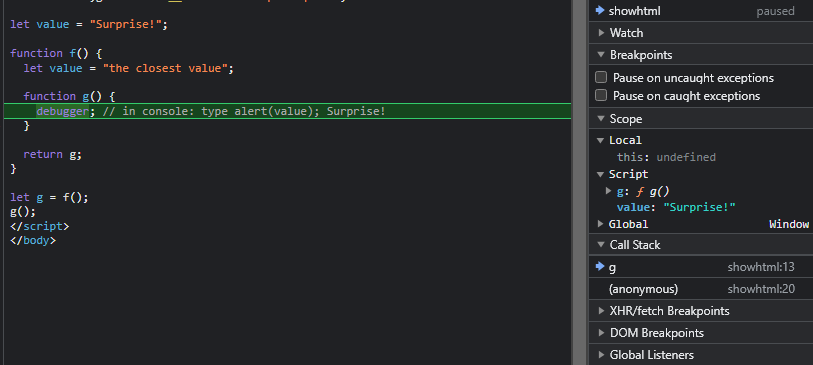

- In JS, all code is associated with a hidden internal [[Object]] called the ``Lexical Environment``.
  It is a theoretical construct [Lexical Environment](https://tc39.es/ecma262/#sec-lexical-environments)  that exists only in the spec to define the behavior and is not an actual Object.
- It has 2 parts,
  * [[Environment Record]]: An [[Object]] that stores all local variables as properties, and some other information like the values of [[this]].
  For ex.:
  
   
  * A reference to the outer Lexical Environment.
  
  There's a ``Global Lexical Environment``, that is associated with the whole JS script. It's outer reference is [[null]] because it has no parent Lexical Environment to refer to.
- Variable lifetime
  
  
  JS already stores a declared variable's property in the [[Environment Record]] even before it is actually declared, this is thanks to the JIT [[Compilation]]. There are many [[Optimization]]s and tricks used by the engine to remove unused variables and modify parts, to have the same effect as intended but with lower costs.
  This is also to say, variables in JS are rather, properties of the [[Environment Record]] [[Object]] and we are simply using that property to hold values.
- [[Function]] lifetime
  Unlike the variable lifetime, a function declaration is already initialized in the [[Environment Record]] if it is declared anywhere. This is why Function declarations can be called even before appearing in the code in the same [[Scope]].
  
  
  This is because function is also a value in JS, and is instantly fully initialized.
  
  Function expressions are tied to variables so they follow Variable lifetime.
- Reference to the outer Lexical Environment
  Whenever a new LE is created, it has a reference to the outer LE.
  
  
  This is how this example is valid:
  ```js
  function yo() {
    let x = 1;
    return function() {
      console.log(x++);
    }
  }
  
  let y = yo();
  y();  //prints 1
  y(); // 2
  y(); // 3
  ```
  as yo()'s LE is stored by the returned function. 
  
  This is also to say, when a variable is to be searched, it is searched from within the current to the outermost [[Environment Record]].
  
  More specifically, all functions have a hidden [[Environment Object]]
  
  This is always set once, that is when a function is created and holds the outer [[Environment Record]].
  So here it is ``counter.[[Environment]]`` that has the property ``count`` in it.
  And in our code, ``y.[[Environment]]`` was holding the property x.
  (Note, the property itself is called ``[[Environment]]`` so accessing it with ``<obj>.`` is using the dot access [[Operator]] and not the ``[ ]`` access Operator )
  
  A variable is only updated in the LE it exists in.
  
  There is a general term for this concept where a [[Function]] remembers variables and identifiers in its outer [[Scope]] and can modify it, such functions are called ``Closures``. In JS all Functions are closures as they can remember their outer scope using the [[Environment Object]] .
- Just like normal [[Object]]s, a LE is only subject to [[Garbage Collection]] when it becomes unreachable. This means that LEs, with them all the variables and functions, are kept in the memory if they have just a single reference to them.
  For ex.:
  ```js
  function f() {
    let value = Math.random();
  
    return function() { alert(value); };
  }
  
  let arr = [f(), f(), f()];
  ```
  Here, 3 LEs are stored in arr and they aren't cleared up until arr itself has references to them.
  
  JS engines perform [[Optimization]] on this as well, such as in V8 engine, while debugging, the [[Environment Object]]'s properties are optimized out.
  For ex.:
  Running this code and using Chrome Debugger 
  ```js
  let value = "Surprise!";
  
  function f() {
    let value = "the closest value";
  
    function g() {
      debugger; // in console: type alert(value); Surprise!
    }
  
    return g;
  }
  
  let g = f();
  g();
  ```
  
  results in
  
-