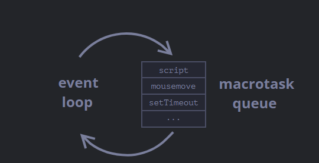
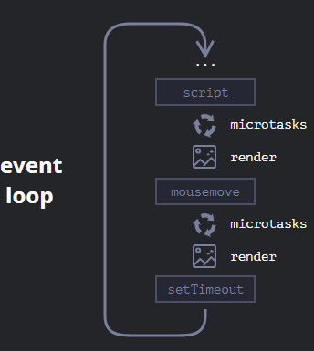

- As JS is a single-threaded language, tasks need to be managed in different queues depending on if they are [[Asynchronous]] or not. [[Scheduling]] also makes use of these queues.
- ``Event Loop``
  In JS, all tasks are put in an infinite loop known as Event Loop and processed sequentially. 
  The engine waits for tasks in this loop, then executes them FIFO whilst more tasks are appended to the end. If there's no task in the event loop, sleep.
  The queue is aka ``Macrotask Queue`` and the flow looks like so
  
  
  This includes everything, even things like [[Rendering]] the changes to [[DOM]] as that task is appended in it too and only after the tasks before it are processed is the DOM modified and rendered. However, Rendering is done after a certain point in macrotask queue when the microtask queue is started and finished.
  
  This means, if a task takes too long in the macrotask queue, it puts the entire [[WebPage]] on a pause, even [[Browser Event]]s can't be handled as the event handlers are also in this queue.
  
  This is why [[Asynchronous]] tasks are put in a separate queue with only their callers in the macrotask queue, like we can see ``setTimeout`` above. So the macrotask ``setTimeout`` puts stuff in the other queue and finishes then the macrotask queue continues.
- ``Microtask Queue``
  aka PromiseJobs
  This is the queue [[Scheduling]] tasks like ``setTimeout`` and [[Asynchronous]] Promises and the like use. 
  Immediately after finishing the macrotask queue until a certain point, the microtask queue is starts getting processed. Further macrotask queue tasks are appended to it as normal but until the microtask queue finishes, the event loop doesn't switch back to the macrotask queue, yes just like the macrotask queue if there are any more tasks added to the microtask queue then they wouldn't be processed until the next switchover from macrotask queue.
  For ex.:
  ```js
  setTimeout(() => console.log("timeout"));
  
  Promise.resolve()
    .then(() => console.log("promise"));
  
  console.log("code");
  //will prints code then timeout then promise
  ```
  So the event loop with microtasks and [[Rendering]] look like so 
  
  
  * We can directly add tasks to the microtask queue with ``queueMicrotask(<function>)``
- [[Web Worker]]s can be used if we don't want to block the main thread. They don't use either of the queues.