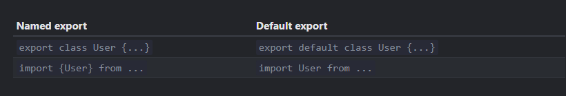

- A module is simply another JS file, a single module is a single [[<script>]]. Modules can call each other by importing/exporting Variables,[[Function]]s, [[Class]]es, [[Object]]s etc. .
- For ex.:
  In a folder X/ 
  file 1.js
  ```js
  export function yo() {
   return 2;
  }
  ```
  file 2.js
  ```js
  import {yo} from './1.js';
  
  yo(); //works, return 2
  ```
  The import path must be either absolute or relative but not bare, so just ``'1.js'`` wouldn't work in [[Browser]]s. It would work in Node though.
- Export and Import
  Export can export multiple declarations at once
  ```js
  function uo(){}
  class X{}
  
  export {uo,X}; //ok
  ```
  
  * Import also has features like * and ``as``  and they work like expected.
  ```js
  import * as x from './1.js';
  ```
  Whilst it pollutes the scope at development time, at runtime, tools like [[Webpack]] do [[Optimization]] and remove unused members.
  
  Also supported by export, ``export {x as y};``
  
  * Default export
  A module can choose to export just a single entity, to do so we use
  ``export default ...`` anything, this allows us to use ``import X from '...';``
  where X is any name we wish, the entity will be referred by this name here.
  
  
  Default exported entities don't need a name in exporting module,
  For ex.:
  In 1.js
  ```js
  export class {...}
  ```
  In 2.js
  ```js
  import X from '...'; 
  //and X would have that class.
  ```
  We can only have at most 1 default export per file and can mix named exports (normal export) as well but its unrecommended.
  
  We can also use the ``as`` keyword to make a default,
  ``export {x as default};``
  Similarly, we can import default and named exports at the same time
  ```js
  import {default as X, y} from '...'; //ok
  ```
  And it becomes a property  if * is used,
  ```js
  import * as X from '...';
  
  let x = X.default; //ok
  ```
- Re-export
  We can re-export modules too
  ```js
  export {X, default as Y} from '...'; //this syntax is required for default exports being re-exported
  export * from '...'; //works, but it ignores default export.
  ```
- Modules only work in browsers being served on HTTP(s), not locally.
  To load a module on in a [[<script>]] in browser we set type attribute to module,  
  For ex.:
  ```html
  <!doctype html>
  <script type="module">
    import {yo} from './1.js';
  
    document.body.innerHTML = yo();
  </script>
  ```
  And the browser automatically loads the modules.
  
  This is also to say, only modules can import/export each other. Normal JS scripts can't use modules.
- Modules have their own top-level [[Scope]]s called ``Module Level Scopes``. Meaning anything `outside` in a module is still [[Scope]]d. This allows MLS to have some cool features like they are always in ``Strict`` mode and can use [[Asynchronous]] ``await`` as-is. This also prohibits other modules from having direct access to their variables/ [[Function]]s/etc.
  For ex.:
  
  ```html
  <!doctype html>
  <script type="module">
    function yo(){}
    window.yoo= function(){}
  </script>
  <script>
    function no() {}
  </script>
  <script type="module">
    yo();                   //fails as it can't find yo
    no();                   //works
    yoo();                  //also works
  </script>
  ```
  In [[Browser]]s we can still make a variable global by directly assigning it to a [[window]] property.
  
  [[this]] is undefined in MLS.
- Modules are evaluated only once. They have a single [[Global]] State as well. This means, if we modify a module from one file, then use it in another then the changes are persistent.
  For ex.:
  In 1.js
  ```js
  export let x = {
   
  };
  
  console.log("yo");
  ```
  
  In 2.js
  ```js
  import {x} from './1.js'; //module 1 is evaluated completely, prints yo
  
  x["naa"]=2;
  ```
  
  In 3.js
  ```js
  import {x} from '1.js'; //already evaluated
  
  console.log(x["naa"]); //prints 2
  ```
  The order of which file is evaluated first depends on which [[<script>]] tag appears first in the [[HTML]] Document. However, if a file has an import on another module, then it is not evaluated until that file is.
  Here, 1.js is evaluated first, ``yo`` is printed, then 2.js starts and sees 1.js already evaluated, then 2.js is evaluated and lastly 3.js.
- ``import.meta``
  This [[Object]] provides metadata about the current module. In [[Browser]]s has a property ``.url`` which has the url of the script if the script is imported from a url.
- Modules scripts are  [[Defer]]red in JS. 
  First the entirety of the [[HTML]] is loaded, then any normal [[<script>]]s then finally modules are loaded, despite the order in which the tags appear in the HTML document. Being deferred means they are loaded parallelly by the browser, but they are executed later.
- External Module [[<script>]]s with the same src tag are ran only once.
- External Module [[<script>]]s that are fetched from another origin must be supplied with the [[CORS]] header with value ``Access-Control-Allow-Origin`` by the remote server. This ensure the remote server's modules are only executed on trusted domains.
-