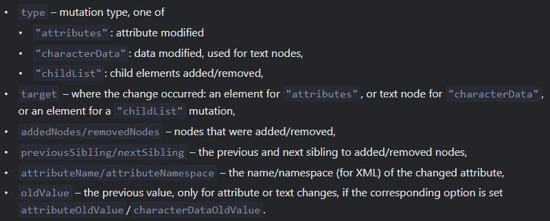

- This is a built-in [[Object]] that observes a given [[DOM]] node and triggers a callback [[Function]] when it detects a change in the node.
  
  We can create an instance with ``let observer= new MutationObserver(<callback function>)`` then attach it to a node with ``<observer Object>.observe(<node>, <optional config Object>)`` where the config Object is an Object with properties
  ``childList``: Boolean, should observe changes on direct child of node
  ``subtree``: Boolean, should observe changes on any level child of node
  ``attributes``: Boolean, should observe changes on attributes of node
  ``attributeFilter``: an [[Array]] of attribute names, to observe only selected ones.
  ``characterData``: Boolean, should observe ``<node>.data`` (text content)
  
  The callback receives an Object of ``MutationRecord`` class. This instance has some useful properties like 
  
  as given in the [spec](https://dom.spec.whatwg.org/#mutationrecord) 
  
  Then to stop observing we can use ``<observer Object>.disconnect()`` .
  * We can use ``<observer Object>.takeRecords()`` to get a list of unprocessed records for which the callback hasn't been executed yet. These records are removed from the active processing queue.
  
  * [[Garbage Collection]] isn't affected by MutationObserver.
-
-