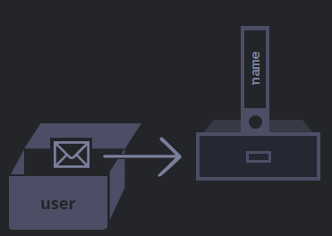

- The signature ``object`` type.
  It's a non-primitive type that can contain collections of data with multiple entities, think of them as "Map" or "Dictionary" from other languages but with the extensibility of "Classes". They are used everywhere in JS, and almost everything in JS is an Object or uses Object.
  For ex.:
  ```js
  let obj= new Object();  //Object Ctor Syntax 
  let obj2 = { }; //same thing, Object Literal Syntax
  ```
- Objects store ``Key:Value`` pairs, each pair is called a ``Property`` and the key is called the ``Property Name`` whilst the ``Value`` is just called the ``Value``.
  
  For ex.:
  ```js
  let obj = {
   name: "YOo",
   age: 200,
   "yoo yoo": 20, //This is a multi-word property name
  }
  ```
  Objects in JS are hash tables, so the Time Complexity of accessing a key is $$\Theta\text{(1)}$$ and O(n).
  
  To create/update a property
  ```js
  obj.name= 2;
  //or  
  obj["yoo yoo"] ="yo";
  ```
  
  To retrieve
  ```js
  console.log(obj.name); //works
  //or  
  console.log( obj["yoo yoo"] );
  ```
  
  To delete
  ```js
  delete obj.name; 
  //or
  delete obj["name"]; 
  ```
  Multi-word Properties can only be accessed with [...] and not the Dot [[Operator]].
-
- [...] access also supports variables inside them.
  For ex.:
  ```js
  let x= "yo";
  let y= {...};
  y[x]; //ok 
  ```
- Computed Properties
  We can use variables as property names too.
  For ex.:
  
  ```js
  let x= "yo";
  let y= {
     [x]: 2,
     [x+"X"]: 34,
  };
  y[x]; //works, returns 2
  y["yo"]; //also works
  y.yo; //works!
  y.yoX; //same
  
  ```
- To check if a key exists in an Object we can use the ``in`` [[Operator]]
  ``if "x" in myobj``
  We can also use ``if myobj["x"]===undefined`` but this also returns true if "x" does exist and stores a value of [[undefined]] in it.
- Property Value Shorthand
  If a key name and variable holding its value has the same name, we can omit the value and it will pick it up from the variable.
  For ex.:
  ```js
  let name = "yo";
  let y= {
     name, //that's it.
  }
  y.name; //works and returns "yo"
  ```
- Keys / Property Names can be either strings or [[Symbol]]s only, the other type are converted to strings. There is no restriction to a property's name as well.
  For ex.:
  ```js
  let x= { 
    return: 2, //ok
    0: 2, //0 is of type Number, so it is converted to "0"
  }
  x.return; //works, returns 2
  x["0"]; //returns 2 
  ```
  There is a special property [[__proto__]] which can't be set for an Object to a non-Object value, that is ``x.__proto__= 2; `` will work but retrieving ``x.__proto__`` will return ``[object] [object]``.
- for..in [[Loop]] can be used with [[Object]]
- We can also get all the keys of an Object with ``Object.keys(<obj var>)``
- Integer Properties and Ordering
  When we loop over keys of an Object, they appear in the order they were created unless they are Integer Properties.
  
  Integer properties are property names that are integers or strings that are directly and fully convertible to integers. Integer properties are sorted automatically.
  For ex.:
  ```js
  let x= {
    "24": "yp",
    "2": "aa"
  }
  let y= {
    "+24": "yp",  //Whilst it can be directly converted to number 24, it is not fully convertible as + is lost
    "abc": "aa"
  }
  
  for (let key in x) {...} //key is 2 then 24 
  for (let key in y) {...} //key is +24 then abc
  ```
- Variables storing [[Primitives]] store their value directly, i.e., the variable of a primitive is a memory location holding the value directly. However [[Object]]s are always stored by reference.
  For ex.:
  
  ```js
  let user = {
    name: "x"
  }
  ```
  Here user actually stores the address of the Object.
  {:height 272, :width 371}
  
  This is also to say, if we copy an object by assignment operator, we actually copy the address and not the actual object and hence we copy by reference.
  ```js
  let x = {...}
  let y= x; 
  //any change on y or x will be visible to both
  ```
- Comparison
  To compare objects we can use the simple ``==`` Operator. It compares the address pointed by the variable.
  ```js
  let x= { };
  let y= { };
  x==y; //false
  y= x;
  x==y; //true
  ```
- To copy an Object,
  Shallow Copy: Copy using assignment operator
  Deep Copy: Iterate over keys and assign each primitive to the other Object. 
  Or
  use ``Object.assign(dest, ...sources)``
  This method returns the dest Object back as well. This method also copies over [[Symbol]] properties.
  However it is still only a single level copy, if there are multiple levels to an Object, i.e., it has nested Objects then it will shallow copy the further levels. 
  
  To deep copy all levels of an Object, we can iterate over keys and check if a key is an Object and if it is we recursively go in it and copy all the primitives
  Or
  use ``let dest =structuredClone(source)`` which does the same.
  ``structuredClone`` also solves circular reference correctly.
  That is,
  ```js
  let x= { };
  x.me= x;
  
  let y= structuredClone(x);
  y===y.me; //returns true
  ```
  However, it can't copy functions defined in an object so either custom loop or using an external library is required.
-
- Methods
  Properties of Objects that hold [[Function]]s.
  For ex.:
  ```js
  let x= { 
    bo: function() {...}, 
    bow() {...},    //method shorthand
  
  };
  x.yo= function() {...};
  
  x.yo(); //works
  ```
  These are the 3 ways to create a method in an Object.
  
  To access the properties of the object inside the function property, we can use the [[this]] keyword.
-
-
- Optional Chaining [[Operator]]
  If a property is [[undefined]] for an object, using this operator we can get undefined instead of an error and if it's not undefined, we can get that property's value instead. 
  ``?.``
  For ex.:
  ```js
  let x= {...};
  console.log(x?.name?.yo); 
  ```
  If x.name exists then get it then if name.yo exists get that. If x.name doesn't exist immediately return undefined, this is also a [[Short-circuit Evaluation]] . This also avoids an error if a property that doesn't exist is accessed using the dot operator.
  
  For methods, we can use the ``?.()``variant.
  That is,
  ```js
  let y= {};
  console.log(y?.yo()); //error
  console.log(y.yo?.()); //ok, returns undefined
  ```
  Similarly, if we are using ``[]`` to access properties, we can use the ``?.[]`` variant.
  ``y?.["abc"]`` works.
  
  And this also Op also works with delete,
  ``delete y?.name;``
-
-
-