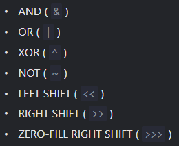

- [[Operand]]s and [[Operator]]s make a mathematical expression.
- 2 types: Unary and Binary. Unary means the operator accepts a single operand, binary means 2.
- Supported Operators in [[ECMAScript]]
  
- [[String]] concatenation adds 2 strings together.
- The binary "+" is the only operator that supports strings in such a way. Other ops don't.
  For ex.:
  ```js
  let x=6-'2'; //stores 4
  ```
- The unary "+" is a bit different too.
  If applied to [[Number]], does nothing. But if applied to other types, converts them to [[Number]]s.
  Works like ``Number(<var/val>)``
  
  For ex.:
  ```js
  let x=2;
  x= +x; //returns 2
  x = -2;
  x = +x; //returns -2
  x= "1";
  x= +x; //converts "1" to int.
  ```
- Precedence
  Basic precedency list
  
  If every operator has the same precedency then it is solved left to right (unless the operator is '=')
   
  
  Reference: [Mozilla Doc](https://developer.mozilla.org/en-US/docs/Web/JavaScript/Reference/Operators/Operator_Precedence)
- All operators in [[ECMAScript]] return a value.
  Even '=' with a precedency value of 2.
  The '=' operator writes a value of the right operand into the left and then returns the value on the right.
  For ex.:
  ```js
  let x= 3;
  let y= (x=5); //solves '=' and then returns 5
  
  ```
  This allows us to do ``chain assignment``, which is evaluated from right to left if everything has same precedence.
- The ',' (comma) operator has a precedency of 1. This operator only returns the value of its right operand.
  For ex.:
  ```js
  let x= (2+3,4+5); //returns 9
  ```
  + has a higher precedence than ',' so it is solved first and 2+3 becomes 5, 4+5 becomes 9. Then the comma operator returns the right operand, 9.
- [[ECMAScript]] supports pre/post increment/decrement operators on variables.
- [[ECMAScript]] also supports modify-then-assign operators like ``+=``.
- [[Bitwise]] Operators
  [[ECMAScript]] also supports these.
  
  
  Reference: [Mozilla Doc](https://developer.mozilla.org/en-US/docs/Web/JavaScript/Guide/Expressions_and_Operators#bitwise_operators)
- [[Comparison]] operators always returns a [[Boolean]] value. 
  There's ``'<','>','<=','>=','!=','==' and '==='``
  For ex.:
  ```js
  let x= 2 > 3; //returns true
  let y= "A" > "Z"; //returns false
  ```
  [[String]]s are compared using lexicographical (letter by letter unicode value) comparison.
  
  When values of different types are compared, they are converted to [[Number]]s. 
  For ex.:
  ```js
  let x= "A" > true; //converts A to Number and gets NaN and compares NaN to 1. Returns false.
  let y= false == "0"; //returns true, because false becomes 0 and "0" also becomes 0.
  ```
  All implicit conversion behaviors can be avoided using [[Strict Equality]] operators.
-
- [[Conditional]] Operator
  Always returns a value, which is given by one of its expressions.
  Combination of ``<bool> ? <expr on true> : <expr on false>``
  For ex.:
  ```js
  let x= 2>3 ? 2 : 3; //returns 3 to x 
  ```
  
  Yes we can nest multiple Conditional Operators.
- Logical Operator
  AND``&&`` OR``||`` NOT``!`` and [[Nullish-Coalescing Operator]]``??``
  
  Unlike in other langs, they can be applied to non-[[Boolean]]s as well and they implicitly convert the value to Boolean and then apply the logical operations.
  For ex.:
  ```js
  let x= null || 1; //converts null to Boolean, gets false, then converts 1 to Boolean, gets true and returns true.
  ```
  
  [[Short-Circuit Evaluation]] is used. That is, in a logical operation the expression is solved from left-to-right converting all non-Boolean values to Boolean and checking them right away. For AND, the first ``false`` terminates/short-circuits the expression and false is returned, for OR the first ``true`` terminates the expression right away.
- dot Operator
  It is used to access whatever is on its left with whatever is on its right.
  For ex.:
  ```js
  let x ={
   a:2,
   yo() {
     console.log(this.a);
    }
   no() {
   }
  };
  
  x.yo(); //prints 2
  let y = x.yo();
  y(); //fails as ``this`` is undefined
  
  //Similarly
  (x.a==2 ? x.yo: x.no)(); //fails as ``this`` is undefined
  ```
  [[this]] is [[undefined]] in these calls because whenever a [[Function]] is called using the dot Operator, the dot Op. doesn't return a function but a special [Reference Type](https://tc39.es/ecma262/#sec-reference-specification-type) which is an internal type from the spec.
  It returns a 3 value combination ``(<base obj>, <prop name>, <is strict mode>)`` so ``x.yo()`` is actually ``(x,'yo',true)``, this allows JS to assign the correct ``this`` to the method. But when we explicitly copy just the function, the [[this]] is lost and hence the function, if relying on ``this``, fails.
  
  The ``[ ]`` access Operator works similarly in this case.
-