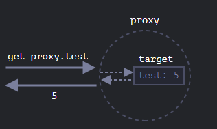
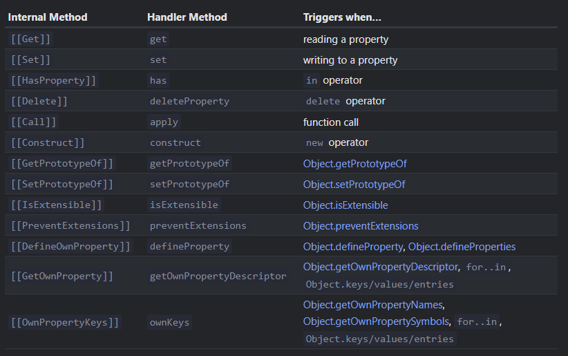
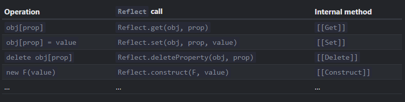

alias:: Proxy Object

- A PO is a special [[Object]] in JS that wraps over another Object and whatever operation is performed on it, it is passed over to the wrapped Object called its ``target``.
- We use the ``Proxy`` class to do so, the syntax being ``Proxy(<target obj>, <handler object>)`` where handler is an [[Object]] that intercepts calls to given methods. 
  For ex.:
  ```js
  let x ={};
  let proxy = new Proxy(x, {});
  proxy.yo= 2; //ok
  console.log(x.yo); //prints 2
  console.log(proxy.yo); //also prints 2
  ```
  It looks like so
  
  
  We can iterate over proxy keys too, which return the target Object's Keys returned as [[Iterable]].
  It is ideal to replace the original [[Object]] with the Proxy Object.
- Internal [[Object]] methods
  Objects in JS have internal methods that define its behavior and behavior of its properties/methods, these internal methods can only be called internally and not through our code. Similarly, we also have Internal Properties like [[Environment Object]], ``[[HomeObject]]``, [[Prototype Object]] etc.. 
  The ``Proxy`` Class hooks into these methods of a target Object and can intercept these calls, provided they are defined in the handler object with the mapped name.
  They are:
  
  When we create an intercept for an internal method in the proxy handler, it is known as a trap.
  
  * Invariant: JS enforces some rules to be followed when working with traps to ensure consistent behavior of Objects. The [Spec](https://tc39.es/ecma262/#sec-proxy-object-internal-methods-and-internal-slots) defines these.
  
  * Each trap is a method with its params.
  For ex.
  The ``get`` trap has 3 params, ``get(<target obj>,<prop name>,<reciever obj>)`` where reciever obj is the obj passed as [[this]] to the intercepted method ``[[GET]]`` if the target property is a getter accessor property. So this trap is called for read access to any property (Remember there is no [[Function]] overloading in JS as methods are identified by name alone, so there can only be 1 method of a name)
  ```js
  
  let x = {
    a: 2,
  };
  
  let proxy = new Proxy(x, {
    get(x, prop) {
      if (prop == "a") {
        return 1;
      } else return x[prop];
    },
  });
  
  console.log(proxy.a);
  ```
  
  Similarly we have set, ``set(target, property, value, receiver)``, this method returns a bool which should be true on a successful updating of the Object, and false otherwise as this is said by an ``Invariant``. 
  Similarly we have other traps like ``apply(target, thisArg, args)`` that wraps functions and is called when the proxy object is called as a function.
  
  * Despite that [[Strict Equality]] differentiates between an [[Object]] and its Proxy.
  An Object is strictly equal to itself only and that can't be intercepted.
  For ex.:
  ```js
  let x= {
   a:2,
  };
  let y = new Set();
  y.add(x);
  console.log(y.has(x)); //true
  x = new Proxy(x, {});
  console.log(y.has(x)); //false
  ```
- ``Reflect``
  This special [[Object]] wraps over all internal methods that the ``Proxy`` Object does, with the same name as the trap method and same args.
  
  It provides a way to directly access the object's internal methods without a Proxy.
  For ex.:
  ```js
  let x ={};
  Reflect.set(x,'a',2);
  console.log(x[a]); //prints 2
  ```
- Not all inbuilt [[Object]] can be Proxied similarly, this is because apart from internal methods and properties, Objects also have  ``internal slot``s. These are special internal properties reserved for internal use, like [[Map]] has ``[MapData]``, these are not trapped by the ``Proxy`` Object so the operations fail on proxy objects. 
  For ex.:
  ```js
  let map = new Map();
  
  let proxy = new Proxy(map, {});
  
  proxy.set('test', 1); // Error
  ```
  A simple trick to fix these errors is
  
  ```js
  let map = new Map();
  
  let proxy = new Proxy(map, {
    get(target, prop, receiver) {
      let value = Reflect.get(...arguments);
      return typeof value == 'function' ? value.bind(target) : value;
    }
  });
  
  proxy.set('test', 1); //works
  ```
  This works because get call here binds the ``this`` of Map's internal methods with the Map Object and so when an object of Map tries to access ``[MapData]`` using [[this]] it gets the binded Map object and not Proxy.
  
  [[Array]] uses no ``internal slot``s. [[Class]]es do use them for private properties/[[Function]]s.
- Revocable Proxy
  A proxy that can be revoked/disabled at any time.
  ```js
  let x = {
  a:2,
  };
  let {proxy, revoke} = new Proxy.revocable(x, {});
  
  console.log(proxy.a); //prints 2
  revoke();
  console.log(proxy.a); //error, proxy is revoked
  ```
  Uses [[Destructuring Assignment]].
-
-