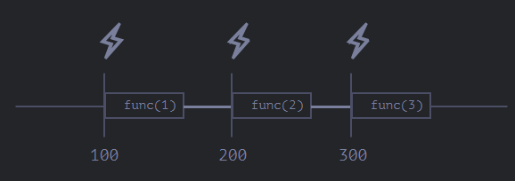

- In JS, we have special functions to schedule given functions or expressions after a set time period.
- We do so using [timers](https://html.spec.whatwg.org/multipage/timers-and-user-prompts.html#timers) in JS. Some of them are:
  ``setTimeout``: Runs the given expression or [[Function]] after given milliseconds of delay, also passing it given args if it accepts.
  ```js
  let timerId = setTimeout(func|code, [delay], [arg1], [arg2], ...)
  ```
  (Note when passing a function x, pass it's value with x not execute it right away with x())
  
  ``setInterval``: Runs the given expr./function after given delay, then repeats the same.
  ```js
  let timerId = setInterval(func|code, [delay], [arg1], [arg2], ...)
  ```
  
  ``clearTimeout(<id>)``: If we pass a setTimeout's/setInterval's returned id to it, it clears the timeout.
  
  We can  nest setTimeout to create a loop much like setInterval. The difference between the 2 execution methodologies is that in setInterval, the timer is already running by the time function execution starts so the function's execution eats into the waiting time and so the actual time difference between calls is always less than the given delay. However, in setTimeout if we set the timer again at the end, it will only start the timer when the execution ends giving closer to given delay between each call.
  For ex.:
  
  setTimeout with 100ms delay
  vs.
  
  setInterval with 100ms delay
  
  No matter how much delay we choose, it will run set...'s code after the synchronous code has finished executing. 
  For ex.:
  ```js
  setTimeout(() => console.log("World"));
  
  console.log("Hello"); //prints "Hello World"
  ```
  0-delay is also not quite 0 in web browsers, this is because according to [[HTML]] spec, after 5 nested 0-delay set... calls, the minimum delay between the next call will be at-least 4ms.
  
  The functions passed to these functions lose their ``this``, as we see in Caching in [[Function]]s. However, in browsers, ``set...`` sets their passed function's ``this`` to  the [[window]] [[Object]], for Node.js, ``this`` is set to the timer [[Object]].
-
-