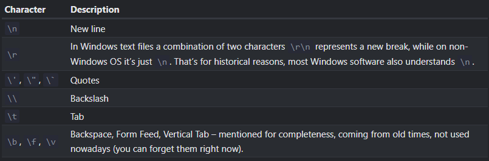

- [[Object]] wrapper for primitive type ``string``.
- Strings are stored with UTF-16 encoding in JS.
- For ex.:
  title:: String
  ```js
  //3 ways of declaring strings
  let x= "Yo"
  x= 'Yo'
  let y=2
  x= `Yo ${y}`
  ```
  The former 2 are the same, but backticks provide extended functionality, i.e., allowing us to embed other variables and expressions into them with ``${...}``
- There is no char type in JS.
- String concatenation:
  We can concat 2 strings with <string val/var> + <string val/var>
  
  Any other type of value also gets converted to string.
  For ex.:
  ```js
  let a= "1"+2+3; //is "123"
  let b= 1+2+"3"; //is "33"
  ```
  This also shows that [[Operator]]s are solved from left to right if they have the same precedence, so if an operand on the left converts the result to string, the ones to the right follow string concatenation.
- [Tagged Templates](https://developer.mozilla.org/en-US/docs/Web/JavaScript/Reference/Template_literals#tagged_templates): 
  We can call a function before a string is processed, the syntax is ``<func> <string enclosed in backticks>``. The function receives the string, processes it and returns the string.
- Special Characters are supported in JS:
  {:height 265, :width 778}
  
  ``\`` is the escape character in JS. 
  
  Yes each special character is just a single character.
- ``.length`` to get a string's length.
- ``[<num>]`` or ``.at(<num>)`` to access individual character of a string. ``.at()`` can also go from the right end if we use a negative number.
- Strings are immutable in JS, we can access individual chars but not mutate them.
- Methods like ``<str>.toLowerCase()``, ``<str>.toUpperCase()``, ``<str>.slice(start, optional end)``, ``<str>.substring(start, optional end)``, ``<str>.substr(start,length)``, ``<str>.indexOf(<value>)`` etc exist.  
  Slice and Substring are the same except substring swaps start and end if start>end.
  
  To convert a char to int, 
  ``<str>.codePointAt(<position>)``
  To convert an int to char
  ``String.fromCodePoint(<value>)``
- ``.split(<str sep>)``: Returns an [[Array]] from a string.