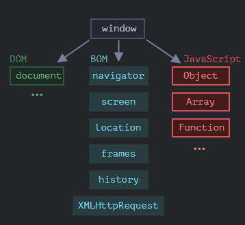

- In [[Browser]]s , this Object provides the functionality required for JS to run, then interact with the [[DOM]] and the [[BOM]]
  
  
  So the window [[Object]] has 2 roles, it is the [[Global]] Object and secondly it provides interactivity with the BOM and DOM.
-
-