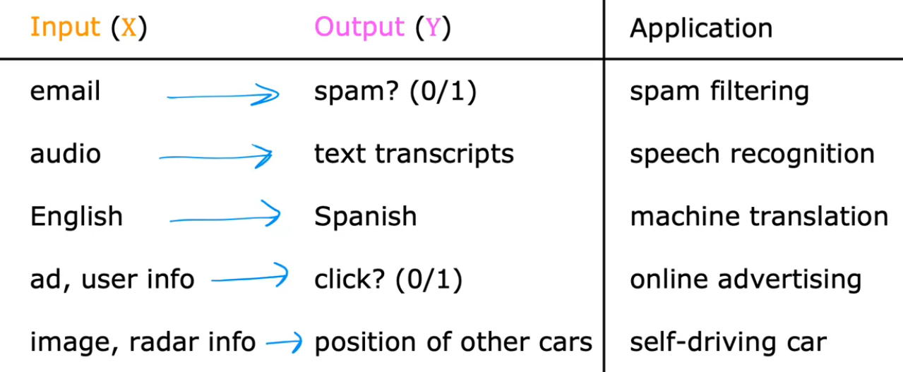

- Algorithms that learn input to output mappings, they are given each input X and its correct output Y and they ``learn`` them and are able to then predict what a correct output should be for a given input.
  
  For ex.:
  
  
  Given these inputs in X, they output Y.
-
-