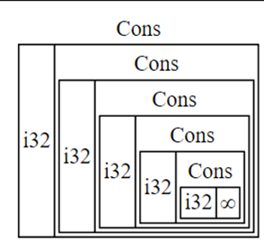

- The simplest Smart [[Pointer]] in Rust. It has the least overhead and provides a simple way to store a value on the heap whilst the pointer remains on the stack.
  
  For ex.:
  ```rust
  fn main() {
      let b = Box::new(5);
      println!("b = {}", b); //prints 5
  } //automatically gets deallocated (along with the value) at the end of the scope.
  ```
- *Recursive [[Data Type]]s*
  A recursive data type is one which has its own type in its fields. 
  For ex.:
  A *Cons List*, this is a data structure in *Lisp* and in Rust could be represented through this [[Enum]]
  
  ```rust
  enum List {
   Cons(i32, List),
   Nil
  }
  
  fn main() {
   let x = List::Cons(1, List::Cons(2, List::Cons(3, List::Nil));
  }
  ```
  This is a recursive data type, however such types are an error in Rust as the compiler needs to know exactly how much size each type takes. However, here if it tries to figure out the size it will go into an infinite loop like so
  
  
  A simple fix to store such types is by using the ``Box`` [[Pointer]] as Rust knows the size of a pointer at compile time and hence does not need to recurse the type definition.
  
  Making our code like so
  
  ```rust
  enum List {
   Cons(i32, Box<List>),
   Nil
  }
  
  fn main() {
   let x = List::Cons(1, Box::new(List::Cons(2, Box::new(List::Cons(3, List::Nil)))));
  }
  ```
-
-