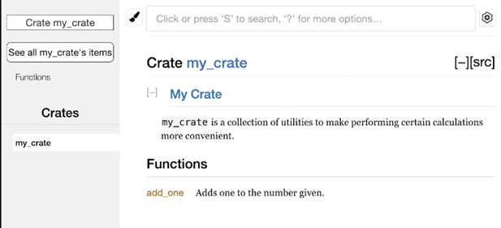

- Works as normal, ``//`` for single line and ``/* */`` for multi-line. ``///`` and ``//!`` for documentation is supported as well.
- /// for documentation comments 
  /// supports Markdown in it and allows documenting things,
  For ex.:
  ```rust
  /// Adds one to the number given.
  ///
  /// # Examples
  ///
  /// ```
  /// let arg = 5;
  /// let answer = my_crate::add_one(arg);
  ///
  /// assert_eq!(6, answer);
  /// ```
  pub fn add_one(x: i32) -> i32 {
      x + 1
  }
  
  ```
- [[Cargo]] ``doc``
  Running this generates the HTML documentation for all the doc commented lines by using the rustdoc tool distributed with Rust. ``–open`` flag on it will open the built HTML page.
- ``//!``
  These type documentation comments document the parent item of a doc comment, i.e., the item that contains the doc comment following the //! styled doc comment. 
  For ex.:
  ```rust
  //! # My Crate
  //!
  //! `my_crate` is a collection of utilities to make performing certain
  //! calculations more convenient.
   
  /// Adds one to the number given.
  // --snip--
  fn addOne() {}
  ```
  Here ``//!`` documents the crate. This is because the next doc comment’s parent is the crate itself,i.e. ``///`` is in a crate and //! adds documentation for it.
  So this is the final generated doc
  