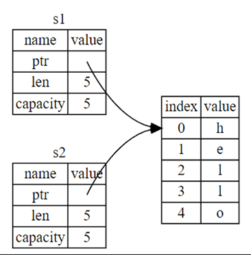

- In Rust, values on the stack are copied automatically. 
  For ex.:
  ```rust
  let a=2;
  let b=a;
  ```
  Since this is a simple [[Data Type]] and is on the stack, it is copied directly. 
  
  And similarly,
  ```rust
  let s1 = String.from(“hello”);
  let s2 = s1;
  ```
  The stack also has ``s1`` and ``s2`` which hold the *Reference* to the [[String]] values on the heap so that reference is copied but not the data itself. Meaning we get
  
  
  So modifying one or the other would affect the other. To prevent this and also the double free problem, which is, if s1 and s2 both try to free the memory then it would cause memory corruption, Rust invalidates the copied variable. This turns the copy operation into a move operation automatically.
  
  For ex.:
  ```rust
      let s1 = String::from("hello");
      let s2 = s1;
   
      println!("{}, world!", s1);
  ```
  is an error as ``s1`` is the owner of the data and when we copy ``s1`` into ``s2``, then ``s2`` takes [[Ownership]] of the value and in doing so makes ``s1`` invalid as it doesn’t have the ownership anymore, so ``s1`` shouldn't be accessed anymore.
  So, Rust, through [[Ownership]] rules ensure the references to the values on the heap are safe.
  
  This is also to say, copy/move is ok but if a value has been moved we can't access it, and if we try to it is an error, but otherwise it is not.
- To actually copy the data, we use the ``.clone()`` [[Function]] implemented by the [[Data Type]]s on the heap as well as [[Pointer]]s. 
  
  For ex.:
  ```rust
  let s1= String::from("yo");
  let s2= s1.clone(); //This is an expensive operation as the heap will be recreated.
  ```
- Values on the stack such as integers can be cloned or copied, i.e., copy or ``.clone()`` are the same thing for  them. As a general rule, all scalar [[Data Type]]s use copying and not moving. And tuples also use copying if they consist of types that implement ``Copy`` [[Trait]]. 
  
  This copy/move scenario works everywhere, even with [[Function]] calls. So passing a heap variable to a function will turn the variable invalid.
-