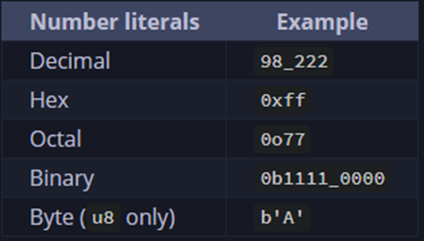

- integers: Numbers without fractional components.
  
  
  For n bits,
  * Signed ints are the ints that care for the sign, + or -. These can store -ve as well as +ve values. Stored using 2’s complement representation. 
  Value range: $$-2^{n-1}$$ < $$2^{n-1}$$
  
  * Unsigned ints can only be +ve. 
  Value range: 0 < $$2^n-1$$
  
  * The ``isize`` and ``usize`` are used to denote size of collections and depend on the architecture of the program, i.e. 64 bits on x64 and 32 bit on x86.
- Numbers can use literals to allow inferring the right type automatically to the [[Variable]]
  
  Like ``57u8`` (57 of type u8).
  
  The ``_`` has 2 uses, for floating-point [[Data Type]]s, it means the decimal position and for ints it is just a visual separator.
- Floating-Point
  ``f32`` and ``f64``, 32 bits and single precision & 64 bits and double precision respectively. In modern CPUs, f64 is as fast as f32 but with greater precision, which is why if f32 isn’t explicitly specified, a floating number is inferred as f64 in rust.
- Numeric Operations
  Same as C++, here's reference: [Docs Book](https://doc.rust-lang.org/book/appendix-02-operators.html)
- Overflow and prevention
  In rust, if an integer overflows (value greater than the size allowed by type) then, if it’s in debug mode 
   then the program [[Panic]]s, and if it’s in release mode then the value wraps around (new value = overflowing value – size of type, if it’s still overflowing then repeat). To allow better checks against said  overflows, rust provides a few standard methods available in same named crates.
  * Wrap in all modes with the ``wrapping_*`` methods, such as ``wrapping_add`` 
  * Return a [[Option Type]]::None value if there is overflow with the ``checked_*`` methods
  * Return the value and a boolean indicating whether there was overflow with the ``overflowing_*`` methods
  * Saturate (Clamp) at the value’s minimum or maximum values with ``saturating_*`` methods
-