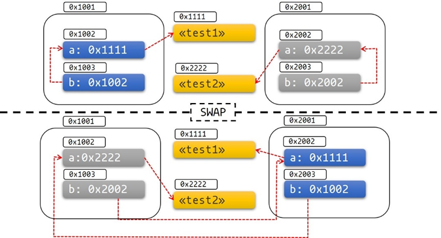

- A Pointer is a [[Data Type]] that points to data stored on the memory. 
  [[Reference Type]]s are the most basic type of pointers in Rust as they point to an address and have no performance overhead, represented with ``&`` [[Operator]].
- *Smart Pointer*s
  Implemented as [[Struct]]s which store data on the heap and usually also have [[Ownership]] of it. They have a bit of performance overhead, as is true with accessing heap anyways, but are able to provide some additional functionality such as cleaning up after all pointers to the same data are out of [[Lifetime]]s.
  
  Smart Pointer [[Data Type]]s must implement at-least the ``Deref`` and ``drop`` [[Trait]].
  Some smart pointers already in the [[Standard Library]] are
  
  * [[Box<T>]]
  * [[Rc<T>]]
  * [[Ref<T>]] and [[RefMut<T>]]
  * [[RefCell<T>]]
  * [[Cell<T>]]
  * [[Mutex<T>]] and [[MutexGuard<T>]]
  
  These smart pointers don't implement the ``Send`` [[Trait]] and ``Sync`` Trait, as they are not safe to be shared across [[Thread]]s. 
  But there are other variants which do, they are
  
  * [[Arc<T>]]
- *Raw Pointer*s
  Rust allows raw pointers. They're allowed to ignore [[Borrow]]ing rules and have multiple pointers (immutable + mutable) to the same  value, aren't required to point to valid memory, can be null, and don't implement any automatic cleanup.
  Creating raw pointers and pointing them to any value is allowed in normal rust. However, dereferencing a raw pointer is [[unsafe]]. 
  
  There's 2 of these
  * immutable Raw Pointer: ``*const T`` where ``*`` is in the type name and not the deref [[Operator]]. These pointers can't be reassigned. 
  
  * mutable Raw Pointer: ``*mut T``. Can be reassigned to point to a different value.
  
  For ex.:
  ```rust
  fn main() {
      let mut num = 5;
  
      let r1 = &num as *const i32;
      let r2 = &mut num as *mut i32;
  
      unsafe {
          println!("r1 is: {}", *r1);
          println!("r2 is: {}", *r2);
      }
   
  } //works
  ```
  We use [[as]] to [[Cast]] a [[Reference Type]] to a Raw Pointer.
- The ``fn`` [[Function]] Pointer
- Pointers and the address problem
  Consider a [[Struct]] like so
  ```rust
  #[derive(Debug)]
  struct Test {
      a: String,
      b: *const String,
  }
  //and the impl block is designed like pointer b always points to a
  //thereby creating a self-referencing struct
  impl Test {
      fn new(txt: &str) -> Self {
          Test {
              a: String::from(txt),
              b: std::ptr::null(),
          }
      }
  
      fn init(&mut self) {
          let self_ref: *const String = &self.a;
          self.b = self_ref;
      }
  
      fn a(&self) -> &str {
          &self.a
      }
  
      fn b(&self) -> &String {
          assert!(!self.b.is_null(), "Test::b called without Test::init being called first");
          unsafe { &*(self.b) }
      }
  }
  
  //Now somewhere we do  std::mem::swap(&mut test1, &mut test2); 
  ```
   Now if we print the value behind b after swapping the memory of 2 objects, that is we swap the memory where the object's reference is stored, then we swap each field's data at their memory addresses. But ``mem::swap`` [[Module]] doesn't modify the values in their addresses, so the pointers will still point to  their old addresses, thereby breaking the self-referential struct.
  
  That is,
  
   
  When we store a pointer as a [[Data Type]] and then do a ``mem::swap`` with another of the same type then the pointer's data is swapped. But, the values at the address theirselves aren't modified.
  This isn't an issue with non self-referential types as it would be intended to have the pointers still point to the same address, but in self-referential types, it'd be a problem.
   
  For this reason extra care must be taken with raw pointers.
  We can resolve this with [[Pinning]].