- Percent: Out of 100
  $$a\%b = \frac{a*b}{100}$$
- If a and b have zeroes, cut them out. 
  For ex.
  In $$20\%30$$, we can cut the 2 zeroes out (as percent means divide by 100) and multiply a to b, to get 6.
- For any multiplication a*b, we can take a or b or both as $$\lparen m + n \rparen * \lparen p + q \rparen $$ where m+n = a and p+q = b and mentally solve them, if either a or b is a single digit then we can leave it and multiply the other sum. For ex.:  
  $$9*72=9*(70+2)$$
  $$=> 630+36 = 666 $$
- For any a*b, if a and b are double digit, then we can use a vedic maths trick to multiply them
  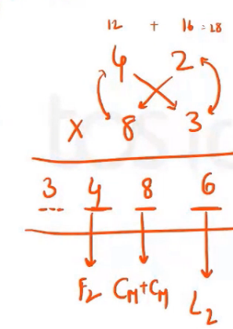
  
  That is, 
  The ones position is multiplying the Last two digits of both the numbers, the next is cross multiplication of the digits and the sum of the multiplications and hundred's position is multiplying the first two digits of both the numbers. And any carry overs we sum.
- Percentages to fractions
  Some percentages can be calculated faster by converting either a or b to fraction.
  For ex.:
  
  $$33.33 \% 93$$ is simply 1/3 if we divide 33.33 by 100, 
  so $$33.93 \% 93 = \frac{1}{3} * 93$$
  
  1/2 = 50%
  1/3 = 33.33%
  1/4 = 25%
  1/5 = 20%
  1/6 = 16.66%
  1/7= 14.28%
  1/8 = 12.5%
  
  2/3 = 66.66%
  2/5 = 40%
  
  and we can play around with percentages, like 40%x is just (20%x+20%x) of x which is just 1/5%x + 1/5%x 
  For ex.:
  $$40\%60 = 24$$
  or
  $$20 \% 60 + 20 \% 60 $$
  $$=> \frac{1 * 60}{5} + \frac{1 * 60}{5}$$
  $$=> 12 + 12 = 24$$
- Percentage To Fraction
  We can find a fraction of a percentage by simply dividing the number by 100 as percent means, out of 100.
  For ex.:
  50% means 50/100
  So,
  $$\frac{50}{100} = \frac{1}{2}$$
- Fraction To Percentage
  Simply multiply by 100.
  $$x\%=\frac{a}{b} $$
  So,
  $$ x = \frac{a}{b}*100$$
- Example Questions
  If given % of x is equal to given % of y, then what % of y will be equal to given % of x.
  
  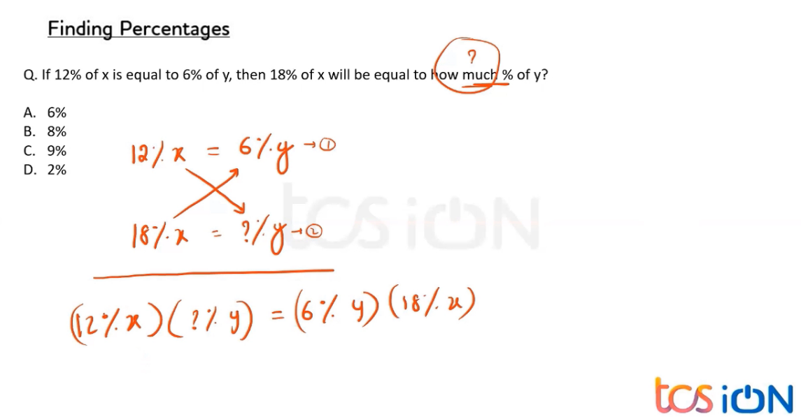{:height 416, :width 778}
  
  A simple method to solve these questions is to cross multiply the equations
  For ex.:
  For the given question,
  $$\lparen 12 \% x \rparen * \lparen ? \% y \rparen = \lparen 6 \% y \rparen * \lparen 18 \% x\rparen$$
  $$ \frac{12*x}{100} * \frac{?*y}{100} = \frac{6*y}{100} * \frac{18*x}{100} $$
  and we get
  $$ 2*? = 18 $$
  $$ ? = 9 $$
- A number when decreased by given % becomes given number. What is the value of the number when increased by given %.
  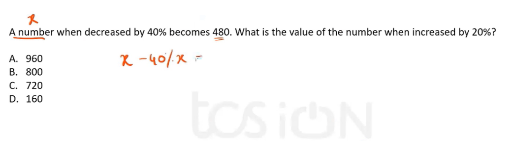
  
  For ex.
  These can be simply solved like so
  Say the given no. is x
  $$x - 40 \% x = 480 $$
  Any number by itself is 100% of itself,
  $$ 100 \% x - 40 \% x = 480 $$
  $$ 60 \% x = 480 $$
  $$ x = 800 $$
  
  Now we have to find when it is increased by 20%, so 120%x
  which is just $$120\%800=960$$
- Finding the %
  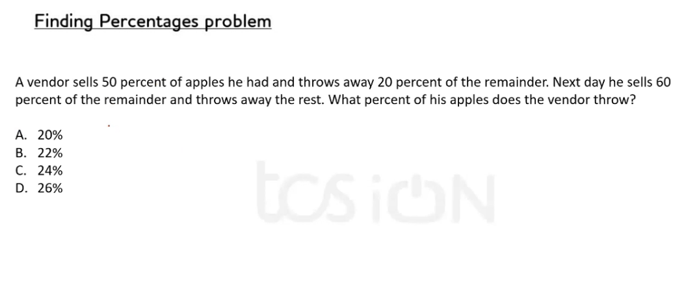
  
  In this question, 
  Let the number of apples be x, we have to find the % of apple he throws.
  
  50%x sold
  Then, he's left with 100%x - 50%x = 50%x (because x cancels out in the subtraction)
  He throws away 20% of 50%x which is 20%50 = 10%x, so he's left with 50%x - 10%x = 40%x
  
  Then he sells 60% of 40%x, which is 60%40 = 24%x, so he's left with 40%x-24%x=16%x which he throws
  So he threw a total of 10%x + 16%x = 26%x
  
  Another way of doing the same is assuming x is 100, then we can directly get results
  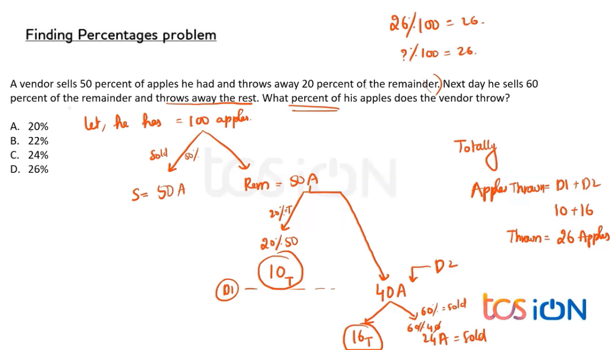{:height 454, :width 778}
- % increase and % decrease problems
  
  We use a slightly different formula for these
  
  $$\% \text {Change} = \frac{Difference}{Initial Value / Compared Value} * 100$$
  
  For ex.:
  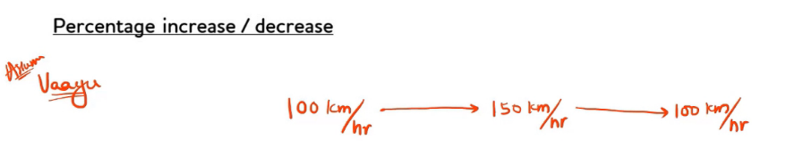
  
  For this problem and finding solutions for these 4 cases,
  
  1. Speed Increase
  2. Speed Decrease
  3. % Increase
  4 % Decrease
  
  We find,
  1. 50 
  2. 50
  3. $$\frac{50}{100}*100 = 50\%$$
  4. $$\frac{50}{150}*100 = 33.33\%$$
  
  An observation is if a value increases from a to b and the increase % in fraction is $$\frac{n}{x}$$, it will decrease by $$\frac{n}{x+n}$$ to go from b to a. 
  
  Or if the value decreases from a to b, and the decrease % in fraction is $$\frac{n}{x}$$ then it will increase by $$\frac{n}{x-n}$$
  
  For ex.:
  In the previous problem, value change from 100 to 150 is $$\frac{1}{2}$$ so the decrement from 150 to 100 is $$\frac{1}{2+1} = \frac{1}{3} $$ which is
- For ex.
  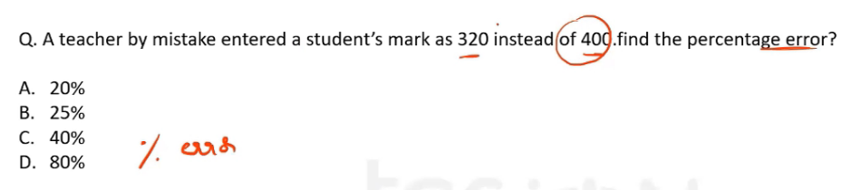
  
  In this problem we use the % Change formula, and the initial value, or the actual value is 400 as it is told in the question, it is not 320
  So, 
  We get $$\frac{400-320}{400} * 100 = 20\%$$
  And it is a 20% decrement.
- For ex.:
  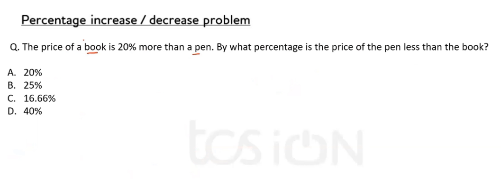
  
  Here, we know that the value is basically x then increases by 20% to become y and now we need to find y to x in %. 
  We can easily get the answer using the observation from earlier, that is converting % into fraction and applying $$ \frac{n}{x} \text{ \% increase } = \frac{n}{x+1} \text{ \% decrease }$$
  
  So $$20\%=\frac{1}{5}$$
  And n = 1, x = 5
  So $$\frac{1}{5-1} = \frac{1}{4} =  \frac{1}{6} * 100 = 16.66\%$$
  
  Another way is to assume price of pen to be 100, then 20% increase would give us the price of book, 120. Now we need to find the percentage decrease between book and the pen, so we do
  
  $$\frac{120-100}{120} * 100 = 16.66\%$$
- Successive Percentage Change
  Problems where there's a given % increase and then consecutively another % increase.
  
  For ex.:
  If there's 100 people a given day, and then 10% more people are added the next day, and then 20% more the day after. How many people are there at the end of 2nd day ?
  We do
  Initial number of people = 100
  10% of 100 = 10, so 10+100= 110 at the end of 1st day
  20% of 110 = 22, 22 + 110 = 132 at the end of the 2nd day
  And the % increase is 100 to 132, which is $$\frac{132-100}{100}*100= 32\% \text{ increase }$$
  
  There's a simple formula for 2 successive % changes is
  $$\text{Overall \% increase/decrease } = a + b + \frac{a*b}{100}$$ where if the change is an increase, a is positive otherwise it is negative, same for b,
  So, for the above problem,
  $$ (+10)+(+20)+\frac{(+10)*(+20)}{100} = 32 \text{ percent }$$
- For ex.:
  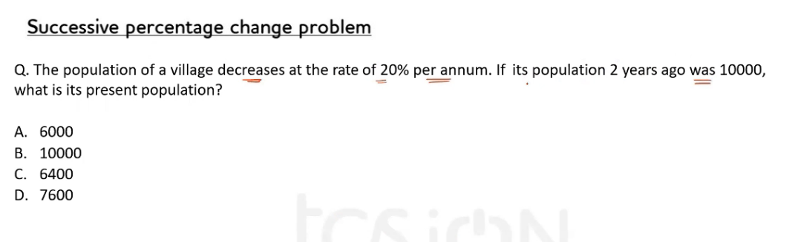
  
  Here initial population is 10000
  Then it decreases by 20% for the first year, and then 20% for the next year
  $$ \text{ Overall change in \% } = -20-20 + \frac{20*20}{100}$$
  $$ - 40 + 4 = - 36 \%$$ 
  \-36% of 10000 = -3600
  So, current population = 10000 - 3600 = 6400
- If there are >2 successive % changes, we do the first 2, then the result of the first 2 with the 3rd and so on.
  For ex.:
  
  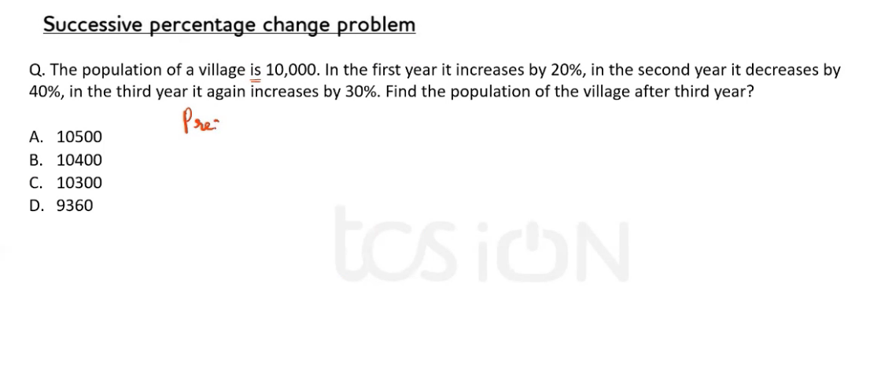
  Here, 
  $$\text{ First 2 changes in \% } = 20 - 40 * \frac{20*(-40)}{100} = -28\% $$
  $$\text{ Next 2 changes in \% } = -28 + 30 * \frac{-28*30}{100} = -6.4\% $$
  \-6.4% of 10000 = 640
  So, current population = 10000-640 = 9360
- Ex.
  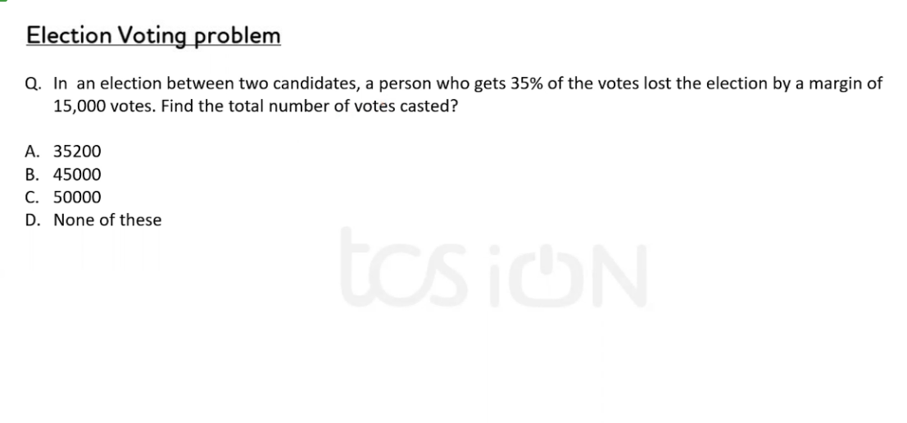
  
  In this question, we know the person who got 35% lost to the other person with 15000 votes, let total votes be x
  The votes of the other person = 100%x-35%x = 65%x
  The difference between votes = 15000
  65%x-35%x= 15000
  30%x = 15000
  And we have to find out 100%x
  So,
  $$(30\%x)*3 + ()$$